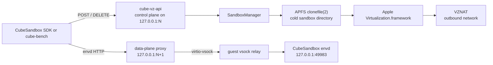
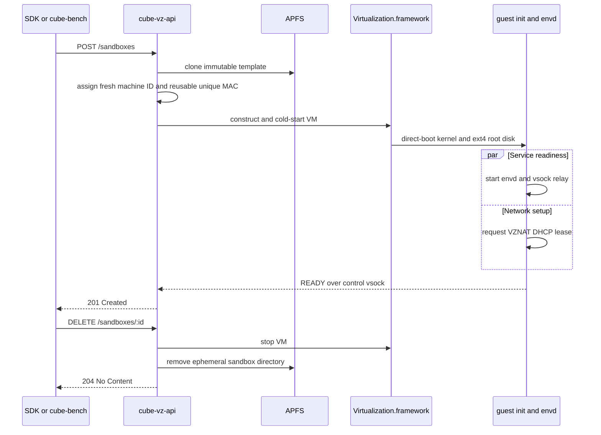

# CubeVZ

CubeVZ is an experimental, native Apple Silicon backend for CubeSandbox. It
boots an ARM64 Linux sandbox directly with Apple's
`Virtualization.framework`, without a Linux host VM or nested KVM layer.

CubeVZ is intended for local development, compatibility testing, and lifecycle
benchmarking on macOS. It is not a production replacement for CubeSandbox's
Linux control plane.

## Architecture

CubeVZ keeps the existing CubeSandbox `envd` service inside the guest and
replaces only the host-side VM lifecycle and transport boundary.



The measured runtime path contains one virtualization layer:

```text
macOS process
  -> Virtualization.framework / Apple Hypervisor
    -> ARM64 Linux sandbox VM
```

### Sandbox lifecycle



`POST /sandboxes` guarantees that the real guest `envd` service is reachable
over vsock. DHCP runs in parallel, so a command requiring outbound Internet
access may need a brief retry immediately after creation.

## Components

| Component | Responsibility |
|---|---|
| `cube-vz` | Creates a VM directory, validates the host, and runs a standalone VM. |
| `cube-vz-api` | Implements the local CubeAPI lifecycle subset and envd data-plane proxy. |
| `CubeVZCore` | Owns manifests, APFS cloning, VZ configuration, VM startup, readiness, and shutdown. |
| `Guest/` | Builds the direct-boot kernel and ext4 image containing upstream `envd`, init, DHCP, and vsock helpers. |
| `Benchmark/` | Runs native VM workloads and the repository's official `cube-bench` lifecycle client. |

The VZ configuration deliberately contains only the devices required by this
backend: one virtio block disk, console, entropy, optional NAT networking, and
optional vsock. The lifecycle guest kernel has its required ext4 and virtio
drivers built in and boots without an initramfs.

## Requirements

| Requirement | Minimum or expectation |
|---|---|
| Host | Apple Silicon (`arm64`) |
| Operating system | macOS 14 or newer |
| Toolchain | Xcode Command Line Tools with Swift 6.2 or newer |
| Guest build | Docker Desktop with `buildx` and Linux ARM64 build support |
| Storage | APFS for copy-on-write sandbox cloning |
| Guest disk | Raw ext4 block image; qcow2 is not supported |

The executables require the `com.apple.security.virtualization` entitlement.
Use the repository Make targets, which build and ad-hoc sign the binaries with
the checked-in entitlement file.

## Quick start

Run these commands from the repository root:

```bash
make cube-vz-test
make cube-vz-doctor
make cube-vz-guest
make cube-vz-smoke
```

The build produces:

| Artifact | Path |
|---|---|
| Standalone VM CLI | `_output/bin/cube-vz` |
| Local lifecycle API | `_output/bin/cube-vz-api` |
| Direct-boot guest kernel | `_output/cube-vz/guest/kernel` |
| Raw ext4 guest disk | `_output/cube-vz/guest/rootfs.raw` |
| Guest checksums and metadata | `_output/cube-vz/guest/SHA256SUMS`, `_output/cube-vz/guest/build-info.txt` |

Docker is used only to produce Linux guest artifacts and helper binaries. VM
creation and execution use native macOS binaries.

## Run the local CubeAPI-compatible service

### 1. Build and validate the backend

```bash
make cube-vz-test cube-vz-doctor cube-vz-guest
```

### 2. Create an immutable template

The destination must not already exist. Keep the template and sandbox
directories on the same APFS volume.

```bash
export CUBEVZ_WORK_DIR="$PWD/.workdir/cube-vz/local"
rm -rf "$CUBEVZ_WORK_DIR"
mkdir -p "$CUBEVZ_WORK_DIR/sandboxes"

_output/bin/cube-vz create \
  --vm-dir "$CUBEVZ_WORK_DIR/template" \
  --kernel _output/cube-vz/guest/kernel \
  --disk _output/cube-vz/guest/rootfs.raw \
  --cpus 2 \
  --memory-mib 2048 \
  --cmdline "console=hvc0 quiet loglevel=0 root=/dev/vda rw rootfstype=ext4 init=/usr/local/sbin/cube-vz-init"
```

Treat the resulting template directory as immutable while the API is running.
If the source artifacts are on another filesystem, `cube-vz create` can use
`--allow-full-copy` for this one-time template creation. Per-sandbox cloning
still requires APFS `clonefile(2)`.

### 3. Start the service

```bash
_output/bin/cube-vz-api \
  --template-dir "$CUBEVZ_WORK_DIR/template" \
  --sandboxes-dir "$CUBEVZ_WORK_DIR/sandboxes" \
  --template-id cube-vz \
  --port 3000
```

With control port `3000`, the data-plane proxy listens on `3001`. Both
listeners bind only to `127.0.0.1`.

Verify the control plane from another terminal:

```bash
curl --fail --silent http://127.0.0.1:3000/health
```

### 4. Create and delete a sandbox

```bash
curl --fail --silent \
  -H 'Content-Type: application/json' \
  -d '{"templateID":"cube-vz"}' \
  http://127.0.0.1:3000/sandboxes
```

The response contains a `sandboxID`:

```json
{
  "clientID": "cube-vz-local",
  "envdVersion": "cube-vz",
  "sandboxID": "sb-<uuid>",
  "templateID": "cube-vz"
}
```

Delete the sandbox when finished:

```bash
curl --fail --silent \
  -X DELETE \
  http://127.0.0.1:3000/sandboxes/sb-<uuid>
```

Deletion is destructive: the VM is stopped and its ephemeral directory is
removed immediately.

### 5. Configure a CubeSandbox SDK client

Use the following environment for clients that support the repository's local
CubeAPI and proxy variables:

```bash
export CUBE_API_URL=http://127.0.0.1:3000
export CUBE_TEMPLATE_ID=cube-vz
export CUBE_PROXY_NODE_IP=127.0.0.1
export CUBE_PROXY_PORT_HTTP=3001
export CUBE_PROXY_SCHEME=http
export CUBE_SANDBOX_DOMAIN=cube.local
```

The SDK sends envd requests to the data-plane listener with a host name in this
form:

```text
49983-<sandbox-id>.cube.local
```

CubeVZ parses that host name only to select a running VM and guest port. It
forwards the original HTTP bytes unchanged through virtio-vsock; it does not
reimplement envd endpoints in Swift.

## Run a standalone VM

The standalone CLI is useful for guest development and console inspection:

```bash
_output/bin/cube-vz create \
  --vm-dir .workdir/cube-vz/demo \
  --kernel _output/cube-vz/guest/kernel \
  --disk _output/cube-vz/guest/rootfs.raw \
  --cpus 2 \
  --memory-mib 2048 \
  --cmdline "console=hvc0 root=/dev/vda rw rootfstype=ext4 init=/usr/local/sbin/cube-vz-init"

_output/bin/cube-vz run --vm-dir .workdir/cube-vz/demo
```

`SIGINT` or `SIGTERM` stops the VM. Every `run` is a fresh cold boot; CubeVZ
does not save or restore VM state.

## API compatibility

CubeVZ implements the minimum local contract required by `cube-bench` and the
current envd SDK path:

| Listener | Route | Behavior |
|---|---|---|
| Control | `GET /health` | Reports API process health. |
| Control | `POST /sandboxes` | Clones, starts, and waits for one sandbox. |
| Control | `DELETE /sandboxes/:id` | Stops and removes one sandbox. |
| Data plane | Any envd HTTP request for port `49983` | Transparently relays bytes to the selected guest over vsock. |

The control server accepts requests up to 1 MiB. The data-plane proxy accepts
up to 64 KiB of HTTP headers before routing. Both apply a five-second deadline
while reading request headers. The process caps concurrent control connections
at 64 and data-plane relays at 128; excess connections receive HTTP 503.
Unsupported routes, templates, and guest ports are rejected rather than
silently emulated.

## Validation and benchmarks

| Command | Purpose |
|---|---|
| `make cube-vz-test` | Runs manifest, path-safety, HTTP parsing, APFS clone, directory, template, and VZ configuration self-tests. |
| `make cube-vz-doctor` | Checks architecture, VZ support, and the virtualization entitlement. |
| `make cube-vz-smoke` | Verifies lifecycle API, transparent envd relay, and a real Go SDK command. |
| `make cube-vz-benchmark` | Runs CPU, memory, and direct random file-I/O workloads inside one native VM. |
| `make cube-vz-lifecycle-benchmark` | Runs the official `examples/cube-bench` create/delete workload at concurrency 1 and 10. |

The reviewed M4 Pro lifecycle baseline completed all 660 measured create/delete
cycles across three independent runs successfully. Headline values are medians
of the three run-level metrics; ranges expose run-to-run variance:

| Tier | Create average | Create P95 | Create P99 | Throughput |
|---|---:|---:|---:|---:|
| Concurrency 1 | 223.7 ms (216.7–226.4) | 242.2 ms (229.6–243.7) | 244.5 ms (233.7–279.8) | 2.63/s (2.49–3.94) |
| Concurrency 10 | 330.2 ms (283.9–349.8) | 401.7 ms (382.3–417.7) | 438.4 ms (413.0–502.6) | 22.42/s (17.76–25.22) |

See [Benchmark/RESULTS.md](Benchmark/RESULTS.md) for host details, phase
timings, workload results, methodology, comparison caveats, and links to the
tracked machine-readable reports. New timestamped reports are also written
under `_output/cube-vz/lifecycle-results/`.

The measured `POST` includes APFS template cloning, VZ construction and cold
start, guest init, and real envd readiness. Docker execution and guest artifact
construction occur before measurement.

## Operational and security boundary

- The control and data-plane listeners are loopback-only and provide no
  authentication or TLS. Do not expose them through a network proxy or port
  forward.
- Anyone able to connect as the local user can create, access, and destroy
  CubeVZ sandboxes.
- Sandbox disks are ephemeral. `DELETE` does not preserve guest state.
- The API holds an exclusive lock on its sandboxes directory. After a process
  restart, it removes stale `sb-*` and interrupted partial-clone directories
  before accepting requests.
- Every sandbox gets a fresh generic machine identifier. Active sandboxes have
  distinct locally administered MAC addresses; inactive addresses are recycled
  to avoid unbounded VZNAT DHCP identities.
- There is no hot pool, prewarmed VM, snapshot restore, saved state, or adaptive
  lifecycle branch. Every create uses the same APFS-clone plus cold-boot path.
- The current data plane exposes only the envd service on guest port `49983`.

The following CubeSandbox capabilities remain outside this minimal backend:

- Jupyter/code-interpreter service on port `49999`;
- arbitrary exposed ports and ingress;
- network policy enforcement;
- pause, rollback, and persistent sandbox storage;
- authentication and multi-tenant authorization;
- AgentHub, OCI template management, and distributed scheduling;
- Linux containerd and CubeShim lifecycle integration.

## Troubleshooting

### The VM binary exits with an entitlement error

Rebuild through `make cube-vz` or `make cube-vz-doctor`. Do not run an unsigned
SwiftPM executable from `.build/` for VM operations.

### APFS cloning fails

Confirm that the template and sandboxes directories are on the same APFS
volume. Use `--allow-full-copy` only when creating the initial template from an
artifact on another filesystem; the lifecycle backend intentionally requires
copy-on-write per-sandbox clones.

### Guest build fails before VM startup

Confirm that Docker Desktop is running and that `docker buildx` can build
`linux/arm64` images. Re-run `make cube-vz-guest` and inspect the Docker error
before running smoke or lifecycle tests.

### envd works but the first outbound command fails

The control path becomes ready before background DHCP necessarily completes.
Retry the outbound operation briefly. Persistent failures should be diagnosed
from the `cube-vz-api` log and guest console.

### The API cannot bind its port

Choose another `--port` and leave the following port free as well. For example,
`--port 33000` uses `33000` for control and `33001` for data-plane traffic.
