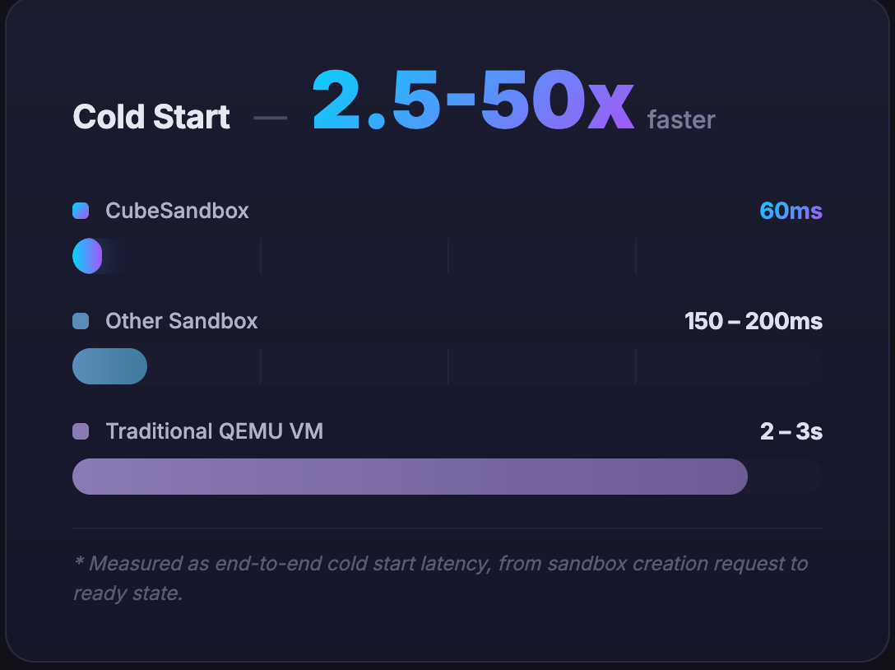
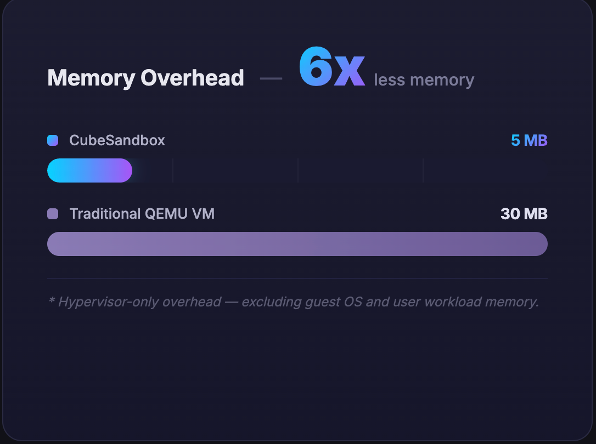
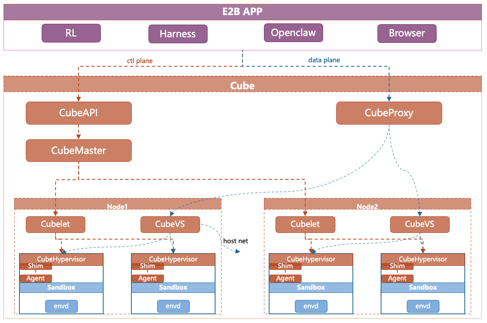

<p align="center">
  
</p>

<h1 align="center">CubeSandbox</h1>

<p align="center">
  <strong>AIエージェント向けの即時・高並列・安全・軽量なサンドボックスサービス</strong>
</p>

<p align="center">
  <a href="https://github.com/tencentcloud/CubeSandbox/stargazers"></a>
  <a href="https://github.com/tencentcloud/CubeSandbox/issues"></a>
  <a href="./LICENSE"></a>
  <a href="./CONTRIBUTING.md"></a>
</p>

<p align="center">
  
  
  
  
</p>

<p align="center">
  <a href="./README.md"><strong>English</strong></a> ·
  <a href="./README_zh.md"><strong>中文文档</strong></a> ·
  <a href="./docs/guide/quickstart.md"><strong>クイックスタート</strong></a> ·
  <a href="./docs/index.md"><strong>ドキュメント</strong></a> ·
  <a href="https://discord.gg/kkapzDXShb" target="_blank"><strong>Discord</strong></a>
</p>

---

Cube Sandboxは、RustVMMとKVMを基盤とした高性能でそのまま使えるセキュアなサンドボックスサービスです。シングルノードデプロイに対応し、マルチノードクラスターへの拡張も容易です。E2B SDKと互換性があり、60ms未満でフルサービス機能を備えたハードウェア分離サンドボックス環境を作成でき、メモリオーバーヘッドは5MB未満に抑えられています。

<p align="center">
  
  
</p>


## デモ

<table align="center">
  <tr align="center" valign="middle">
    <td width="33%" valign="middle">
      <video src="https://github.com/user-attachments/assets/f87c409e-29fc-4e86-9eac-dbeaff2aca18" controls="controls" muted="muted" style="max-width: 100%;"></video>
    </td>
    <td width="33%" valign="middle">
      <video src="https://github.com/user-attachments/assets/50e7126e-bb73-4abc-aa85-677fdf2e8c67" controls="controls" muted="muted" style="max-width: 100%;"></video>
    </td>
    <td width="33%" valign="middle">
      <video src="https://github.com/user-attachments/assets/052e0e77-e2d9-409e-90b8-d13c28b80495" controls="controls" muted="muted" style="max-width: 100%;"></video>
    </td>
  </tr>
  <tr align="center" valign="top">
    <td>
      <em>インストール & デモ</em>
    </td>
    <td>
      <em>パフォーマンステスト</em>
    </td>
    <td>
      <em>RL（SWE-Bench）</em>
    </td>
  </tr>
</table>


## 主な特長

- **超高速コールドスタート:** リソースプールの事前準備とスナップショットクローン技術により、時間のかかる初期化を完全にスキップ。フルサービス対応のサンドボックスのエンドツーエンドの平均コールドスタート時間は60ms未満です。
- **シングルノードでの高密度デプロイ:** CoW技術による極限のメモリ再利用と、Rustで再構築し徹底的に軽量化したランタイムにより、インスタンスあたりのメモリオーバーヘッドを5MB未満に抑制 — 1台のマシンで数千のエージェントを実行可能です。
- **真のカーネルレベル分離:** Dockerの安全でない共有カーネル（Namespace）方式ではありません。各エージェントが専用のゲストOSカーネルで動作するため、コンテナエスケープのリスクを排除し、LLMが生成したあらゆるコードを安全に実行できます。
- **ゼロコスト移行（E2Bドロップイン置換）:** E2B SDKインターフェースとネイティブ互換。URL環境変数を1つ変更するだけで、ビジネスロジックの変更なしに、高価なクローズドソースサンドボックスからより高性能な無料のCube Sandboxへ移行できます。
- **ネットワークセキュリティ:** eBPFを活用したCubeVSが、カーネルレベルでサンドボックス間の厳密なネットワーク分離と、きめ細かなエグレストラフィックフィルタリングポリシーを実施します。
- **すぐに使える:** ワンクリックデプロイで、シングルノードとクラスター両方のセットアップに対応。
- **イベントレベルのスナップショットロールバック（近日公開）:** ミリ秒粒度の高頻度スナップショットロールバックにより、保存された任意の状態からフォークベースの探索環境を迅速に作成可能。
- **本番環境実績:** Cube SandboxはTencent Cloudの本番環境で大規模に検証済みで、安定性と信頼性が実証されています。

## ベンチマーク

AIエージェントのコード実行において、CubeSandboxはセキュリティとパフォーマンスの完璧なバランスを実現しています：

| 指標 | Dockerコンテナ | 従来のVM | CubeSandbox |
|---|---|---|---|
| **分離レベル** | 低（共有カーネルNamespace） | 高（専用カーネル） | **最高（専用カーネル + eBPF）** |
| **起動速度** <br>*フルOS起動時間 | 200ms | 数秒 | **サブミリ秒（<60ms）** |
| **メモリオーバーヘッド** | 低（共有カーネル） | 高（フルOS） | **超低（徹底軽量化、<5MB）** |
| **デプロイ密度** | 高 | 低 | **最高（ノードあたり数千）** |
| **E2B SDK互換** | / | / | **✅ ドロップイン** |

*   *コールドスタートはベアメタルで計測。単一並列で60ms、50並列作成時の平均67ms、P95 90ms、P99 137ms — 一貫して150ms未満。*
*   *メモリオーバーヘッドはサンドボックスのスペックが32GB以下で計測。より大きな構成ではわずかに増加する可能性があります。*

起動レイテンシとリソースオーバーヘッドの詳細な指標については、以下をご参照ください：


<table align="center">
  <tr align="center" valign="middle">
    <td width="33%" valign="middle">
      
    </td>
    <td width="33%" valign="middle">
      
    </td>
    <td width="33%" valign="middle">
      
    </td>
  </tr>
  <tr align="center" valign="top">
    <td colspan="2">
      <em>単一および高並列ワークロードの両方で150ms未満のサンドボックス提供</em>
    </td>
    <td>
      <em>各インスタンスサイズにおけるCubeSandboxの基本メモリフットプリント</em><br>
      <sup>(*青: サンドボックス仕様、オレンジ: 基本メモリオーバーヘッド)。インスタンスサイズが拡大しても、メモリ消費量はわずかにしか増加しないことに注目。
</sup>
    </td>
  </tr>
</table>


</br>

## クイックスタート

<p align="center">
  <a href="./docs/guide/quickstart.md">
    
  </a>
</p>

<p align="center">
  <em>⚡ ミリ秒レベルの起動 — 高速起動フローをご覧いただき、<a href="./docs/guide/quickstart.md" target="_blank">クイックスタートガイド</a>へお進みください。</em>
</p>


Cube SandboxにはKVM対応のx86_64 Linux環境が必要です — **WSL 2**、**Linux物理マシン**、または**クラウドベアメタルサーバー**のいずれでも動作します。

> まだ環境がありませんか？
> - **Windowsユーザー**: 管理者PowerShellで `wsl --install` を実行してWSL 2をセットアップ（Windows 11 22H2以上が必要、BIOS/WSLでネストされた仮想化を有効にしてください）。
> - **その他**: x86_64 Linux物理マシンを用意するか、クラウドプロバイダーからベアメタルサーバーをレンタルしてください。

環境が整ったら、4つのステップで最初のサンドボックスを起動できます：

1. **ランタイム環境の準備**（x86_64ベアメタルLinuxサーバーをお持ちの場合はこのステップをスキップ）

WSL / Linuxマシンで以下を実行：

```bash
git clone https://github.com/tencentcloud/CubeSandbox.git
# 中国本土からのアクセスを高速化する場合は、ミラーからクローン：
# git clone https://cnb.cool/CubeSandbox/CubeSandbox

cd CubeSandbox/dev-env
./prepare_image.sh   # 初回のみ: ランタイムイメージのダウンロードと初期化
./run_vm.sh          # 環境を起動。このターミナルは開いたままにしてください（Ctrl+a x で終了）
```

2つ目のターミナルで、準備した環境にログイン：

```bash
cd CubeSandbox/dev-env && ./login.sh
```

> これにより、以降のインストールがすべてこの使い捨てLinux環境内で行われるため、ホストはクリーンな状態を保てます。詳細は[開発環境](./docs/guide/dev-environment.md)をご参照ください。

2. **Cube Sandboxサービスの起動**

`login.sh` で入った環境内（またはベアメタルサーバー上で直接）、所在地に応じて以下の**いずれか**のコマンドを実行：

- **グローバルユーザー**（GitHubからダウンロード）：

  ```bash
  curl -sL https://github.com/tencentcloud/CubeSandbox/raw/master/deploy/one-click/online-install.sh | bash
  ```

- **中国本土のユーザー**：

  ```bash
  curl -sL https://cnb.cool/CubeSandbox/CubeSandbox/-/git/raw/master/deploy/one-click/online-install.sh | MIRROR=cn bash
  ```

> 詳細は[クイックスタート — 中国本土ミラー](./docs/guide/quickstart.md#step-2-install)をご参照ください。

3. **コードインタープリターサンドボックステンプレートの作成**

インストール後、ビルド済みイメージからコードインタープリターテンプレートを作成：

```bash
cubemastercli tpl create-from-image \
  --image ccr.ccs.tencentyun.com/ags-image/sandbox-code:latest \
  --writable-layer-size 1G \
  --expose-port 49999 \
  --expose-port 49983 \
  --probe 49999
```

次に以下のコマンドでビルドの進行状況を監視：

```bash
cubemastercli tpl watch --job-id <job_id>
```

**⚠️ イメージはかなり大きいです** — ダウンロード、展開、テンプレートのビルドには時間がかかる場合があります。しばらくお待ちください。

上記コマンドが完了し、テンプレートのステータスが `READY` になるまで待ちます。出力から**テンプレートID**（`template_id`）をメモしてください — 次のステップで必要になります。

4. **最初のエージェントコードを実行**

Python SDKのインストール：

```bash
yum install -y python3 python3-pip
pip install e2b-code-interpreter
```

環境変数の設定：

```bash
export E2B_API_URL="http://127.0.0.1:3000"
export E2B_API_KEY="dummy"
export CUBE_TEMPLATE_ID="<your-template-id>"  # ステップ3で取得したテンプレートID
export SSL_CERT_FILE="$(mkcert -CAROOT)/rootCA.pem"
```

分離されたサンドボックス内でコードを実行：

```python
import os
from e2b_code_interpreter import Sandbox  # E2B SDKをそのまま使用

# Cube Sandboxがすべてのリクエストを透過的にインターセプト
with Sandbox.create(template=os.environ["CUBE_TEMPLATE_ID"]) as sandbox:
    result = sandbox.run_code("print('Hello from Cube Sandbox, safely isolated!')")
    print(result)
```

> 変数リファレンスの完全版とその他の例は[クイックスタート — ステップ4](./docs/guide/quickstart.md#step-4-run-your-first-agent)をご参照ください。

さらに探索したい方は、📂 [`examples/`](./examples/) ディレクトリをご覧ください。コード実行、Shellコマンド、ファイル操作、ブラウザ自動化、ネットワークポリシー、一時停止/再開、OpenClaw統合、RL訓練などのシナリオを網羅しています。

### さらに詳しく

- 📖 [ドキュメントホーム](./docs/index.md) - 完全なガイドとAPIリファレンス
- 🔧 [テンプレートの概念](./docs/guide/templates.md) - イメージからテンプレートへの概念とワークフロー
- 🌟 [サンプルプロジェクト](./docs/guide/tutorials/examples.md) - Cube Sandboxの様々なユースケースを示すハンズオン例（ブラウザ自動化、OpenClaw統合、RL訓練ワークフローなど）
- 💻 [開発環境（QEMU VM）](./docs/guide/dev-environment.md) - ベアメタルがない？使い捨てのOpenCloudOS 9 VMを起動し、その中でCube Sandboxを実行

## アーキテクチャ

<p align="center">
  
</p>

| コンポーネント | 役割 |
|---|---|
| **CubeAPI** | 高並列REST APIゲートウェイ（Rust）、E2B互換。URLを変更するだけでシームレスに移行可能。 |
| **CubeMaster** | クラスターオーケストレーター。APIリクエストを受信し、対応するCubeletにディスパッチ。リソーススケジューリングとクラスター状態を管理。 |
| **CubeProxy** | E2Bプロトコル互換のリバースプロキシ。リクエストを適切なサンドボックスインスタンスにルーティング。 |
| **Cubelet** | コンピュートノードのローカルスケジューリングコンポーネント。ノード上の全サンドボックスインスタンスの完全なライフサイクルを管理。 |
| **CubeVS** | eBPFベースの仮想スイッチ。カーネルレベルのネットワーク分離とセキュリティポリシーの適用を提供。 |
| **CubeHypervisor & CubeShim** | 仮想化レイヤー — CubeHypervisorがKVM MicroVMを管理し、CubeShimがcontainerd Shim v2 APIを実装してサンドボックスをコンテナランタイムに統合。 |

👉 詳細は[アーキテクチャ設計ドキュメント](./docs/architecture/overview.md)と[CubeVSネットワークモデル](./docs/architecture/network.md)をご覧ください。

## コミュニティ & コントリビューション

バグ報告、機能提案、ドキュメント改善、コード提出など、あらゆる種類のコントリビューションを歓迎します！

- 🐞 **バグを見つけましたか？** <a href="https://github.com/tencentcloud/CubeSandbox/issues" target="_blank">GitHub Issues</a>でイシューを送信してください。
- 💡 **アイデアがありますか？** <a href="https://github.com/tencentcloud/CubeSandbox/discussions" target="_blank">GitHub Discussions</a>で会話に参加してください。
- 🛠️ **コードを書きたいですか？** <a href="./CONTRIBUTING.md" target="_blank">CONTRIBUTING.md</a>でPull Requestの提出方法をご確認ください。
- 💬 **チャットしたいですか？** <a href="https://discord.gg/kkapzDXShb" target="_blank">Discord</a>に参加してください。

## ライセンス

CubeSandboxは[Apache License 2.0](./LICENSE)の下でリリースされています。

CubeSandboxの誕生はオープンソースの巨人たちの肩の上に立っています。[Cloud Hypervisor](https://github.com/cloud-hypervisor/cloud-hypervisor)、[Kata Containers](https://github.com/kata-containers/kata-containers)、virtiofsd、containerd-shim-rs、ttrpc-rustなどに特別な感謝を捧げます。CubeSandboxの実行モデルに合わせて一部のコンポーネントにカスタマイズされた修正を加えており、元のファイル内の著作権表示は保持されています。
