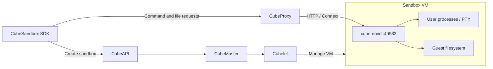
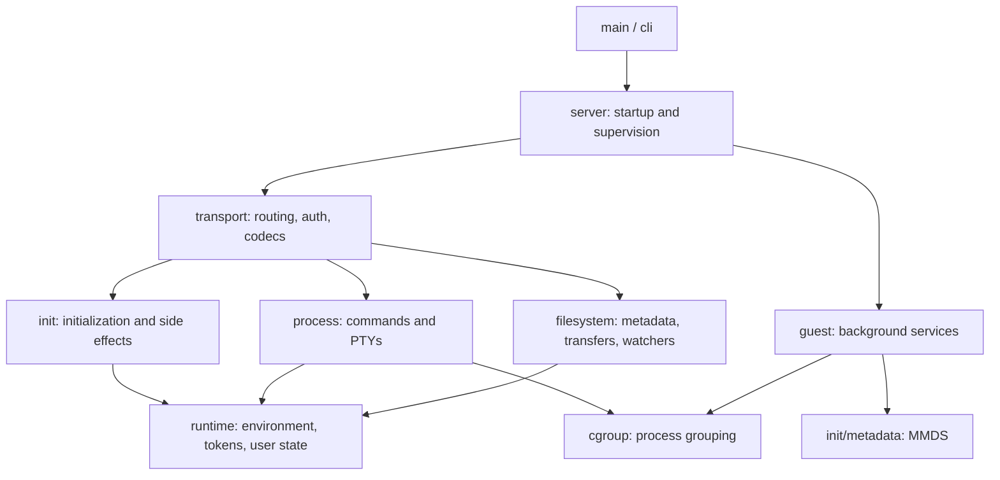
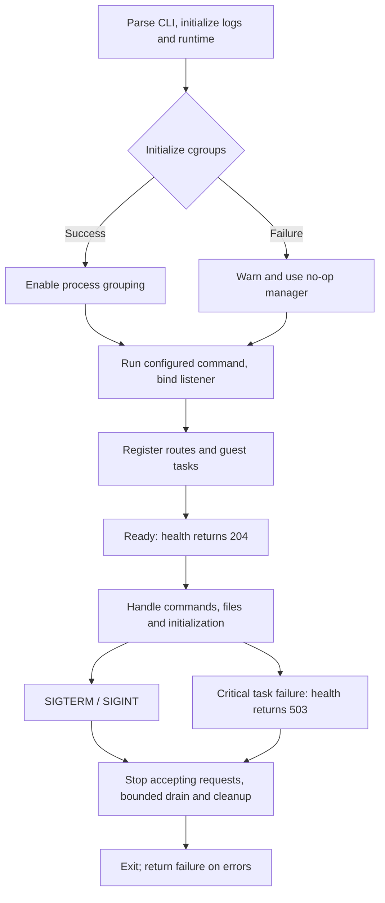

# cube-envd

[中文](README_zh.md)

[API reference](doc/cube-envd-api.md)

`cube-envd` is CubeSandbox's Rust implementation of the sandbox data-plane
daemon. It runs inside the guest and serves command execution, PTYs, filesystem
operations and file transfers through the existing envd HTTP/Connect interfaces.
Its default port is **49983**.

**Upstream Go envd remains the default.** Rust is an explicitly selected
alternative, built from this repository. Selecting the CubeSandbox SDK does not
select the daemon: the template's image determines which implementation runs.

## Contents

- [Features](#features)
- [Architecture](#architecture)
- [Directory structure](#directory-structure)
- [Prerequisites](#prerequisites)
- [Build the component](#build-the-component)
- [Build a sandbox image](#build-a-sandbox-image)
- [Create a template and use the SDK](#create-a-template-and-use-the-sdk)
- [Runtime configuration and diagnosis](#runtime-configuration-and-diagnosis)
- [Tests](#tests)

## Features

- **Process execution**: run commands, stream stdin/stdout/stderr, and manage
  PTYs, signals and exit status.
- **File operations**: inspect metadata, create directories, move and remove
  files, and watch directories; upload, download and compose file content over HTTP.
- **Runtime initialization**: accept `/init` to configure environment variables,
  access tokens, default users and working directories, guest certificates and mounts.
- **Guest services**: expose health checks and resource metrics, manage TCP
  forwarding and idle connections, and fetch MMDS metadata and export logs in
  Firecracker mode.

See the [API reference](doc/cube-envd-api.md) for the implemented HTTP endpoints
and Process/Filesystem protocols. The envd compatibility version does not imply
complete coverage of every upstream feature.

## Architecture

### System context

CubeAPI, CubeMaster and Cubelet manage templates, scheduling and VM lifecycles.
SDK command and file requests reach cube-envd inside the guest through CubeProxy.
Sandbox creation and command execution use separate control and data paths.



### Module boundaries

`server` assembles and supervises services, `transport` adapts protocols, and
`process` and `filesystem` perform domain operations. File bytes travel through
`/files`; Filesystem RPC handles metadata and directory operations.



### Execution flow

The main startup and shutdown paths are shown below. Unavailable cgroup setup
logs a warning and falls back to a no-op manager. Once grouping is enabled, a
later placement failure still rejects the affected process. Critical task
failures make health checks fail and trigger bounded shutdown.



## Directory structure

`cube-envd` is a standalone Cargo project using the repository-root
`rust-toolchain.toml`. The tree below maps source files to their responsibilities;
subdirectory `mod.rs` files define each module's main types and interfaces.

```text
cube-envd/
├── Cargo.toml / Cargo.lock       # Dependencies, features and locked versions
├── Makefile                     # build, fmt, clippy, test and ci targets
├── build.rs                     # Generate protocol bindings and embed version metadata
├── proto/                       # Process, Filesystem and test protocol definitions
├── src/
│   ├── main.rs                  # Entry point, version commands and service startup
│   ├── lib.rs                   # Module exports, generated bindings and version constants
│   ├── cli.rs                   # Command-line parsing
│   ├── server.rs                # Service assembly, readiness, supervision and shutdown
│   ├── runtime.rs               # Environment, token, default user and working directory state
│   ├── error.rs                 # Domain errors and classification
│   ├── telemetry.rs             # Log formatting, collection and buffering
│   ├── cgroup.rs                # cgroup v2 grouping, no-op fallback and cleanup
│   ├── transport/
│   │   ├── mod.rs              # Routes, middleware and request shutdown
│   │   ├── rest.rs             # health, init, files, envs and metrics HTTP handlers
│   │   ├── connect.rs          # Process / Filesystem RPC adapters
│   │   ├── auth.rs / cors.rs   # Tokens, file signatures, user selection and CORS
│   │   ├── encoding.rs         # Message compression and decompression
│   │   ├── framing.rs          # Streaming message frame adapters
│   │   ├── grpc.rs             # gRPC status and trailer handling
│   │   ├── json.rs             # ProtoJSON adapters
│   │   ├── json_error.rs       # JSON error diagnostics
│   │   ├── end_message.rs      # Connect terminal messages
│   │   └── limits.rs / timeout.rs # Parser limits and request timeouts
│   ├── process/
│   │   ├── mod.rs              # Process registry, RPC operations and lifecycle
│   │   ├── linux.rs            # Linux user identity, process and PTY primitives
│   │   ├── input.rs / output.rs # Input writes, output subscriptions and exit events
│   │   └── snapshot_test.rs    # Scheduling and observation fixtures for VM snapshot tests
│   ├── filesystem/
│   │   ├── mod.rs              # Paths, permissions, metadata and directory operations
│   │   ├── download.rs         # Downloads, ranges and conditional requests
│   │   ├── download_metadata.rs # MIME types and content detection
│   │   ├── upload.rs           # Streaming uploads and destination writes
│   │   ├── multipart.rs        # Multipart upload parsing
│   │   ├── compose.rs          # File composition and source cleanup
│   │   ├── watch/mod.rs        # Directory notifications and streaming responses
│   │   ├── watch/polling.rs    # Polling watcher registry and event queues
│   │   └── snapshot_test.rs    # Scheduling and observation fixtures for VM snapshot tests
│   ├── init/
│   │   ├── mod.rs              # Initialization request parsing and state updates
│   │   ├── effects.rs          # CA, NFS and event forwarding configuration
│   │   └── metadata.rs         # MMDS client and metadata parsing
│   ├── guest/
│   │   ├── startup.rs          # Metadata refresh and log export tasks
│   │   ├── port_forward.rs     # TCP listener scanning and socat management
│   │   ├── metrics.rs          # Guest CPU, memory and disk metrics
│   │   └── idle.rs             # HTTP idle connection handling
│   └── conformance/            # Protocol test service behind the test-support feature
├── tests/                      # Rust integration tests, Python scenarios and shared fixtures
└── doc/                        # English/Chinese API references and template / SDK guides
```

Tokio provides async execution, Axum and connectrpc provide the server and
transport layer, buffa supplies protobuf messages, and libc provides Linux
syscalls. `build.rs` uses a dependency-provided protoc; no system protoc is
required. Generated bindings live in Cargo's build output directory. Release
images do not enable `test-support`.

Integration outside this directory lives in the [Dockerfile](../docker/Dockerfile.cube-base-rust),
[shared entrypoint](../docker/cube-entrypoint.sh), [CI workflow](../.github/workflows/build-cube-envd-image.yml)
and [SDK E2E suite](../tests/e2e/sdk_compat/README.md).

## Prerequisites

Run the commands below from the **repository root**.

- Use Linux for daemon execution. Local compilation needs Git, Make, a native
  compiler/linker and the Rust toolchain pinned in
  [`rust-toolchain.toml`](../rust-toolchain.toml), currently **1.89.0**.
- Image and static-binary builds use Docker with Buildx. The Dockerfile supplies
  Rust and build tools, so a host Rust installation is not needed for that path.
  Another architecture's runtime layers need a native builder or configured
  Docker emulation support.
- Template and SDK use requires an existing CubeSandbox platform with working
  API, template builder, compute and proxy services. The build node must be able
  to read the chosen image. A local Docker tag is not automatically available on
  a remote node. See the [deployment guide](../deploy/one-click/README.md).
- The Python SDK requires Python 3.9 or later. Use a virtual environment for the
  examples below.

## Build the component

For a native development build with the pinned host toolchain:

```bash
cargo --version
rustc --version
rustfmt --version
cargo clippy --version
make -C cube-envd build

cube-envd/target/debug/cube-envd -version
cube-envd/target/debug/cube-envd cube-version
cube-envd/target/debug/cube-envd -commit
```

These commands assume `CARGO_TARGET_DIR` is unset. If you set it, the executable
is under that directory's `debug/` subdirectory. `-version` reports the envd
compatibility version, `cube-version` reports the Rust product version, and
`-commit` reports the build's source revision. A compatibility version is not a
claim that every upstream feature is supported. Source archives without Git
metadata must supply `CUBE_ENVD_COMMIT` as the full source commit SHA for native
Cargo builds. For the root Makefile image and binary export targets below, pass
`CUBE_COMMIT=<full source commit SHA>` instead.

For a static release executable, use the repository's Docker export target:

```bash
make cube-envd TARGET_ARCH=amd64
# _output/bin/cube-envd/amd64/envd

make cube-envd TARGET_ARCH=arm64
# _output/bin/cube-envd/arm64/envd
```

| Build architecture | Rust target | Exported executable |
| --- | --- | --- |
| amd64 / x86_64 | `x86_64-unknown-linux-musl` | `_output/bin/cube-envd/amd64/envd` |
| arm64 / aarch64 | `aarch64-unknown-linux-musl` | `_output/bin/cube-envd/arm64/envd` |

`OUTPUT_DIR` changes the export root. Packaging an explicitly selected binary
through `ENVD_LOCAL_PATH` is described in the
[image and bundle instructions](../docker/README.md#export-a-daemon-for-existing-package-inputs).

## Build a sandbox image

```bash
# Existing Go provider.
make cube-base TARGET_ARCH=amd64 CUBE_BASE_IMAGE=cubesandbox-base:go-local

# Explicit Rust provider.
make cube-base-rust TARGET_ARCH=amd64 CUBE_BASE_RUST_IMAGE=cubesandbox-base:rust-local
make cube-base-rust TARGET_ARCH=arm64 CUBE_BASE_RUST_IMAGE=cubesandbox-base:rust-local-arm64

# Add nginx using the existing example's base-image argument.
docker build --build-arg CUBE_BASE_IMAGE=cubesandbox-base:rust-local \
  -t cubesandbox-demo-nginx:rust-local examples/cubesandbox-base-nginx

# Inspect the selected amd64 daemon without starting the guest services.
docker run --rm --entrypoint /usr/bin/envd cubesandbox-base:rust-local -version
docker run --rm --entrypoint /usr/bin/envd cubesandbox-base:rust-local cube-version
docker run --rm --entrypoint /usr/bin/envd cubesandbox-base:rust-local -commit
```

These commands produce local images; they do not publish them. The Rust image
build uses [Dockerfile.cube-base-rust](../docker/Dockerfile.cube-base-rust), the
root toolchain and locked dependencies, and installs the executable as
`/usr/bin/envd`. The image has a `user` account with UID 1000; the SDK's default
command user is still root.

The image runs envd and the optional application CMD under tini and the shared
entrypoint supervisor. Do not start a second envd in CMD. If envd exits, the
supervisor terminates the application and stops the container. It does not
silently restart the daemon or switch to Go. To use Go again, select a Go image
when creating a new template and create sandboxes from that template; this does
not migrate the state of existing Rust sandboxes.

## Create a template and use the SDK

See the [template and SDK guide](doc/usage.md) for image access, template readiness,
SDK configuration, commands, file read/write and cleanup. For request fields and
wire protocols, see the [API reference](doc/cube-envd-api.md).

## Runtime configuration and diagnosis

| Setting | Meaning |
| --- | --- |
| `ENVD_PORT` | Image listen port, default `49983`; keep template probes and exposed ports consistent. |
| `ENVD_LOG_FILE` | Image log destination, default `/var/log/envd.log`; `-` writes to container stdout/stderr. |
| `ENVD_EXTRA_ARGS` | Additional image arguments, parsed as whitespace-separated words, not shell expressions. |
| `ENVD_BIN` | Executable used by the image entrypoint, default `/usr/bin/envd`. |
| `-cgroup-root` | Daemon cgroup root, default `/sys/fs/cgroup`. |
| `-isnotfc` | Select non-Firecracker guest mode; the image entrypoint adds it when absent. |
| `--log-format json` | Select structured daemon logs. |

Rust uses writable cgroup v2 with CPU and memory controllers for its additional
process groups. If initialization fails, including on cgroup v1 or a read-only
hierarchy, it logs the reason and uses a no-op manager. Children inherit the
existing cgroup placement; VM/platform limits remain separate. A placement
failure after successful initialization still rejects the affected child.
TCP forwarding also needs socat and the guest address `169.254.0.21`.

If a template does not become READY, inspect its build job and daemon logs, check
image accessibility and architecture, and confirm the probe targets port 49983.
If SDK calls fail after READY, check API/proxy routing, credentials and the
selected template. Image labels alone do not prove the running daemon's identity;
the maintained acceptance cases inspect its running executable through the SDK.

## Tests

Completed local functional results and sanitized logs are available in the
[functional validation report](doc/validation.md).

Run the complete component checks with `make -C cube-envd ci`.
Run it in the isolated environment defined by the
[component workflow](../.github/workflows/build-cube-envd-image.yml) and
[validation Dockerfile](../docker/tests/Dockerfile.envd-ci). This keeps source
read-only, uses Docker-managed Cargo/build cache volumes and a private writable cgroup, and
removes SYS_TIME before starting test daemons. Do not run the test cgroup bootstrap
on the host or grant access to the host clock to make a test pass. The workflow
sets `CARGO_TARGET_DIR` inside the container; it requires no particular host
directory layout. Native builds use `cube-envd/target` unless you override it.

| Scope | Entry point | Coverage |
| --- | --- | --- |
| Component | `make -C cube-envd ci` | Formatting, Clippy, build, Rust tests and type checking. |
| Process / PTY | [Process tests](tests/process_start_list.rs), [PTY tests](tests/process_pty.rs) | Command lifecycle, input/output and terminal behavior. |
| Filesystem / HTTP files | [Filesystem tests](tests/FILESYSTEM.md), [transfer tests](tests/FILE_TRANSFERS.md) | Metadata, watchers, upload/download and compose. |
| Guest services | [Guest service tests](tests/GUEST_SERVICES.md) | Initialization, metadata, logs, metrics, forwarding and idle handling. |
| Image | [Docker tests](../docker/README.md) | Entrypoint supervision, daemon identity and health. |
| SDK / platform | [SDK E2E](../tests/e2e/sdk_compat/README.md) | New template readiness, sandbox creation, health, commands, files and optional Go/Rust performance comparison. |

VM snapshot cases require the fixtures documented with those tests. A skipped
case is not evidence of compatibility. Cross-compilation and QEMU execution do
not establish native arm64 platform behavior; Firecracker and Cloud Hypervisor
also require their own platform validation.
