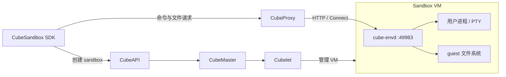
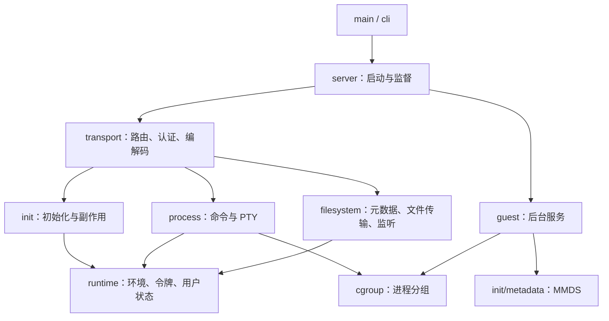
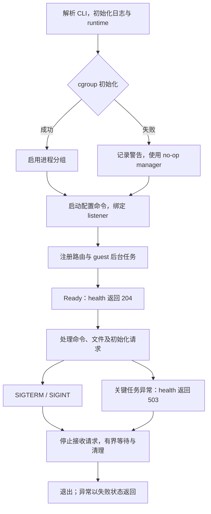

# cube-envd

[English](README.md)

[API 文档](doc/cube-envd-api_zh.md)

`cube-envd` 是 CubeSandbox 使用 Rust 实现的沙箱数据面守护进程。它运行在 guest
内部，通过现有 envd HTTP/Connect 接口提供命令执行、PTY、文件系统操作和文件
传输服务，默认监听 **49983** 端口。

**上游 Go envd 保持默认。** Rust 是从本仓库构建、需要显式选择的替代实现。
选择 CubeSandbox SDK 不等于选择 Rust daemon；实际使用哪种实现由模板镜像决定。

## 目录

- [功能](#功能)
- [架构](#架构)
- [目录结构](#目录结构)
- [前提条件](#前提条件)
- [构建组件](#构建组件)
- [构建沙箱镜像](#构建沙箱镜像)
- [创建模板并使用 SDK](#创建模板并使用-sdk)
- [运行配置与排查](#运行配置与排查)
- [性能](#性能)
- [测试](#测试)

## 功能

- **进程执行**：启动命令，传输 stdin/stdout/stderr，管理 PTY、信号和退出状态。
- **文件操作**：查询元数据、创建目录、移动和删除文件、监听目录变化；通过 HTTP
  上传、下载和拼接文件内容。
- **运行时初始化**：接收 `/init`，设置环境变量、访问令牌、默认用户及工作目录，
  执行 guest 证书和挂载配置。
- **guest 服务**：提供健康检查与资源指标，管理 TCP 转发和空闲连接；在
  Firecracker 模式下获取 MMDS 元数据并导出日志。

接口定义见 [API 文档](doc/cube-envd-api_zh.md)。兼容范围以已实现的 HTTP 接口和
Process/Filesystem 协议为准；envd 兼容版本号不代表完整覆盖上游全部功能。

## 架构

### 系统位置

CubeAPI、CubeMaster 和 Cubelet 管理模板、调度及 VM 生命周期。SDK 的命令与文件
请求经 CubeProxy 到达 guest 内的 cube-envd。控制面创建 sandbox 与数据面执行
命令是两条调用路径。



### 模块边界

`server` 负责组装和监督，`transport` 适配协议，`process` 与 `filesystem` 执行
领域操作。文件字节传输由 `/files` 处理，Filesystem RPC 负责元数据和目录操作。



### 执行流程

下面展示 daemon 的主要启动和关闭路径。cgroup 初始化不可用时记录警告并降级；
已经启用的 cgroup 后续归组失败仍会拒绝对应进程。关键任务异常使健康检查失败，
并触发有界关闭。



## 目录结构

`cube-envd` 是独立的 Cargo 项目，工具链由仓库根目录的 `rust-toolchain.toml`
统一指定。以下为源码导航；各子目录中的 `mod.rs` 定义该模块的主要类型和接口。

```text
cube-envd/
├── Cargo.toml / Cargo.lock       # 依赖、feature 与锁定版本
├── Makefile                     # build、fmt、clippy、test、ci 入口
├── build.rs                     # 生成协议绑定并注入版本信息
├── proto/                       # Process、Filesystem 及测试协议定义
├── src/
│   ├── main.rs                  # 程序入口、版本命令与服务启动
│   ├── lib.rs                   # 模块导出、生成的协议绑定与版本常量
│   ├── cli.rs                   # 命令行参数解析
│   ├── server.rs                # 服务组装、就绪状态、任务监督与关闭
│   ├── runtime.rs               # 环境变量、令牌、默认用户和工作目录状态
│   ├── error.rs                 # 领域错误及错误分类
│   ├── telemetry.rs             # 日志格式、采集与缓冲
│   ├── cgroup.rs                # cgroup v2 分组、no-op 降级与清理
│   ├── transport/
│   │   ├── mod.rs              # 路由、中间件与请求关闭
│   │   ├── rest.rs             # health、init、files、envs、metrics HTTP handler
│   │   ├── connect.rs          # Process / Filesystem RPC 适配
│   │   ├── auth.rs / cors.rs   # 令牌、文件签名、用户选择与 CORS
│   │   ├── encoding.rs         # 消息压缩与解压
│   │   ├── framing.rs          # 流式消息帧适配
│   │   ├── grpc.rs             # gRPC 状态与 trailer 处理
│   │   ├── json.rs             # ProtoJSON 适配
│   │   ├── json_error.rs       # JSON 错误诊断
│   │   ├── end_message.rs      # Connect 终止消息
│   │   └── limits.rs / timeout.rs # 解析限制与请求超时
│   ├── process/
│   │   ├── mod.rs              # 进程注册、RPC 操作与生命周期
│   │   ├── linux.rs            # Linux 用户身份、进程与 PTY 原语
│   │   ├── input.rs / output.rs # 输入写入、输出订阅与退出事件
│   │   └── snapshot_test.rs    # VM 快照测试的调度与观测夹具
│   ├── filesystem/
│   │   ├── mod.rs              # 路径与权限、元数据和目录操作
│   │   ├── download.rs         # 下载、Range 与条件请求
│   │   ├── download_metadata.rs # MIME 类型与内容识别
│   │   ├── upload.rs           # 流式上传与目标文件写入
│   │   ├── multipart.rs        # multipart 上传解析
│   │   ├── compose.rs          # 文件拼接与源文件清理
│   │   ├── watch/mod.rs        # 目录事件监听与流式响应
│   │   ├── watch/polling.rs    # 轮询 watcher 注册与事件队列
│   │   └── snapshot_test.rs    # VM 快照测试的调度与观测夹具
│   ├── init/
│   │   ├── mod.rs              # 初始化请求解析与状态更新
│   │   ├── effects.rs          # CA、NFS 与事件转发配置
│   │   └── metadata.rs         # MMDS 客户端与元数据解析
│   ├── guest/
│   │   ├── startup.rs          # 元数据刷新与日志导出任务
│   │   ├── port_forward.rs     # TCP listener 扫描与 socat 管理
│   │   ├── metrics.rs          # guest CPU、内存与磁盘指标
│   │   └── idle.rs             # HTTP 空闲连接处理
│   └── conformance/            # test-support feature 下的协议测试服务
├── tests/                      # Rust 集成测试、Python 场景与共享夹具
└── doc/                        # 中英文 API 文档和模板 / SDK 使用指南
```

Tokio 提供异步执行，Axum 和 connectrpc 提供服务及传输层，buffa 提供 protobuf
消息，libc 提供 Linux 系统调用。`build.rs` 使用依赖提供的 protoc，无需额外安装
系统 protoc。生成的绑定位于 Cargo 构建输出目录；发布镜像不启用 `test-support`。

镜像及平台集成入口位于组件目录外：[Dockerfile](../docker/Dockerfile.cube-base-rust)、
[共享 entrypoint](../docker/cube-entrypoint.sh)、[CI workflow](../.github/workflows/build-cube-envd-image.yml)
和 [SDK E2E](../tests/e2e/sdk_compat/README_zh.md)。

## 前提条件

下文命令均从**仓库根目录**执行。

- daemon 在 Linux 上运行。本机编译需要 Git、Make、本机编译器/链接器，以及
  根目录 [`rust-toolchain.toml`](../rust-toolchain.toml) 指定的 Rust 工具链，
  当前为 **1.89.0**。
- 镜像与静态二进制构建使用带 Buildx 的 Docker。Dockerfile 提供 Rust 和构建
  工具，此路径不要求宿主安装 Rust。构建其他架构的运行层需要对应原生 builder
  或已配置的 Docker 模拟执行支持。
- 模板和 SDK 使用需要已有 CubeSandbox 平台，其 API、模板构建器、计算与代理
  服务应正常工作。构建节点必须能读取所选镜像；本地 Docker tag 不会自动出现在
  远端节点。平台部署参见[部署说明](../deploy/one-click/README.md)。
- Python SDK 要求 Python 3.9 或更新版本。下文示例使用虚拟环境。

## 构建组件

使用已安装的锁定工具链执行本机开发构建：

```bash
cargo --version
rustc --version
rustfmt --version
cargo clippy --version
make -C cube-envd build

cube-envd/target/debug/cube-envd -version
cube-envd/target/debug/cube-envd cube-version
cube-envd/target/debug/cube-envd -commit
```

这些命令假定未设置 `CARGO_TARGET_DIR`；若已设置，程序位于该目录下的 `debug/`
子目录。`-version` 输出 envd 兼容版本，`cube-version` 输出 Rust 产品版本，
`-commit` 输出构建使用的源码 revision。兼容版本号不代表支持上游所有功能。
没有 Git 元数据的源码归档，本机 Cargo 构建需通过 `CUBE_ENVD_COMMIT` 提供完整
源码提交 SHA；下文根 Makefile 的镜像构建与二进制导出目标则需传入
`CUBE_COMMIT=<完整源码提交 SHA>`。

需要静态发布程序时，使用仓库的 Docker 导出目标：

```bash
make cube-envd TARGET_ARCH=amd64
# _output/bin/cube-envd/amd64/envd

make cube-envd TARGET_ARCH=arm64
# _output/bin/cube-envd/arm64/envd
```

| 构建架构 | Rust target | 导出的程序 |
| --- | --- | --- |
| amd64 / x86_64 | `x86_64-unknown-linux-musl` | `_output/bin/cube-envd/amd64/envd` |
| arm64 / aarch64 | `aarch64-unknown-linux-musl` | `_output/bin/cube-envd/arm64/envd` |

`OUTPUT_DIR` 可修改导出根目录。通过 `ENVD_LOCAL_PATH` 显式选择二进制并打入
部署包的方式，见[镜像与部署包说明](../docker/README.md#export-a-daemon-for-existing-package-inputs)。

## 构建沙箱镜像

```bash
# 现有 Go 实现。
make cube-base TARGET_ARCH=amd64 CUBE_BASE_IMAGE=cubesandbox-base:go-local

# 显式选择 Rust。
make cube-base-rust TARGET_ARCH=amd64 CUBE_BASE_RUST_IMAGE=cubesandbox-base:rust-local
make cube-base-rust TARGET_ARCH=arm64 CUBE_BASE_RUST_IMAGE=cubesandbox-base:rust-local-arm64

# 使用现有示例的基础镜像参数添加 nginx。
docker build --build-arg CUBE_BASE_IMAGE=cubesandbox-base:rust-local \
  -t cubesandbox-demo-nginx:rust-local examples/cubesandbox-base-nginx

# 查看所选 amd64 daemon 的身份，不启动 guest 服务。
docker run --rm --entrypoint /usr/bin/envd cubesandbox-base:rust-local -version
docker run --rm --entrypoint /usr/bin/envd cubesandbox-base:rust-local cube-version
docker run --rm --entrypoint /usr/bin/envd cubesandbox-base:rust-local -commit
```

这些命令只构建本地镜像，不发布镜像。Rust 镜像使用
[Dockerfile.cube-base-rust](../docker/Dockerfile.cube-base-rust)、根工具链和锁定
依赖构建，并将程序安装到 `/usr/bin/envd`。镜像提供 UID 1000 的 `user` 账户，
SDK 默认命令用户仍为 root。

镜像通过 tini 和共享 entrypoint supervisor 运行 envd 及可选的应用 CMD。
不要在 CMD 中再次启动 envd。envd 退出后，supervisor 会终止应用并停止容器，
不会静默重启 daemon 或切换为 Go。若要重新使用 Go，请选择 Go 镜像创建新模板，
再从该模板创建 sandbox；此操作不迁移已有 Rust sandbox 的状态。

## 创建模板并使用 SDK

完整操作步骤见[模板与 SDK 使用指南](doc/usage_zh.md)，包括镜像可达性、模板 READY、
SDK 配置、命令执行、文件读写和资源清理。接口字段与协议见
[API 文档](doc/cube-envd-api_zh.md)。

## 运行配置与排查

| 配置 | 含义 |
| --- | --- |
| `ENVD_PORT` | 镜像监听端口，默认 `49983`；模板探针和暴露端口需保持一致。 |
| `ENVD_LOG_FILE` | 镜像日志位置，默认 `/var/log/envd.log`；`-` 表示输出到容器 stdout/stderr。 |
| `ENVD_EXTRA_ARGS` | 镜像附加参数，按空白分词，不执行 shell 表达式。 |
| `ENVD_BIN` | 镜像 entrypoint 使用的程序，默认 `/usr/bin/envd`。 |
| `-cgroup-root` | daemon 的 cgroup 根目录，默认 `/sys/fs/cgroup`。 |
| `-isnotfc` | 选择非 Firecracker guest 模式；镜像 entrypoint 在未提供时自动添加。 |
| `--log-format json` | 使用结构化 daemon 日志。 |

Rust 使用带 CPU、memory controller 的可写 cgroup v2 创建额外进程分组。
如果初始化失败，例如环境使用 cgroup v1 或只读层级，会记录原因并使用 no-op
manager。子进程继承既有 cgroup 归属，VM/平台限制独立存在；如果已经成功初始化，
后续归组失败仍会拒绝对应子进程。TCP 转发还需要 socat 和 guest 地址 `169.254.0.21`。

模板无法 READY 时，先看构建任务与 daemon 日志，检查镜像可达性、架构和 49983
探针。READY 后 SDK 调用失败时，检查 API/代理路由、凭据及所选模板。
镜像标签不能单独证明运行中 daemon 的身份；现有验收用例通过 SDK 检查其实际
运行的可执行程序。

## 性能

原生 amd64 SDK/CubeProxy 对比中，修复后 Rust 的实测结果如下。
每场景、每个实现共 500 个正式样本，分为五组独立 sandbox 测量，并发为 1。

| 场景 | Rust median ms | Go median ms |
| --- | ---: | ---: |
| 短命令 | 14.348 | 16.026 |
| 4 KiB 读 | 1.813 | 1.451 |
| 4 KiB 写 | 1.475 | 1.319 |
| 4 MiB 读 | 26.965 | 33.636 |
| 4 MiB 写 | 31.493 | 12.764 |

短命令与 4 KiB 读取相对修复前 Rust 均在五组中改善；大文件写入仍明显落后 Go。
这是暖缓存、固定内容下的 SDK 端到端延迟，不代表所有场景或生产性能。
修复前后对比、p95、逐组结果、资源与并发限制见[详细性能报告](doc/performance_zh.md)。

## 测试

已完成的本地功能验证结果及脱敏日志见[功能验收报告](doc/validation_zh.md)。

完整组件检查命令为 `make -C cube-envd ci`。
应在[组件 workflow](../.github/workflows/build-cube-envd-image.yml)和
[验证 Dockerfile](../docker/tests/Dockerfile.envd-ci)定义的隔离环境中运行：源码只读
挂载，使用 Docker 管理的 Cargo/构建缓存卷及私有可写 cgroup，并在启动测试 daemon 前移除
SYS_TIME。不要在宿主执行测试 cgroup bootstrap，也不要为通过测试而授权修改宿主时钟。
workflow 在容器内设置 `CARGO_TARGET_DIR`，不要求宿主具有特定目录结构；
本机构建在没有覆盖设置时使用 `cube-envd/target`。

| 范围 | 入口 | 覆盖内容 |
| --- | --- | --- |
| 组件 | `make -C cube-envd ci` | 格式、Clippy、构建、Rust 测试和类型检查。 |
| 进程 / PTY | [进程测试](tests/process_start_list.rs)、[PTY 测试](tests/process_pty.rs) | 命令生命周期、输入输出及终端行为。 |
| 文件系统 / HTTP 文件 | [文件系统测试](tests/FILESYSTEM.md)、[文件传输测试](tests/FILE_TRANSFERS.md) | 元数据、监听、上传下载和拼接。 |
| guest 服务 | [guest 服务测试](tests/GUEST_SERVICES.md) | 初始化、元数据、日志、指标、转发和空闲处理。 |
| 镜像 | [Docker 测试](../docker/README.md) | entrypoint 监督、daemon 身份和健康检查。 |
| SDK / 平台 | [SDK E2E](../tests/e2e/sdk_compat/README_zh.md) | 新模板就绪、sandbox 创建、健康、命令、文件及可选 Go/Rust 性能对比。 |

VM 快照用例需要对应测试文档说明的夹具。跳过的用例不代表兼容性已验证。
交叉编译和 QEMU 执行不能证明原生 arm64 平台行为；Firecracker 与 Cloud Hypervisor
也需要各自的平台验证。
