# CubeSandbox Chart 组件关系与运行流程

本文说明 `deploy/kubernetes/chart` 的整体架构、组件关系、安装流程和运行期关键链路，帮助交付、运维和后续开发快速理解 Chart 如何还原 One Click 包能力。

## 1. 总体分层

CubeSandbox Chart 按职责分为 7 层：

| 层级 | 组件 | Kubernetes 形态 | 主要职责 |
| --- | --- | --- | --- |
| 控制面 | CubeMaster | Deployment + Service + Secret + PVC/hostPath | 节点注册、模板/rootfs artifact 管理、内置 DB migration、核心调度/元数据能力 |
| 控制面 API | CubeAPI | Deployment + Service | 对外 HTTP API，读写 MySQL，访问 CubeMaster |
| 管理入口 | WebUI | Deployment + Service + ConfigMap | 静态控制台，反向代理 `/cubeapi/` 到 CubeAPI |
| 运维入口 | cubemastercli | Deployment | 面向 `kubectl exec` 的 CLI Pod，交付真实 `cubemastercli` 并注入本 Release 的 CubeMaster endpoint |
| 依赖存储 | MySQL / Redis | 内置 StatefulSet + Headless Service + volumeClaimTemplates/hostPath，或第三方服务 | MySQL 存储业务数据；Redis 存储 CubeProxy / lifecycle-manager 状态 |
| 计算面 | Cube Node Big Pod | DaemonSet | 节点初始化、运行 cubelet/network-agent、透明 egress sidecar |
| 数据面入口 | CubeProxy + 集群 DNS | CubeProxy Deployment；自动把 `*.domain` 写入集群 CoreDNS | HTTP/HTTPS sandbox 入口；集群内域名泛解析 |
| 生命周期 | cube-lifecycle-manager | Deployment + ClusterIP Service | sandbox 自动 pause/resume；通过 Redis 发现 CubeProxy 副本 |


默认完整部署形态：

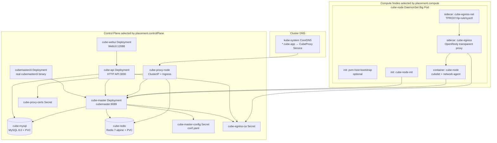

## 2. 资源与镜像职责

### 2.1 控制面

| 资源 | 模板 | 镜像 / 数据 | 说明 |
| --- | --- | --- | --- |
| `cube-master` | `templates/master.yaml` | `images.master` | 复用 `CubeMaster/docker/Dockerfile`；启动时挂载 Chart 渲染的 `conf.yaml`；数据库迁移由 CubeMaster 内置逻辑完成 |
| `cube-master-config` | `templates/master-config-secret.yaml` | `deploy/kubernetes/chart/files/cube-master/conf.yaml` 渲染结果 | 注入 MySQL / Redis / CA 等运行配置 |
| `cube-master-storage` | `templates/master.yaml` / `templates/master-pvc.yaml` | PVC / existingClaim / hostPath / emptyDir | 对应 One Click `/data/CubeMaster/storage` artifact 目录；默认使用 PVC，避免多 control 节点场景下 hostPath 数据绑定单节点 |
| `cube-api` | `templates/api.yaml` | `images.api` | 暴露 HTTP API，连接 CubeMaster 和 MySQL |
| `cubemastercli` | `templates/cubemastercli.yaml` | `images.cubemastercli` | 运维 CLI Pod；只内置真实 `CubeMaster/bin/cubemastercli`，Chart 注入本 Release 的 CubeMaster endpoint |
| `cube-webui` | `templates/webui.yaml` | `images.webui` + nginx ConfigMap | 提供控制台入口，`/cubeapi/` 代理到 CubeAPI |
| `cube-secret` | `templates/secret.yaml` | MySQL / Redis / Proxy 密码 | Chart 管理内置依赖和组件间连接密码 |

### 2.2 内置或第三方 MySQL / Redis

| 模式 | 行为 |
| --- | --- |
| 内置 MySQL | `mysql.host=""` 时安装 `cube-mysql` StatefulSet / Headless Service / volumeClaimTemplates，显式配置 `mysql.persistence.hostPath` 时才使用 hostPath |
| 第三方 MySQL | `mysql.host` 非空时不安装内置 MySQL，CubeMaster / CubeAPI 使用外部地址 |
| 内置 Redis | `redis.host=""` 且控制面或 CubeProxy 需要 Redis 时安装 `cube-redis` StatefulSet / Headless Service / volumeClaimTemplates |
| 第三方 Redis | `redis.host` 非空时不安装内置 Redis，CubeProxy / CubeMaster 使用外部地址 |

### 2.3 计算面 Big Pod

`cube-node` DaemonSet 是计算节点上的 Big Pod。它只调度到
`placement.compute.nodeSelector` 命中的节点，Chart 不负责给节点打 label。

| 容器 | 类型 | 镜像 | 职责 |
| --- | --- | --- | --- |
| `stage-toolbox` | Init Container | `images.node` | 将镜像内 `/usr/local/services/cubetoolbox` **覆盖式**同步到宿主机同名 hostPath（与一键包一致），使 shim/runtime 二进制在 Pod 重建后仍可被存量进程持有 |
| `pvm-host-bootstrap` | Init Container，可选 | `images.pvmHostBootstrap` | 安装/配置 PVM host kernel，必要时协调节点重启 |
| `cube-node-init` | Init Container | `images.nodeInit` | 节点预检和准备：KVM、XFS、内存、glibc、cgroup、cubecow 依赖、CIDR 冲突、CubeMaster 连通性 |
| `cube-node` | 主容器 | `images.node` | 运行 cubelet 和 network-agent；选择 guest kernel；向 CubeMaster 注册节点；挂载 hostPath toolbox |
| `cube-egress` | Sidecar | `images.cubeEgress` | 透明出站代理，提供 loopback admin health |
| `cube-egress-net` | Sidecar | `images.cubeEgressNet` | 管理 host network namespace 中的 TPROXY、ip rule、sysctl 规则 |

关键 hostPath：

| hostPath | 用途 |
| --- | --- |
| `/usr/local/services/cubetoolbox` | 镜像 toolbox 的宿主机副本（与一键包 INSTALL_PREFIX 相同；Cubelet / network-agent / cube-shim / guest kernel）；升级时覆盖，存量 shim 靠 inode 存活 |
| `/data/cubelet` | cubelet 数据和 `cubelet.sock` |
| `/tmp/cube` | network-agent gRPC socket |
| `/data/cube-shim` | cube runtime/shim 运行数据 |
| `/data/snapshot_pack` | snapshot pack 数据 |
| `/data/log` | Cube Node / shim / egress 日志 |
| `/dev`、`/sys`、`/lib/modules` | KVM、内核模块、网络和系统能力 |

### 2.4 数据面入口

| 资源 | 模板 | 职责 |
| --- | --- | --- |
| `cube-proxy-node` Deployment | `templates/proxy-node.yaml` | sandbox HTTP/HTTPS 数据面；`placement.controlPlane`；Pod 网络 |
| `cube-lifecycle-manager` Deployment / Service | `templates/lifecycle-manager.yaml` | sandbox 自动 pause/resume；CubeProxy 通过 `$cube_sidecar_addr` 回调 `/internal/resume`，CLM 经 Redis 发现各 proxy 副本 |
| `cube-proxy-certs` Secret / Certificate | `templates/proxy-node.yaml` | TLS 证书，支持 selfSigned、inline、existingSecret、certManager |
| `cube-proxy-node` Service | `templates/proxy-service.yaml` | ClusterIP，Ingress / 集群 DNS 后端 |
| `cube-proxy-node` Ingress | `templates/proxy-ingress.yaml` | `domain` / `*.domain`；SSL passthrough，TLS 仍在 CubeProxy 终结 |
| cluster DNS | `templates/cluster-dns.yaml` | CubeProxy 启用时把 `*.cubeProxy.domain` rewrite 到 ClusterIP Service |

CubeProxy 数据面入口：

- 运行在 Pod 网络（无 hostNetwork）；nginx 监听 containerPort（默认 80/443）。
- `cube-proxy-node` 复用 `placement.controlPlane`。
- 外部流量：Ingress → ClusterIP Service → Pod；TLS 在 CubeProxy 终结（默认 nginx-ingress SSL passthrough 注解）。
- 集群内 `*.cube.app` rewrite 到 CubeProxy ClusterIP Service。
- CubeProxy 通过 Redis 中的 owner `HostIP:hostPort` 元数据转发到目标 compute 节点 sandbox。
- Chart 不修改 CubeProxy Lua 后端解析语义。

## 3. 默认 DNS 架构

Chart **不**部署自有 CoreDNS。CubeProxy 启用且 `configureClusterDNS=true`（默认）时：

- Helm hook 把 `domain` / `*.domain` rewrite 到 `<release>-proxy-node.<ns>.svc.cluster.local`。
- CubeProxy Service 为 **ClusterIP**，解析结果是 Service VIP。
- `cubeNode.dns.sandbox.followNodeDns=true`：guest 跟随节点/集群 DNS。

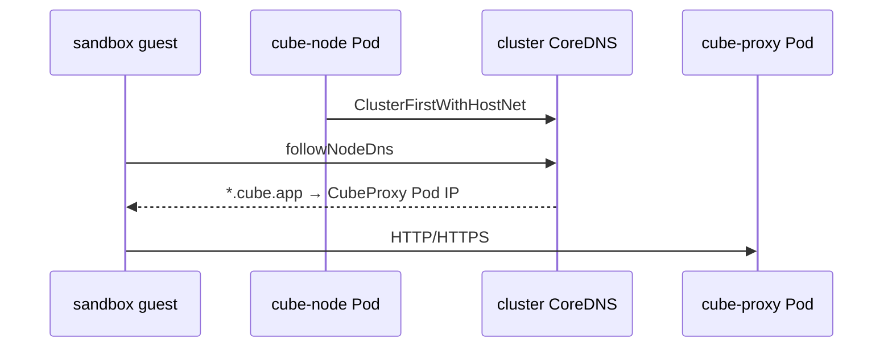

关键点：

- 域名用 `cubeProxy.domain`（默认 `cube.app`）。
- 集群内泛解析不需要单独配 IP。
- 若平台禁止改 `kube-system/coredns`，设 `cubeProxy.configureClusterDNS=false`。
- 外部客户端仍需自行配置公网/Private DNS 或 LB。

## 4. 安装与启动流程

### 4.1 Helm 渲染与校验

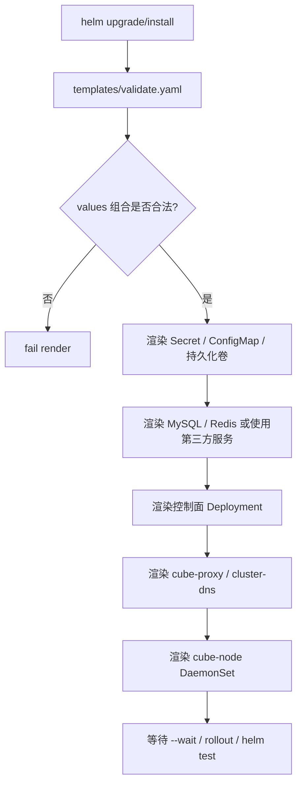

主要 validate 规则：

- `controlPlane.enabled=true` 时必须配置 `placement.controlPlane.nodeSelector`。
- `cubeNode.enabled=true` 时必须配置 `placement.compute.nodeSelector`。
- `cubeProxy.enabled=true` 时必须配置 `placement.controlPlane.nodeSelector`。
- `cubeProxy.configureClusterDNS=true` 时必须配置 `cubeProxy.domain`。
- compute-only 模式必须显式配置 `externalControlPlane.masterEndpoint`。
- PVM host kernel bootstrap 只能在明确命中 selector 的节点上执行。

### 4.1.1 调度与时区

- CubeMaster、CubeAPI、WebUI、cubemastercli、内置 MySQL、内置 Redis、CubeProxy、cube-lifecycle-manager 使用 `placement.controlPlane`。
- `cube-node` 使用 `placement.compute`。
- 所有 Chart 管理的 Cube 容器、sidecar 和 initContainer 都通过 `global.timezone` 注入 `TZ`，默认 `Asia/Shanghai`。

### 4.2 控制面启动

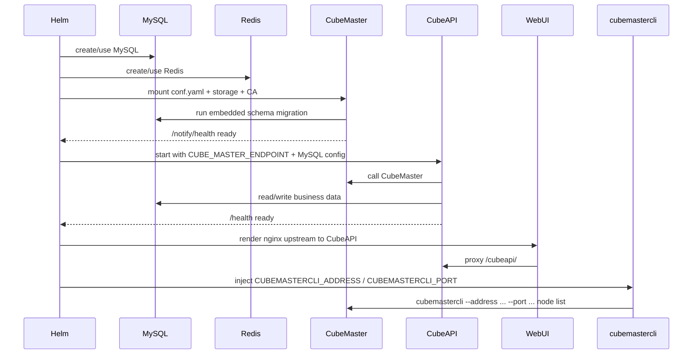

说明：

- Chart 不交付独立 `cube-db-migrate` Job。
- `cubemastercli` 只通过独立 `cubemastercli` 运维镜像交付；不混入 `cube-master` 或 `cube-node` 运行镜像，不提供 `ctl` wrapper。
- CubeMaster 内置 migration SQL，启动时自行迁移。
- CubeMaster artifact storage 默认使用 PVC，可切换到 existingClaim；hostPath 仅适合单节点临时环境。

### 4.3 计算节点启动

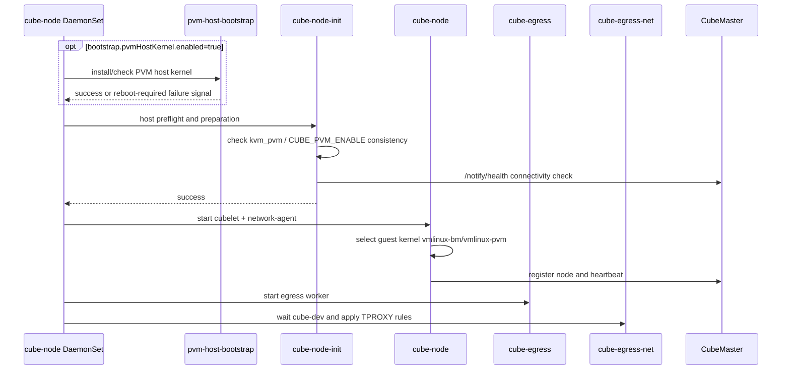

`cube-node` 使用 startupProbe、readinessProbe、livenessProbe：

- startupProbe：等待 cubelet 9999 启动，避免慢启动期间被 liveness 提前杀死。
- readiness/liveness：默认 readiness 为 exec 门禁（9999 + network-agent `/readyz` + sock），确保 `LoadExistingShims` / network-agent `recover()` 完成后再 Ready；liveness 仍检查 cubelet 9999。
- `cube-egress`：检查 `127.0.0.1:9090/admin/v1/health`。
- `cube-egress-net`：检查 `cube-dev`、ip rule、table 100 local route、mangle `TRANSPROXY` 80/443 规则。

计算面镜像升级（不杀存量沙箱）见 [`UPGRADE.md`](UPGRADE.md)。

### 4.4 节点注册与健康链路

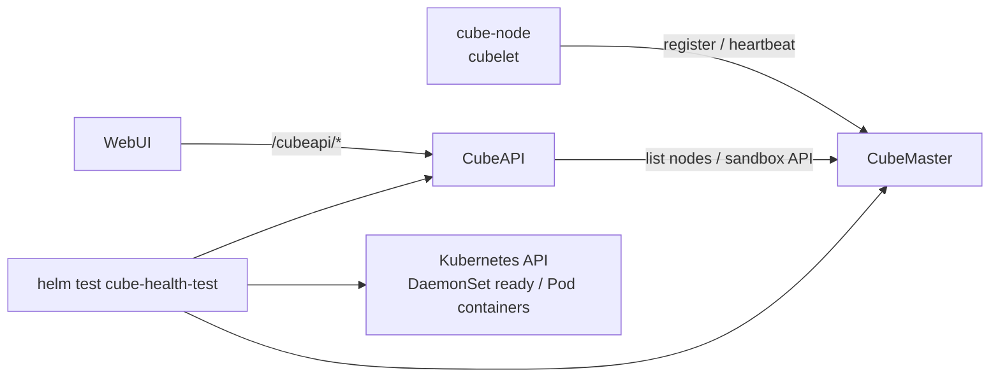

验收关注点：

- CubeMaster `/notify/health` 成功。
- CubeAPI `/health` 成功。
- CubeAPI 能查询到 healthy node。
- `cube-node` DaemonSet ready 数等于命中 selector 的节点数。
- `cube-egress` / `cube-egress-net` sidecar 存在且 Ready。

## 5. 运行期关键数据流

### 5.1 WebUI / API / Master / DB

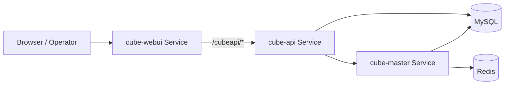

用途：

- 控制台操作、模板管理、sandbox 查询等通过 CubeAPI。
- CubeAPI 读写业务数据到 MySQL。
- CubeMaster 维护节点和任务元数据，使用内置迁移保证 schema。

### 5.2 Sandbox 入口流量

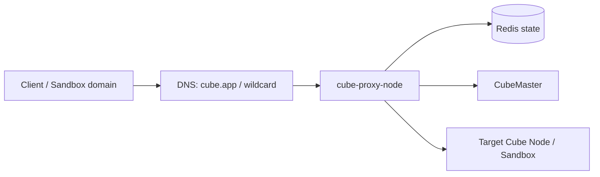

说明：

- `cube-proxy-node` 默认启用，随 Chart 一起安装和卸载。
- 数据面入口为 ClusterIP Service + Ingress（SSL passthrough，TLS 在 CubeProxy 终结）。
- 无 Ingress Controller 时可设 `cubeProxy.ingress.enabled=false`，自行把外部流量接到 Service。
- TLS 支持 selfSigned、existingSecret、inline、certManager。
- 生产环境应提供正式证书，并把 sandbox domain / wildcard DNS 指向 Ingress 入口。
- Chart 在 CubeProxy 启用时自动配置集群内 `*.cube.app`；外部 DNS 仍需使用方配置。计算节点 guest 默认跟随节点 DNS。

### 5.3 Sandbox 出站 egress

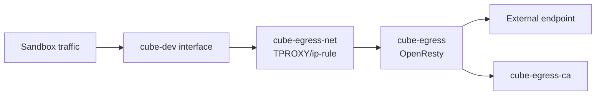

说明：

- `cube-egress-net` 只负责 host network 规则。
- `cube-egress` 负责透明代理和证书能力。
- CubeMaster / CubeAPI / Cube Node 共享 `cube-egress-ca` Secret，保证模板构建、AgentHub/OpenClaw 注入和运行期信任一致。

### 5.4 模板构建

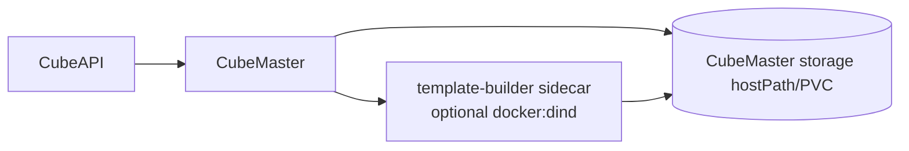

说明：

- `controlPlane.templateBuilder.enabled=true` 时，CubeMaster Pod 内增加 `template-builder` sidecar。
- sidecar 默认使用 `docker:27-dind`，给模板构建提供 Docker/BuildKit 能力。
- 构建产物写入 CubeMaster artifact storage。

## 6. external control plane / compute-only 模式

compute-only 模式对齐 One Click 的计算节点单独交付场景。

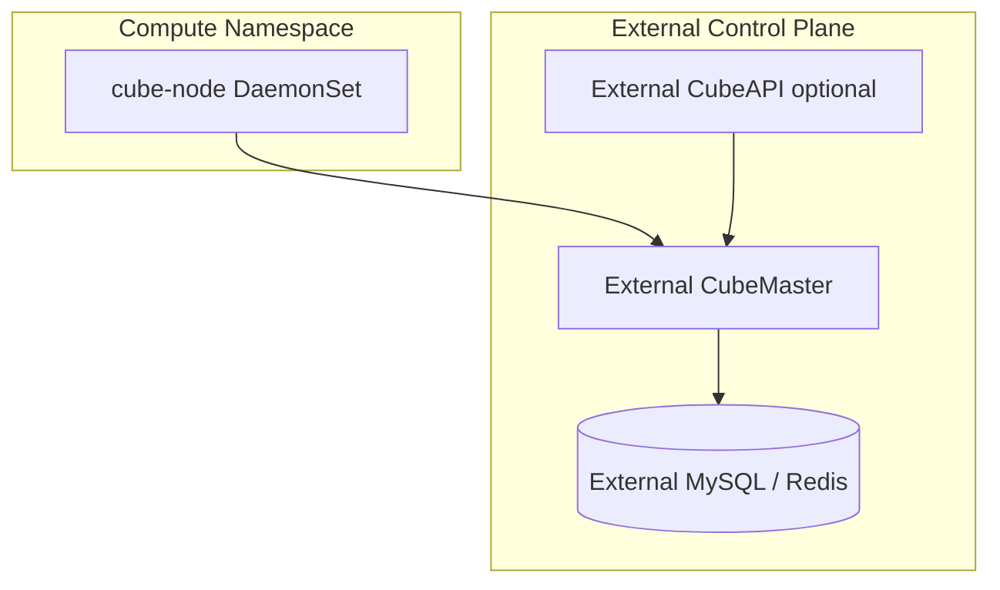

compute-only Release：不安装控制面与 CubeProxy（除非另配）；集群 DNS 注入随 proxy 关闭。

关键 values：

```yaml
controlPlane:
  enabled: false
externalControlPlane:
  enabled: true
  masterEndpoint: <external-master>:8089
  apiEndpoint: http://<external-api>:3000 # optional, for helm test
```

行为：

- 不安装 Chart 内置 Master / API / MySQL / Redis / WebUI。
- `cube-node` 使用 `externalControlPlane.masterEndpoint` 注册外部 CubeMaster。
- 如果配置 `externalControlPlane.apiEndpoint`，Helm test 会校验外部 API 和节点注册。
- 默认不安装 `cube-proxy-node`，避免 compute-only release 留下与外部控制面不一致的数据面资源。

## 7. 关键 values 开关

| values 路径 | 默认 | 影响 |
| --- | --- | --- |
| `global.timezone` | `Asia/Shanghai` | 注入所有 Chart 管理的 Cube 容器、sidecar 和 initContainer 的 `TZ` |
| `storageClass.create` | `true` | 是否创建 Chart 默认的状态组件 StorageClass |
| `storageClass.name` | `cube-cbs-wffc` | CubeMaster storage、内置 MySQL、内置 Redis 默认使用的 StorageClass |
| `storageClass.volumeBindingMode` | `WaitForFirstConsumer` | 多可用区 TKE 集群中等待 Pod 选中 control 节点后再创建 CBS 盘，避免 PV zone 与 control 节点不匹配 |
| `controlPlane.enabled` | `true` | 是否部署内置控制面 |
| `externalControlPlane.enabled` | `false` | 是否使用外部 CubeMaster |
| `placement.controlPlane.nodeSelector` | `cube.tencent.com/role=control` | 控制 CubeMaster、CubeAPI、WebUI、cubemastercli、内置 MySQL、内置 Redis、CubeProxy、cube-lifecycle-manager 调度范围 |
| `placement.compute.nodeSelector` | 含 `allow-pvm-bootstrap=true` | 控制 `cube-node` 调度范围，并要求节点显式允许 PVM bootstrap |
| `cubeProxy.domain` | `cube.app` | sandbox 域名；集群 DNS 与 TLS 共用 |
| `cubeProxy.configureClusterDNS` | `true` | 是否把 `*.domain` 自动写入集群 CoreDNS |
| `cubeNode.dns.sandbox.followNodeDns` | `true` | guest 是否跟随节点/集群 DNS |
| `cubeNode.dns.sandbox.nameservers` | `[]` | 显式覆盖 guest nameserver |
| `cubeNode.pvmGuestKernel.enabled` | `true` | 是否选择 PVM guest kernel；`cube-node-init` 校验该值与 `kvm_pvm` 状态一致 |
| `bootstrap.pvmHostKernel.enabled` | `true` | 是否执行 host kernel bootstrap；默认可能安装 host kernel 并按租约重启计算节点 |
| `bootstrap.pvmHostKernel.bootArgs` | `nopti pti=off` | PVM host kernel 启动参数；当前 `kvm_pvm` 不支持 host KPTI，默认关闭 PTI |
| `bootstrap.nodeInit.*` | 多项 | 控制节点预检、XFS、KVM、CIDR 检测 |
| `mysql.host` | `""` | 非空时使用第三方 MySQL |
| `redis.host` | `""` | 非空时使用第三方 Redis |
| `cubeProxy.enabled` | `true` | 是否部署 CubeProxy 数据面入口 |
| `cubeProxy.ingress.enabled` | `true` | 是否创建 Ingress（SSL passthrough → CubeProxy） |
| `cubeProxy.advertiseIP` | `""` | 可选，仅作外部入口提示；集群内泛解析不依赖它 |
| `lifecycleManager.enabled` | `true` | 是否部署 cube-lifecycle-manager（CubeProxy 启用时必开） |
| `cubeEgress.enabled` | `true` | 是否在 Big Pod 中启用 egress sidecar |
| `webui.enabled` | `true` | 是否部署 WebUI |
| `controlPlane.templateBuilder.enabled` | `false` | 是否启用模板构建 sidecar |

## 8. Helm test 覆盖

`templates/tests/` 提供 Chart 内置验收：

| Test Pod | 覆盖内容 |
| --- | --- |
| `<release>-health-test` | CubeMaster、CubeAPI、节点注册、WebUI、CubeProxy、DaemonSet/Deployment/StatefulSet ready、Egress sidecar 存在性 |
| `<release>-mysql-test` | 内置 MySQL `mysqladmin ping` |
| `<release>-redis-test` | 内置 Redis `PING` |
| `<release>-dns-test` | 集群 CoreDNS 解析 `cube.app` / wildcard → CubeProxy Service |
| `<release>-node-image-test` | `cube-node` 镜像内 runtime 工具和必需 asset |
| `<release>-node-runtime-test` | 计算节点 host runtime：`/dev/kvm`、cubelet socket、network-agent socket |

执行：

```bash
helm test <release> -n <namespace> --timeout 20m --logs
```

## 9. 资源所有权与卸载边界

Chart 管理并随 release 卸载：

- 控制面 Deployment / Service；
- 内置 MySQL / Redis；
- CubeDNS；
- CubeProxy；
- CubeNode DaemonSet；
- CA / TLS / config Secret；
- Helm test RBAC；
- diagnostics ConfigMap。

Chart 不管理：

- 使用方给节点打的 label / taint；
- 第三方 MySQL / Redis；
- 外部 DNS / 负载均衡；
- hostPath 数据目录；
- host kernel、GRUB、udev、fstab 或 XFS 等节点级持久修改。
- One Click 单节点 seed SQL / demo 数据；Chart 依赖真实 `cube-node` Pod 注册节点。

因此卸载后，节点级数据和外部接入应按平台 runbook 清理。
