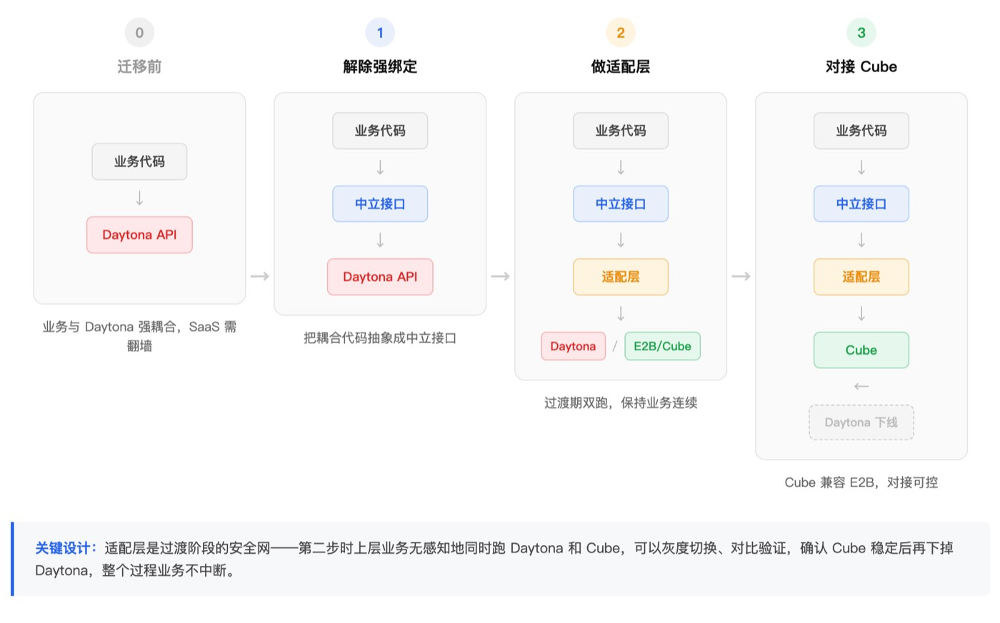

# From Daytona to CubeSandbox: Lenovo's Cloud Agent Sandbox Migration and Evolution

Interviewee｜Lenovo AI R&D Engineer · Li Jian

**Editor's note:** Replacing a cloud Agent product's sandbox from Daytona to Cube looks like just swapping to a faster tool. But in practice, the migration changes three things: the sandbox deployment model (SaaS → self-hosted), the sandbox startup model (per-session rebuild → snapshot restore), and more fundamentally — the sandbox's role in the product architecture (from "tool execution container" to "independent runtime environment").

Lenovo Research Institute AI Lab's cloud Agent product went through two phases: 1.0 treated the sandbox as a "start one per session, dispose when done" isolated execution environment; 2.0 put the daemon and Agent entirely inside the sandbox, making the sandbox a standalone node that can be backed up and rolled back. Between the two phases, the sandbox usage model underwent a fundamental shift. This article documents the complete migration from Daytona to Cube for Lenovo's cloud Agent, as a reference for other migrators.

## 1. Migration Background and Selection

Lenovo Research Institute AI Lab's cloud Agent is a general-purpose product. Users interact with the Agent through conversations, and the Agent performs actions like code execution, file operations, and browser automation during task execution. For data and operational safety, these actions are executed in sandboxes — a new sandbox is launched for each session.

Lenovo Research Institute AI Lab initially used Daytona sandboxes. But as features expanded, more and more pre-installed software was added to the sandbox (Playwright, noVNC, etc.), and startup time eventually exceeded 10 seconds. The engineering team made a series of optimizations to bring it down to about 5 seconds, but at the cost of significantly increased code complexity. And 5 seconds was still not fast enough — especially with planned batch concurrency scenarios where this latency would be amplified into a serious bottleneck. Additionally, the Daytona SaaS version had network restrictions requiring enterprise VPN access.

Slow startup, network restrictions, and SaaS costs — these three issues combined prompted the AI Lab team to find alternatives.

Two core concerns drove the selection: first, domestic technology — they wanted a fully domestic tech stack; second, startup and concurrency performance. Lenovo Research Institute AI Lab then ran a series of performance comparisons, verifying that with the same configuration, Cube's sandbox startup could be compressed from over 10 seconds to under 100 milliseconds.

Cost savings from eliminating SaaS fees, and local deployment eliminating the VPN access requirement. Thus, the AI Lab officially began the migration from Daytona to Cube.

## 2. Migration Process: Three Steps and the Adapter Layer Strategy

The real migration effort wasn't on Cube's side, but in "decoupling from Daytona" — Daytona and E2B (which Cube is compatible with) have incompatible APIs, so simple interface substitution wasn't possible. Lenovo Research Institute AI Lab's overall migration proceeded in three steps:

**Step 1: Decouple hard bindings.** While interface isolation was considered during development, actual code still had不少 coupling with Daytona — sandbox creation parameters, lifecycle management, file operations all carried Daytona-specific conventions. This step involved finding all directly coupled code and abstracting it into neutral interface definitions.

**Step 2: Build an adapter layer.** During the transition, the AI Lab built an SDK-level adapter layer supporting both Daytona and E2B interfaces. Since Cube is E2B-compatible, the adapter layer had the integration point pre-reserved.

In implementation, the adapter layer defined a unified Sandbox Provider base class, with Daytona and E2B interfaces each inheriting from it — effectively implementing two sets of interface calls. One interface was Daytona, extracted from existing code with original call logic preserved; the other implemented the E2B interface. Since the two are largely functionally aligned, they share the same set of abstract methods. Upper-layer business code calls the unified Provider interface without感知 the underlying differences. At runtime, which interface is used is specified by configuration — the底层 can be Daytona or Cube (Cube is E2B-compatible). When adding more sandbox services in the future, just add a new Provider with zero impact on business code.

*Figure 1: Adapter layer architecture, Sandbox Provider inheritance*

**Step 3: Connect the adapter layer to Cube.** With the adapter layer in place, the final step was connecting the E2B-compatible interface to Cube. Since Cube is itself E2B-compatible, this step was relatively manageable.

*Figure 2: Complete migration flow*

## 3. Practices and Pitfalls During Migration

After migrating to Cube, the Playwright, noVNC, and other pre-installed software from the original Daytona sandbox needed to be remade into templates. This process went unexpectedly smoothly — with AI assistance, first generating a Docker image, then converting to a Cube template, was almost a single command. Compared to template creation via Daytona's SaaS process, Cube's local deployment made iteration significantly faster, and debugging was convenient. You could boldly try various pre-installed combinations: putting different types of Agents in templates, adding various tools and software, with very low trial-and-error cost.

Li Jian said that after the 1.0 version launched, the most visible benefit was immediate: startup speed dropped from over 10 seconds to under 100 milliseconds, with users barely感知 any wait; SaaS fees were eliminated, and the VPN issue disappeared. The hidden benefit was in the debugging experience — after local deployment, you could directly inspect sandbox status, logs, and resource usage, making template iteration a rapid trial-and-error process.

The only pitfall was the Volume feature. During the Daytona era, the team used Volume to map S3 buckets for inter-sandbox file sharing. After migrating to Cube, Cube itself had mounting capability, but early versions had a serious limitation: different sandboxes couldn't共同 modify the same mounted directory, or sandbox hibernation would cause snapshot corruption. This significantly impacted Lenovo Research Institute AI Lab's business scenario — in 2.0 mode, multiple sandboxes need to share the same data, and shared writes are a hard requirement. Cube improved this mechanism in the subsequently released v0.6.0, and multi-sandbox shared mounts now work properly.

## 4. From 1.0 to 2.0: The Transformation of the Sandbox's Role

After 1.0 stabilized, the product evolved to 2.0. From 1.0 to 2.0 is not a simple feature iteration but a fundamental change in sandbox usage model.

In the 1.0 phase, the sandbox was a "tool execution container" — a new sandbox per session, disposed when done, stateless, short-lived; in the 2.0 phase, the sandbox became an "independent runtime environment."

The 2.0 architecture originated from a practical constraint. The original design was to install a daemon on the user's local computer, with the server controlling the local AI Agent through it. But this design had two limitations: some users needed a cleaner local environment and didn't want to install Agent dependencies locally; some users didn't have computers suitable for deploying Agents at all. The solution was to put the daemon and Agent entirely inside a Cube sandbox — the server interacts with the Cube-hosting server through another daemon, and the sandbox runs the daemon plus Agent, forming a clean, independent environment. Even without a suitable computer, the system can run through the sandbox.

The real value of this transformation is that the sandbox is no longer a disposable execution container, but a standalone node that can run long-term, be backed up, and be rolled back. A typical 2.0 scenario: at a certain point in a task, the user may want to try different subsequent directions — take a snapshot, and if the path doesn't work, roll back and start over. This "backup-rollback" capability was useless in the 1.0 disposable model, but in 2.0 it became a core capability — transforming the sandbox from "run and discard" to "an experimental ground for repeated exploration."

But 2.0 mode also brought a new problem. Multiple sandboxes run long-term on servers, each with ongoing tasks, and servers occasionally need restarts — after restart, sandboxes without snapshots simply disappear. Li Jian mentioned this is the biggest puzzle Lenovo Research Institute AI Lab has encountered with the current Cube version, and they hope for a focused solution to the problem of sandboxes disappearing after server restarts.

This is indeed a current Cube architectural constraint. Sandboxes are based on MicroVM plus snapshot restore, with runtime state in memory — restart clears it. Filesystem data can be persisted via Volume, but in-memory process state and conversation context currently can only be saved through manual or scheduled snapshots.

The good news is that Cube plans to introduce **cross-machine recovery in v0.7.0 — pausing the sandbox before shutdown, migrating it to another machine for recovery, effectively turning "restart means loss" into "migrate before restart."** Enterprises or teams with similar needs are welcome to follow Cube's upcoming v0.7.0 release.

**Before the feature lands, 2.0 scenarios still require the business side to implement a scheduled snapshot调度 layer as a fallback.**

## 5. Advice for Followers

When asked for advice to teams preparing to migrate from Daytona, Li Jian said: "It's not as troublesome as imagined. Our migration went quite smoothly, and functionally we can basically cover everything Daytona offered." From this migration experience, a few points are worth preparing in advance, as reference for peers evaluating migration:

- **Interface decoupling is the biggest workload.** Daytona and Cube/E2B APIs are incompatible. Before migration, it's best to梳理 all sandbox-interacting code and abstract directly coupled parts into neutral interfaces.
- **The key to migration is building an adapter layer, not direct replacement.** Supporting both interface sets during the transition maintains business continuity and reduces risk.
- **Template creation cost is low — be bold.** After Cube local deployment, with AI assistance, image creation is almost a single command. Don't be intimidated by the prospect of "rebuilding the pre-installed environment."
- **Plan Volume and snapshot strategies in advance.** If your scenario involves long-running sandboxes (similar to 2.0 mode), think through persistence strategy before migration — what data needs Volume persistence, which sandboxes need scheduled snapshots, how to recover after restart. These issues don't surface in 1.0 mode but become core risks in 2.0.

## Conclusion

The most noteworthy aspect of this migration is not the "startup speed from 10 seconds to 100 milliseconds" number — what's more worth recording is how switching sandbox platforms ultimately drove the product architecture's evolution.

In the 1.0 phase, the sandbox was a "start one per session" isolated execution container. After migrating to Cube, because of fast startup, flexible deployment, and low template creation cost, the team naturally began exploring "can we put more things in the sandbox" — leading to the 2.0 "daemon + Agent entirely in sandbox" architecture, transforming the sandbox from "tool execution container" to "independent runtime environment." From "disposable" to "long-running," the sandbox lifecycle management complexity rises a step. This is not just a problem for Cube to solve — it's one that all teams wanting to use sandboxes as runtime environments need to face together.

*Thanks to Lenovo AI Engineer Li Jian for accepting the Cube project team's interview and contributing to this content.*
