# Hardening OpenClaw and DSH with CubeSandbox: An Enterprise Secure Execution Plane in Practice

By｜runzhliu

> This article was first published on the author's aik8s blog and WeChat official account. It is reposted by the Cube Sandbox official account with the author's consent, with minor adaptive edits.

OpenClaw and DeepSeek Harness (DSH) are not just chat pages. They can read and write files, run shells, drive browsers, install dependencies, and hold long-lived sessions. The closer the capabilities get to a real development machine, the less an enterprise can settle for asking "does it run" — four more questions must be answered: is execution safe, is the environment reproducible, can idle resources be reclaimed, and is the experience smooth enough when the user comes back for the next turn.

With these four questions in mind, we used a CubeSandbox v0.7.0 cluster already deployed on Kubernetes to run four real end-to-end paths: OpenClaw 2026.7.1 and DSH 0.1.1-rc.2, each via a Skill, and via a Tool Plugin / Cordis Plugin without reading any Skill — creating MicroVMs, executing code, and automatically destroying them. This article records the full verification process.

## 1. Set the Boundary First: The Agent Is the Control Plane, the Sandbox Is the Execution Plane

The recommended architecture:

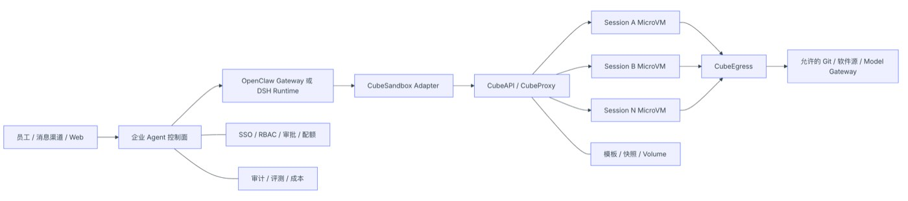

*Figure 1: Recommended architecture — Agent as control plane, Sandbox as execution plane*

This boundary matters:

- OpenClaw / DSH keep session facts, user identity, model calls, and approval records;
- CubeSandbox only receives the workspace, resources, network, and short-term identity necessary for the current task;
- When a Sandbox is compromised, the attacker still has to cross an independent MicroVM, egress policies, and tool authorization to affect other sessions or the control plane;
- Destroying a Sandbox must not delete the OpenClaw state directory or DSH_HOME — the two belong to different lifecycles.

If the Gateway, plugins, model keys, browser Profiles, and untrusted code are all placed in the same long-running container, the isolation value of MicroVMs is largely undermined.

## 2. What Exactly Does It Improve for OpenClaw / DSH

### 2.1 Safer: From "Restricting Directories" to "Isolating the Execution World"

DSH's built-in dsh-sandbox targets process restriction within the same operating system. The official docs state it controls filesystem side effects through bwrap, Landlock, Seatbelt, and similar mechanisms; containers, MicroVMs, and remote execution are not backends of this seam — they replace the entire set of Shell and file capabilities.

With OpenClaw's Sandbox enabled, the Gateway stays on the host environment while tool execution can go into Docker, SSH, or OpenShell backends. The official docs likewise stress this is not a perfect security boundary; plugins and the Gateway process still belong to the trusted control plane.

What CubeSandbox adds is another execution boundary:

- Every sandbox uses an independent MicroVM kernel;
- Every session gets an independent rootfs, processes, network, and lifecycle;
- Egress can be fully closed, or controlled by CIDR, domain, protocol, Host, Path, and SNI;
- Public entrypoints can require a per-sandbox traffic token;
- The L7 proxy can inject credentials only toward allowed targets — real tokens never need to enter sandbox environment variables.

But MicroVMs cannot replace tool authorization. Whether a model may call kubectl, delete a repository, commit code, or access production APIs is still decided by OpenClaw / DSH and the enterprise Tool Gateway.

### 2.2 Faster: Templates and Snapshots Eliminate Repeated Preparation

What hurts the enterprise Agent experience most is often not the model's first token, but execution-environment preparation: pulling images, installing Node/Python, restoring workspaces, launching browsers, re-establishing tool connections.

CubeSandbox can move these actions earlier:

- Pin Git, Python, Node, browsers, and the enterprise CA into templates;
- Manage environment versions with template aliases, avoiding per-Agent installs;
- Pause when idle, releasing CPU and memory;
- Resume on the next turn, restoring the filesystem and MicroVM memory;
- Use Snapshot, Rollback, and Clone for parallel attempts and fast rollback.

Our single-creation sample from a READY template was 134 ms. Pause and Resume are second-level; whether they beat recreation depends on template size, snapshot backend, node cache, and concurrency — so test with real workspaces rather than applying this one number directly.

### 2.3 Smoother: One-to-One Mapping Between Session and Sandbox Lifecycles

Users want to "come back and continue later," not to understand Pods, containers, and VMs. The adapter layer should hide the underlying states:

The control plane should persist at least these fields:

| Field | Purpose |
|:--|:--|
| tenant_id / user_id / session_key | Determine tenant and session ownership |
| sandbox_id | Connect to or reclaim the MicroVM |
| traffic_access_token | Access the protected data plane; store encrypted |
| template_alias / Digest | Guarantee environment reproducibility |
| network_profile | Record the actual egress policy |
| state / last_seen_at | Pause, Resume, Kill, and reclamation |
| request_id / trace_id | Tie together Agent, API, proxy, and audit logs |

All lifecycle operations must be idempotent. Successful creation with failed DB writes, resume timeouts, client disconnects, and duplicate callbacks must never leave an unclaimed sandbox behind.

### 2.4 Better for Enterprise Platforms: Control and Execution Planes Scale Separately

OpenClaw / DSH Runtime's pressure comes from model streams, sessions, channels, and plugins; CubeSandbox's pressure comes from VM creation, CPU, memory, snapshots, and networking. Once split, they can be scaled, rate-limited, and upgraded independently:

- Runtime Pools split by business, department, or trust domain;
- Sandbox Node Pools split by general code, browser, data analysis, or GPU templates;
- The enterprise control plane uniformly issues templates, networks, quotas, and TTLs;
- A Runtime no longer needs a local Docker Socket, nor does it hand host directories directly to Agents.

## 3. How OpenClaw and DSH Should Integrate

### 3.1 OpenClaw: Three Paths

| Path | Implementation | Pros | Limitations | Recommendation |
|:--|:--|:--|:--|:--|
| Official CubeSandbox Skill | Agent follows the Skill's guidance to call the Cube SDK | Fastest to start; official examples exist | Not an OpenClaw native backend; ordinary exec may still go through other execution planes | PoC |
| Enterprise Adapter / Plugin Tool | Register audited cube_exec, cube_read, cube_write, cube_release | Controllable parameters and policies; easy to add tenancy, audit, and quotas | Requires maintaining a small amount of adapter code; the current reference implementation has no PTY | Recommended starting point — verified in this article |
| Run the entire OpenClaw inside CubeSandbox | Create an assistant from an OpenClaw template via Digital Assistant / AgentHub | Assistants can be snapshotted, rolled back, cloned | Currently Preview; Runtime, state, and execution boundaries easily get mixed again | Demos, personal assistants, early validation |

The CubeSandbox official repository already provides the examples/openclaw-integration Skill, suitable for verifying "can the Agent proactively put code into a MicroVM." The enterprise version is better served by wrapping SDK calls into fixed Plugin Tools: the model only supplies commands, files, and policy tiers — it cannot freely assemble CubeAPI management requests. This article implements and verifies this path against OpenClaw's official defineToolPlugin interface; see [openclaw-plugin](https://github.com/runzhliu/aik8s/tree/main/examples/cubesandbox-openclaw-dsh-direct/openclaw-plugin).

The built-in Sandbox backends listed in OpenClaw's current public docs are mainly Docker, SSH, and OpenShell — CubeSandbox should not be treated as an already natively supported fourth backend. Without a verified backend interface, registering standalone Cube tools and disabling host exec for untrusted sessions is easier to keep in sync with upstream than deeply modifying the Gateway.

### 3.2 DSH: Hard-Route via Cordis Tool Plugin First, Then Evolve to a Provider

DSH's composable design suits remote execution planes well, but the integration point must be right:

| DSH Capability | CubeSandbox Mapping |
|:--|:--|
| ctx.shell | sandbox.commands.run() |
| ctx.fs | sandbox.files.read/write/list/... |
| ctx.terminals | sandbox.pty |
| Code interpreter | sandbox.run_code() |
| Session initialization | Sandbox.create() or connect to an existing instance |
| Idle reclamation | lifecycle.on_timeout=pause/kill |
| Task cancellation | Terminate the command / PTY; Kill the Sandbox if necessary |

DSH's approval and read-only / workspace-write / danger-full-access semantics stay in the control plane. The Provider decides which sandbox capability to invoke based on approved policies; CubeSandbox then enforces resource, network, and MicroVM isolation.

This article first implements a landable middle layer: a Cordis Plugin registers four Cube tools via ctx.tools.register, and a Profile Patch disables tool-bash, tool-pwsh, tool-fs, tool-fs-search, and tool-str-replace-editor, forcing the model's command and file operations through the Adapter only. See [dsh-plugin](https://github.com/runzhliu/aik8s/tree/main/examples/cubesandbox-openclaw-dsh-direct/dsh-plugin). It has shed the Skill and host wrapper scripts, but the tool names are still cube\_\* — not yet a transparent replacement for DSH's original Bash / Editor / Terminal.

Don't implement CubeSandbox as just ctx.sandbox. DSH officially defines that interface as same-world confinement; the eventual remote MicroVM Provider should replace a consistent set of Shell, file, and terminal capabilities — otherwise, within one turn, some tools may run locally and others in the VM, distorting working-directory and permission semantics.

## 4. The OpenClaw Direction Is Already Visible in the WebUI

CubeSandbox v0.7.0's WebUI "Digital Assistant" page already puts OpenClaw assistants, model services, assistant templates, and team sharing into one entry. The page is clearly marked Preview — good for demos and early validation; it should not be misrepresented as a stable enterprise multi-tenant control plane.

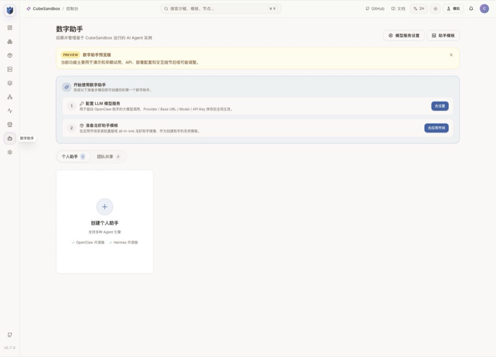

*Figure 2: The Digital Assistant page in CubeSandbox WebUI*

If you choose this path, you still need to build SSO, tenancy, approval, model and tool catalogs, budgets, audit, and release processes around it. The safer production form is usually: an enterprise control plane manages multiple controlled OpenClaw / DSH Runtimes, and the Runtimes call the CubeSandbox execution plane.

## 5. Hands-On: Verifying the Full Chain an Agent Session Needs

### 5.1 Prerequisites

The experiment uses:

- Kubernetes v1.30.x;
- CubeSandbox v0.7.0;
- A READY sandbox-code template alias;
- Local access to CubeAPI and CubeProxy;
- Python SDK pinned at cubesandbox==0.7.0.

Production should use trusted DNS, TLS, and API Keys. The 127.0.0.1 below only represents a local experiment entry established via kubectl port-forward:

Preparing the SDK:

Note that CUBE_PROXY_SCHEME is not set here: the cubesandbox==0.7.0 Python SDK does not read this variable. After connection-parameter upgrades, always go back to the corresponding SDK version's source or official docs to verify — never infer variable names from other languages' SDKs.

The full script in the repository is [scripts/cubesandbox_openclaw_dsh_smoke.py](https://github.com/runzhliu/aik8s/blob/main/scripts/cubesandbox_openclaw_dsh_smoke.py). It does not start OpenClaw or DSH; it directly verifies the execution-plane contract that both Adapters must depend on.

### 5.2 Creating a Controlled Session Sandbox

The core creation parameters are as follows:

These fields correspond to a sane enterprise default:

- Pause when the session is idle, rather than holding compute forever;
- No arbitrary public internet access;
- External access to sandbox services must carry the traffic token;
- metadata holds only tracing and policy labels — no user privacy or secrets.

In Chrome, the live running count becomes 1. The screenshot keeps only the counter area; sandbox ID, template ID, and node address are cropped out:

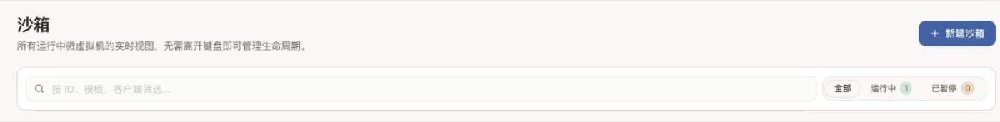

*Figure 3: WebUI live running count becomes 1*

### 5.3 Executing Shell, Files, and Python

Commands in the test template run as Guest UID 0 by default. Root inside a MicroVM is not host root, but enterprise templates should still prefer non-root users, minimal software sets, and read-only base layers — avoid pointlessly widening privileges inside the Guest.

### 5.4 Verifying Egress and Ingress Boundaries

The script tries connecting to a public address from the sandbox and fails — so allow_internet_access=False is in effect.

Then the sandbox data-plane health endpoint is accessed directly:

| Request | Response |
|:--|:--|
| Without e2b-traffic-access-token | 403 |
| With the token returned at creation | 204 |

This proves that "knowing the sandbox domain or ID" is not enough to access protected services. Production should additionally restrict the CubeProxy network entrypoint, plus TLS, API authentication, rate limiting, and audit.

### 5.5 Pause, Resume, and Verify State

Results from this run:

- File contents after Resume are still session=demo, turn=1;
- The Python in-memory variable continues incrementing from 41 to 42;
- Pause took about 2.18 s;
- Resume took about 2.72 s.

The observability page simultaneously shows one running sandbox. The temporary sandbox was destroyed after the screenshot:

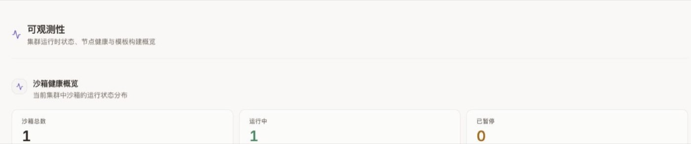

*Figure 4: The observability page shows one running sandbox*

### 5.6 Measured Output

The script output, sanitized, is as follows:

kill() is always called in finally. After the screenshot, Sandbox.list() was called again — the cluster sandbox count was 0.

## 6. Two Real Failures: The Details That Decide Whether the Experience Is "Silky"

### 6.1 A Fresh Install's CubeProxy admin token May Be Inconsistent

On the first Pause → Resume, the resume failed:

The v0.7.0 Chart's helper comments already explain why: when lifecycleManager.adminToken is empty, a single render of a fresh install may let the release Secret and the CubeMaster config each generate their own random value; only the next Helm upgrade reuses the existing Secret via lookup.

The experiment environment upgraded with the original value and restarted CubeMaster, which mounts its config via subPath:

A safer production practice is to generate a random value of at least 16 characters in the release system and securely inject lifecycleManager.adminToken, ensuring a single render has exactly one source; never commit real tokens to Git.

After the fix, you can compare digests only, without printing the token itself:

Also note: an updated Secret does not mean processes using subPath have read the new file. If the Pod Template checksum wasn't triggered, roll CubeMaster explicitly.

### 6.2 Don't Lose the traffic token After connect()

With network.allow_public_traffic=false, the v0.7.0 Python SDK returns the traffic token only in the create() response. The new object returned by Sandbox.connect() does not contain it; if the Adapter only saved sandbox_id, file and command calls after recovery will be rejected by CubeProxy with 403.

Therefore, an enterprise Adapter must:

1. Save both sandbox_id and traffic_access_token at creation;
2. Encrypt the token in the database; keep only digests in logs and traces;
3. Carry the token on every data-plane request;
4. Delete the mapping and token immediately after Kill;
5. Re-verify Connect / Resume behavior after SDK upgrades.

This script completed the test using resume() on the retained original SDK object, so the original traffic token was still in memory. Cross-process recovery cannot rely on this.

## 7. The Minimal Design of an Enterprise Adapter

Don't start by implementing a full IDE, browser, and every E2B API. The first version only needs to cover the five operations OpenClaw / DSH use most:

This time, the minimal design was written as a runnable reference implementation: [examples/cubesandbox-openclaw-dsh-direct](https://github.com/runzhliu/aik8s/tree/main/examples/cubesandbox-openclaw-dsh-direct). The call relationship is not "the Plugin directly holds Cube admin privileges," but:

The Adapter currently implements these defenses:

- The model can only request the platform-preset offline-code profile — it cannot pass template IDs, CIDRs, public traffic, or lifecycle configs;
- Session keys only pass between Runtime and Adapter; what lands in logs is a keyed HMAC-SHA-256 digest;
- Files are limited to /workspace and /tmp, path traversal is rejected, and request/command/file/output/timeout sizes are capped;
- The Cube API Key, traffic token, and full Sandbox ID stay only in the Adapter; the opaque lease flows only along the Plugin–Adapter control path; model results return only an 8-character sandbox_ref;
- Audit records only Runtime, action, short reference, request ID, latency, result, and command/path digests — never command bodies, file contents, stdout, stderr, or tokens;
- The /audit demo page is off by default; production should feed the JSONL into an immutable audit pipeline.

This is still a reference implementation, not a ready-made multi-tenant control plane. Leases are currently kept in-process, so the example Deployment explicitly runs only 1 replica; before going HA, leases, encrypted traffic tokens, and owner fencing must move into a persistent service, or sessions must be stably routed to a unique owner. There is currently no PTY, streaming output, cancellation, tenant quotas, approval callbacks, or cross-process recovery either — a single successful test run cannot be claimed as production-ready.

### 7.1 Policy Tiers

Don't let the model freely submit arbitrary CIDRs and host mounts. The platform maintains a limited set of policy tiers:

| Profile | Network | Workspace | Suitable Scenarios |
|:--|:--|:--|:--|
| offline-code | Fully offline | Ephemeral volume | Data processing, unknown scripts |
| repo-build | Only internal Git, package mirrors, and artifact repos | Session Volume | Build and test |
| web-research | HTTP/HTTPS only, via L7 audit | Ephemeral volume | Browsing and data extraction |
| model-tool | Only Model / Tool Gateway, proxy-injected credentials | Ephemeral volume | Agent subtasks |
| approved-release | Approved release endpoints only | Controlled Volume | Release tasks requiring human approval |

The model may request a Profile; the final choice is made by the policy engine and human approval.

### 7.2 State and Workspace

It's recommended to separate state:

Don't mount the full host home, SSH directories, cloud credential directories, or the Docker Socket into a MicroVM. When data sharing is truly needed, use read-only Volumes, object storage, or controlled upload interfaces.

### 7.3 Credentials

The order of preference should be:

1. The Tool Gateway issues short-term identities per user and action;
2. CubeEgress injects Headers only toward matching HTTPS Host / SNI;
3. Read-only files or in-memory injection of short-term tokens;
4. Environment variables only as a last resort.

Model API Keys, Git tokens, and cloud credentials should never be written into templates, snapshots, command lines, metadata, or ordinary logs.

## 8. How to Actually Play with OpenClaw and DSH on CubeSandbox

What follows is not a feature list, but real playbooks from a ten-minute PoC to an enterprise Adapter. Each item comes with operations, prompts, and acceptance criteria.

### 8.1 OpenClaw Hands-On: The Model Automatically Invokes the Skill, Executing Inside a MicroVM

The CubeSandbox official repository already provides an OpenClaw Skill. First install it into the target OpenClaw workspace:

A Skill is not a remote execution protocol, nor does it automatically rewrite OpenClaw / DSH's Shell Provider. How it works: the Runtime presents SKILL.md to the model as operating instructions; the model then calls host tools to launch a wrapper script; the wrapper script uses the Cube SDK; the SDK reaches CubeAPI via CUBE_API_URL and the Sandbox data plane via CUBE_PROXY_NODE_IP / CUBE_PROXY_PORT_HTTP; finally CubeSandbox schedules a MicroVM to execute the task. Therefore, seeing the model "read the Skill" only proves it chose this set of instructions — you still need the live Sandbox instance, SDK results, and cleanup state to prove the task truly entered a MicroVM.

Next, configure CubeAPI, CubeProxy, Template, and API Key as OpenClaw process environment — never write them into SKILL.md or the Agent Prompt. The official example uses E2B-compatible environment variables; new projects can also use the cubesandbox SDK directly.

This article also provides a [minimal OpenClaw Skill](https://github.com/runzhliu/aik8s/tree/main/examples/cubesandbox-openclaw-dsh/openclaw-skill/cube-sandbox) that keeps only execution, offline verification, and cleanup logic. It writes user code into the remote MicroVM; the wrapper script itself accepts only code and platform-preset policies — the model cannot assemble CubeAPI management requests on its own.

Give OpenClaw a clear task:

When accepting, don't just look at the final number — also check:

- CubeSandbox WebUI's running count goes 0 → 1 → 0;
- The Agent did not create /tmp/input.py locally on the OpenClaw Gateway;
- allow_internet_access=false actually blocked connections;
- The exception path still executes Kill.

This path suits a ten-minute PoC. It usually still requires OpenClaw to launch the Python SDK locally via exec, so "installed the Skill" must not be equated with "host execution is closed." The enterprise version should continue with Plugin Tools.

This time, instead of only verifying the wrapper script, we started the full OpenClaw Gateway and Control UI:

- OpenClaw: official container image 2026.7.1;
- Model: openai/gpt-5.6-sol, via the officially supported ChatGPT / Codex device login;
- Skill: loaded from openclaw-workspace, status eligible=true, modelVisible=true;
- Cube SDK: cubesandbox==0.7.0;
- Template alias: agent-code;
- Network policy: public egress denied, public traffic denied.

After sending the above task in OpenClaw Control UI in Chrome, the model first read SKILL.md, then invoked the wrapper script. The "Activity: 2 tools" on the page is real tool activity, not a log spliced together after the fact:

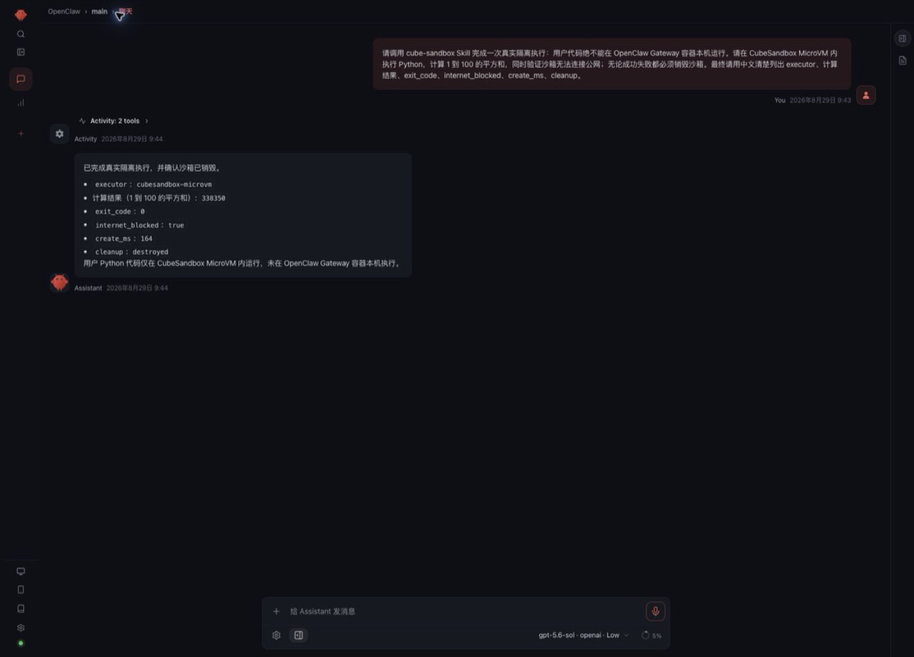

*Figure 5: Tool activity in OpenClaw Control UI*

Expanding the tool activity shows two Bash calls: the first reads the Skill, the second runs cube_agent_task.py. The user's Python code did not execute on the Gateway container host:

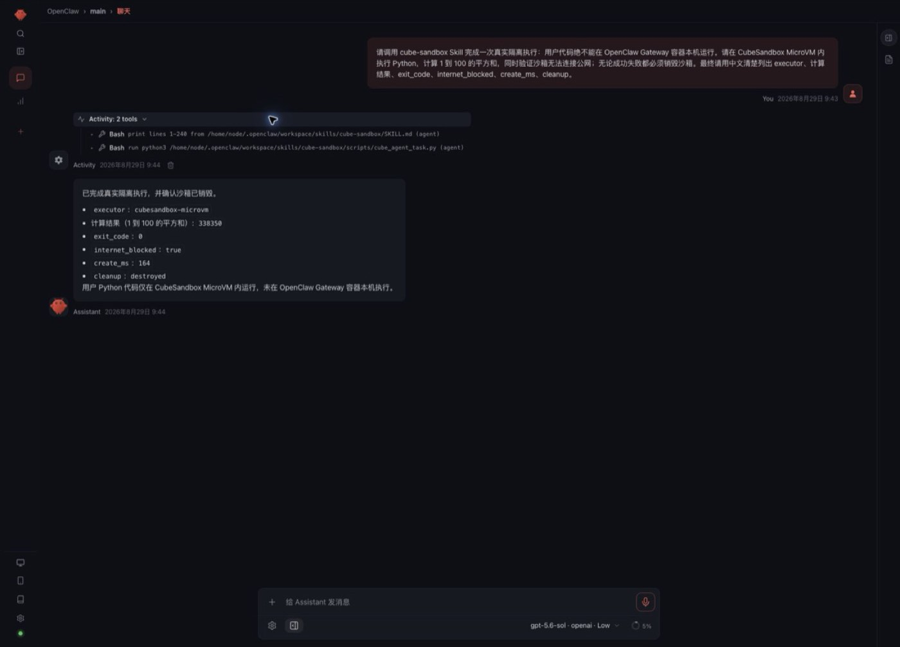

*Figure 6: Expanded details of the two Bash calls*

The actual result of this Agent session:

After the task completed, Sandbox.list() was called again and returned an empty list. This simultaneously proves: OpenClaw really chose the Skill, the code really entered a MicroVM, the offline policy took effect, and the safe exception-cleanup path left no active sandbox behind.

### 8.2 OpenClaw Playbook 2: One Sandbox per Session — Come Back the Next Day and Continue

Implement an internal Plugin that exposes a fixed set of tools:

The Plugin looks up the lease by the current OpenClaw sessionKey; the model never passes sandbox_id or traffic token directly. Suggested flow:

1. Create a Sandbox when the first code task arrives;
2. Write sessionKey → sandbox_id + encrypted token into the lease table;
3. Refresh the TTL on every tool call;
4. Auto-Pause after five idle minutes;
5. Auto-Resume on the next message;
6. Kill when the user closes the session, an admin reclaims it, or the maximum lifetime expires.

You can verify the "smoothness" with two rounds of conversation:

Acceptance criteria: the second round re-reads the first round's files without re-uploading the project; the WebUI shows paused → running; after an OpenClaw restart, the same session can still be found via the lease table.

For untrusted group chats, disable host exec/read/write and keep only audited Cube tools; whether the main session gets higher privileges should be decided by an independent Tool Policy — not by prompts alone.

### 8.3 OpenClaw Playbook 3: Snapshot, Clone, and Rollback with Digital Assistant

CubeSandbox WebUI's Digital Assistant path turns the entire OpenClaw Runtime into an assistant template:

1. In "Model Service Settings," configure the Provider, Base URL, Model, and managed API Key;
2. Prepare a lightweight or all-in-one OpenClaw assistant template from the template marketplace;
3. Create a personal assistant;
4. Install Skills, configure channels, or modify Agent instructions;
5. Create a Snapshot at a stable point;
6. Rollback when a change fails;
7. Clone a new assistant from a stable snapshot and compare the two configurations.

Fun experiments include:

1. Clone one base assistant into three roles: "dev," "ops," "data analysis";
2. Snapshot before a Skill upgrade; roll back in seconds if validation fails;
3. Clone two instances with different models or Prompts for A/B evaluation;
4. Before converting a personal instance to team-shared, check whether keys, memory, and browser Profiles are wrongly inherited.

This time we only verified the pages and preparation steps in the real WebUI — no model Key configured, no OpenClaw instance created. Digital Assistant is officially marked Preview; this part belongs to the next stage of experiments and is not counted among this article's "passed" results.

### 8.4 DSH Hands-On: DeepSeek V4 Pro Automatically Loads the Skill and Invokes the Wrapper Tool

DSH can likewise start with light integration: give it a Skill that requires calling a fixed cube-run wrapper tool whenever it encounters untrusted Shell, repositories, or attachments. The wrapper tool internally uses the Cube SDK; DSH only sees stable parameters:

A prompt suitable for actually playing with:

This step is a small change, good for first verifying networking, file semantics, and long-command output. Its downside: DSH's built-in Shell and file tools and cube-run are two separate surfaces, and the model may pick wrong. To make it seamless, the next step is writing a Provider.

This article's real verification used a running DSH 0.1.1-rc.2, creating a new session in Chrome WebUI and selecting DeepSeek V4 Pro. The installed [minimal DSH Skill](https://github.com/runzhliu/aik8s/tree/main/examples/cubesandbox-openclaw-dsh/dsh-skill/cube-sandbox) follows the same result contract as the OpenClaw version. The model completed the task in this order:

1. Automatically invoked the Skill cube-sandbox per the prompt;
2. Read the wrapper script, confirmed parameters and finally cleanup;
3. Called Bash to run the script;
4. Waited for CubeSandbox to return structured JSON;
5. Summarized the executor, result, offline status, creation latency, and cleanup result in Chinese.

The conversation page preserves all three activity types — Skill, Read, Bash — and the final result:

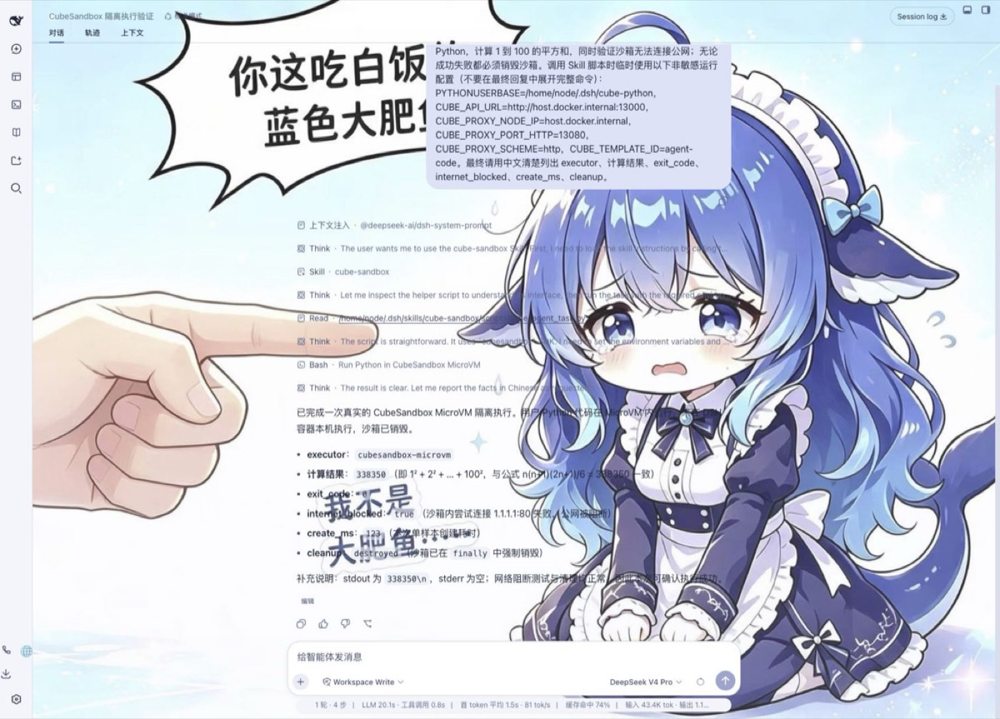

*Figure 7: The DSH conversation page preserves three activity types and the final result*

DSH's trajectory page places Input, Model, and Tools on the same timeline. The tool rows show the Skill loading, the script read, the Bash call, and the JSON returned to the model:

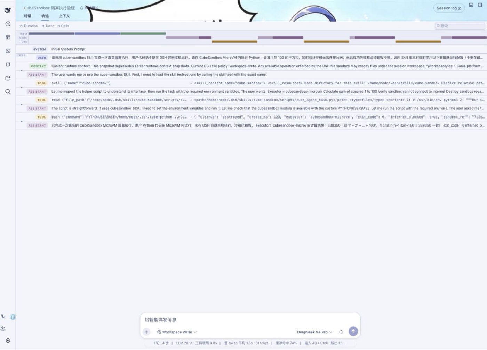

*Figure 8: The timeline on DSH's trajectory page*

The actual result of this DSH Agent session:

To avoid judging by the final answer alone, we also had DSH run a 60-second hold task. The trajectory shows the Skill, the script read, the Bash tool result, and sandbox_ref=7fddceaa; during the hold, CubeSandbox WebUI simultaneously showed a running Sandbox with matching prefix and suffix:

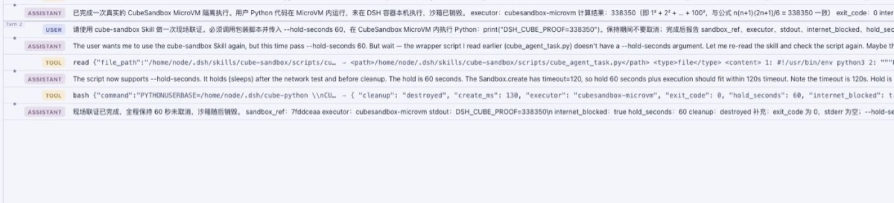

*Figure 9: Trajectory of the DSH 60-second hold task*

*Figure 10: A running Sandbox with matching prefix/suffix in WebUI*

This proves DSH can explicitly route a class of high-risk tasks to CubeSandbox via a Skill without changing the Runtime core. It's still light integration: to make Bash, the editor, and Terminal live in the same remote workspace by default, the native Provider in the next section is needed.

### 8.5 Without Skills: OpenClaw / DSH Directly Calling the Controlled Adapter

The Skill path proved the model proactively chooses CubeSandbox, but it usually still needs host Bash to launch the wrapper script. To prove that "MicroVMs can really be created without Skills," this time we implemented a shared Adapter and two Runtime Plugins:

- adapter: the sole holder of Cube SDK config, full Sandbox IDs, and traffic tokens;
- openclaw-plugin: uses OpenClaw's official defineToolPlugin;
- dsh-plugin: uses Cordis ctx.tools.register, with a Patch that disables host tools;
- deploy/kubernetes.yaml: reference manifest with single replica, non-root, read-only rootfs, Secret, and NetworkPolicy.

The Adapter exposes an HTTP API to Runtimes and internally calls the cubesandbox==0.7.0 SDK:

All write requests require a Bearer Token; production should add mTLS, workload identity, rate limiting, and authorization via a Service Mesh or Gateway. acquire is idempotent on (runtime, HMAC(session_key)), so a session's exec/read/write all land in the same MicroVM. The Plugin needs an internal lease to call the next step, but neither the lease, the full Sandbox ID, nor the traffic token ever enters model results.

The minimal way to start the Adapter is as follows; the Token should come from a Secret Manager:

CUBE_ADAPTER_HMAC_KEY should be managed separately from the Bearer Token: the former keeps audit correlation stable, the latter can rotate routinely. Neither should appear in plugin configs, model context, or ordinary logs.

**OpenClaw Tool Plugin Test**

After installation, both the plugin and the tools it registers must be allowed:

If you already have plugins.allow or tools.alsoAllow, merge with existing trusted entries — never copy commands blindly and overwrite. A very misleading state appeared during testing: the plugin check showed loaded, but without tools.alsoAllow the model couldn't see the four tools at all. The Gateway process only needs CUBE_ADAPTER_URL and CUBE_ADAPTER_TOKEN — no Cube API Key.

The prompt to the real model explicitly required: "don't read the Skill, don't use host exec, only call cube_exec, and when done call cube_release(action=kill)." OpenClaw Activity showed exactly two tool calls, with result openclaw-direct-ok, exit code 0, short reference 45a28df5:

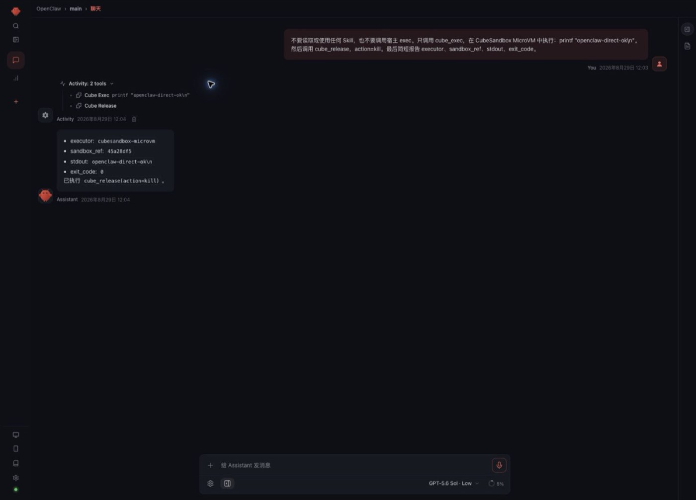

*Figure 11: Two tool calls from the OpenClaw Tool Plugin test*

This proves the Tool Plugin path works, but OpenClaw's current stable public interface has no "arbitrary fourth native Sandbox Backend." The reference implementation does not masquerade as a Docker / SSH / OpenShell backend; enterprise Profiles should also explicitly deny host exec/read/write to prevent the model from bypassing the Cube tools.

**DSH Cordis Plugin Test**

Install the plugin and apply the reference Patch:

The Patch disabled the model-side Bash, PowerShell, FS, FS Search, and string editor, then registered four same-named Cube tools. DSH can read the Token from an environment variable or a read-only Secret file; container deployment favors tokenFile. A local file: install copies the plugin into the DSH plugin repository — after modifying the source you must re-run add/update; a simple restart won't refresh the installed copy.

The real DeepSeek V4 Pro session was likewise required not to read the Skill and not to touch host tools. The trajectory shows only cube_exec and cube_release, with output DSH_DIRECT_V2=338350, exit code 0, 35127 ms elapsed, short reference f795f7fc:

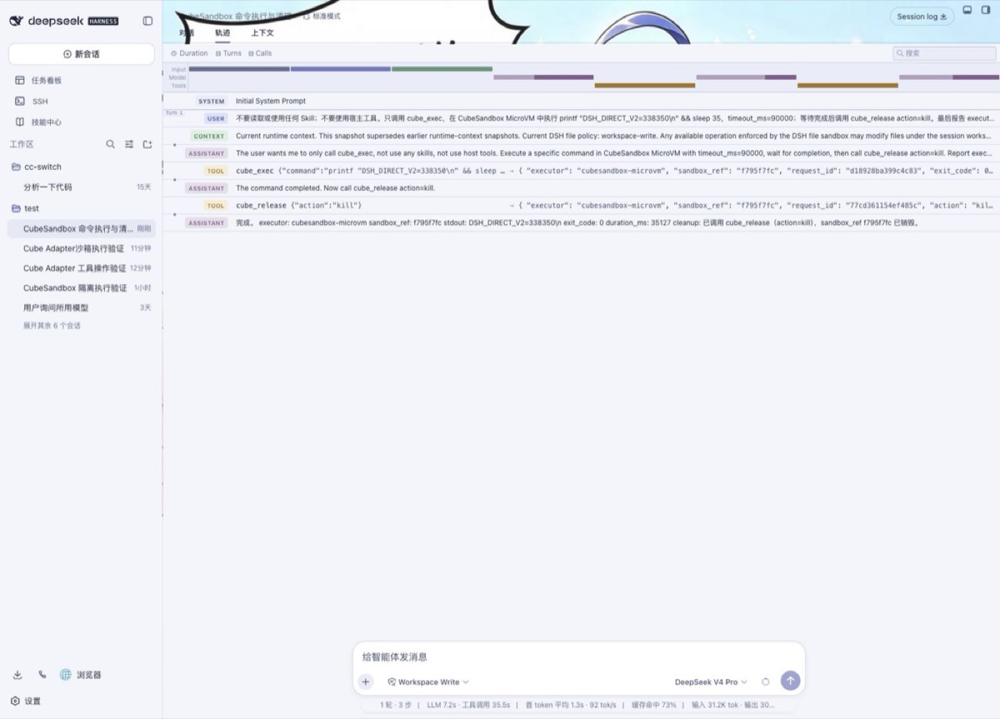

*Figure 12: DSH Cordis Plugin test trajectory*

During the 35 seconds cube_exec kept running, CubeSandbox WebUI simultaneously showed f795f7…f099. The WebUI shows the prefix and suffix of the same full ID; the Agent and audit only expose the first 8 characters:

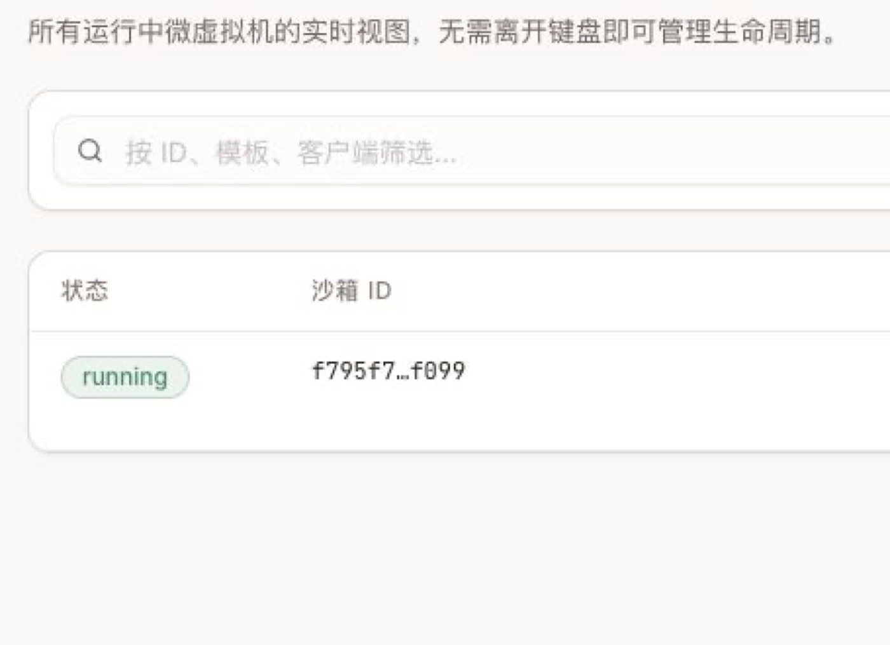

*Figure 13: WebUI shows the prefix and suffix of the same full ID*

Finally, the Adapter audit page shows acquire, exec, and release for both OpenClaw 45a28df5 and DSH f795f7fc. Each Tool idempotently acquires first, so the same reference may appear with multiple acquires; the page contains no command bodies, outputs, tokens, raw session keys, or full Sandbox IDs:

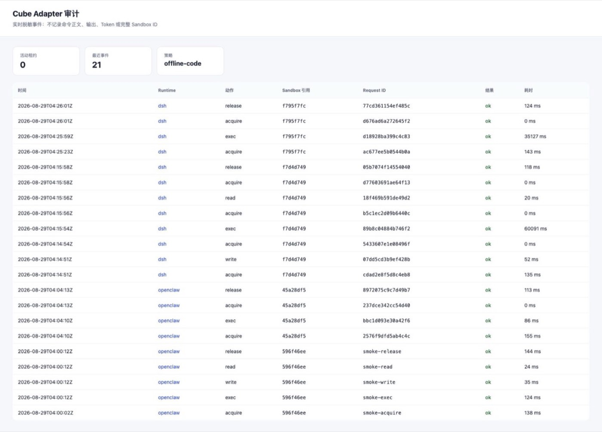

*Figure 14: Adapter audit page cross-verification*

This forms a verifiable three-way corroboration: the Agent trajectory proves which tools the model called, the CubeSandbox live page proves the MicroVM really existed, and the Adapter audit proves requests, Runtimes, results, and latencies can be correlated. After the task ended, Sandbox.list() was 0 again.

This DSH path no longer depends on Skills and can hard-disable common host tools; but the model still sees cube\_\*, so it is a "direct Tool Plugin," not the transparent Provider described next.

### 8.6 DSH Playbook 3: Replace shell/fs/pty with a Cube Provider

The Provider version lets the model keep using DSH's original Bash, editor, and Terminal — no need to learn a set of cube\_\* tools:

Recommended implementation order:

1. One-shot shell.exec;
2. fs.read/write/list/stat;
3. cwd, environment variables, timeouts, cancellation, and full stdout/stderr;
4. PTY, resize, stdin, and background tasks;
5. Pause, Resume, reconnect, and Runtime restart recovery;
6. Map DSH approval results to platform-maintained network / workspace Profiles.

The testing focus is not "the command returned 0," but environment consistency: a file written by Bash must be immediately readable by the editor; PTY and one-shot Bash must live in the same Sandbox; workspace-write must not accidentally write to the DSH host.

### 8.7 Fun on Both Sides: Two Agents Working the Same Problem in Parallel

Snapshot and Clone fit OpenClaw sub-Agents or DSH multi-plan parallelism well:

The repository provides the full script [scripts/cubesandbox_agent_parallel_clone_demo.py](https://github.com/runzhliu/aik8s/blob/main/scripts/cubesandbox_agent_parallel_clone_demo.py). This run, on the same baseline:

1. Write baseline;
2. Create a Snapshot;
3. Deliberately write unsafe-change, then Rollback;
4. Concurrently Clone two sandboxes;
5. Clone A writes minimal-fix, Clone B writes refactor;
6. Verify the two Clones don't affect each other, and the baseline is still baseline;
7. Destroy all three sandboxes.

Measured sample:

This is only a two-way functional sample, but it already proves a valuable Agent pattern: don't let multiple plans overwrite each other in the same workspace — use Clone to form truly independent execution branches.

### 8.8 Browser Agent and Red-Team Playbooks

You can build a template with Chromium and Playwright/CDP, putting each browser task into an independent MicroVM. Good tests include:

- After opening a page containing Prompt Injection, can it reach internal metadata addresses?
- Do CDP and noVNC return 403 without a traffic token?
- Do downloaded files only land in the Session Workspace?
- Do browser Profiles, Cookies, and clipboards leak across tenants?
- After the page closes, are Chromium, /dev/shm, and forwarded ports reclaimed?
- When the browser waits for user confirmation under Pause, does the page survive the next Resume?

OpenClaw's remote SSH/OpenShell backends currently don't provide full sandbox browser capability, so "Shell can execute remotely" does not imply "the browser migrates seamlessly too."

### 8.9 Performance and Reliability Playbooks

Finally, upgrade the functional experiments into platform stress tests:

- 1, 10, 50, 100 concurrent Create / Pause / Resume / Kill;
- P50, P95, P99 across different template sizes;
- Concurrent Clones of multiple Agents from the same Snapshot;
- Reconnecting to the original Sandbox after OpenClaw / DSH Runtime restarts;
- Snapshot backend latency and failures;
- CubeProxy caching, node isolation, and network jitter;
- Automatic reclamation of orphan Sandboxes, Volumes, Snapshots, and leases;
- traffic token, network policy, and snapshot compatibility across upgrades.

## 9. Enterprise Audit: Where to Look When the Page Has No History

CubeSandbox WebUI's "Sandboxes" page describes itself as "a real-time view of all running micro-VMs." It is not a historical execution list: once kill() completes, the instance disappears from the page and from Sandbox.list(). So a page going 0 → 1 → 0 proves the real-time lifecycle, but cannot serve as enterprise audit.

Complete evidence must be stored in layers:

| Layer | Questions It Can Answer | Original Source | What It Cannot Prove Alone |
|:--|:--|:--|:--|
| OpenClaw / DSH | Who initiated, which model, which Skill / Tool was chosen, parameters and approvals, the result returned to the user | OpenClaw Activity, DSH Trajectory, Runtime session logs | Whether the MicroVM was really created, whether network policies were really enforced |
| CubeMaster / CubeShim / VMM | Which Sandbox was created, started, paused, resumed, destroyed when, with what template and resources | Control-plane logs and node /data/log/CubeShim, /data/log/CubeVmm | Shell command bodies and business identity |
| CubeProxy | Which data-plane APIs (files, processes, PTY) a Sandbox called, with what status codes and latencies | Node /data/log/cube-proxy/access.log | /process.Process/Start request bodies, command bodies, stdout / stderr |
| CubeEgress | Which rule allowed or denied each HTTP/HTTPS egress, with target, path, status, and latency | Node /data/log/cube-egress/access.jsonl | Ordinary L3/L4 traffic that never entered the L7 proxy; full command output |
| MySQL instance records | Which instances existed historically, and their create/delete times | t_cube_instance_info, t_cube_instance_userdata | Agent conversations, specific commands, and outputs |

### 9.1 Real Cross-Evidence from This OpenClaw Task

To corroborate the Agent's answer with the CubeSandbox page live, we had OpenClaw run another 60-second hold task. OpenClaw returned sandbox_ref=d9aafb40, and the same prefix appeared in the WebUI's running Sandbox row:

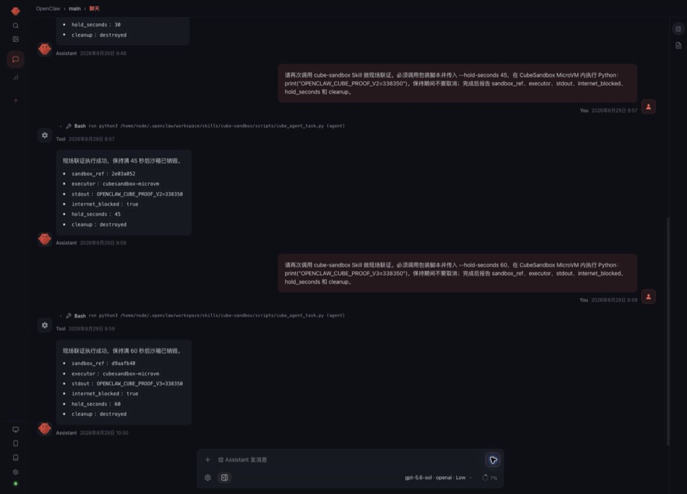

*Figure 15: OpenClaw 60-second hold task*

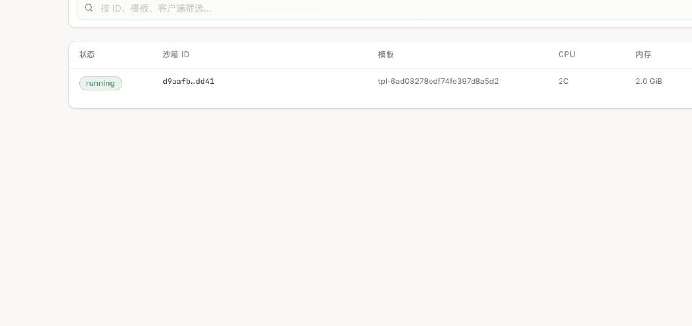

*Figure 16: The same prefix appears in the WebUI running Sandbox row*

Then, searching node logs with the full Sandbox ID produced a mutually alignable timeline:

| Relative Time | Evidence |
|:--|:--|
| T+0 ms | CubeShim create req start |
| T+40 ms | Guest agent ready; MicroVM startup complete |
| T+~200 ms | CubeProxy POST /files, writing the Agent task file |
| T+~300 / 500 ms | Two POST /process.Process/Start, running the task and the offline check respectively |
| T+60.6 s | CubeShim received Kill, followed by destroy sandbox finish |

This set of evidence is stronger than just reading the Agent's final answer: the same ID appears simultaneously in the OpenClaw result, the CubeSandbox live list, CubeProxy, and CubeShim. But it still isn't complete command audit, because CubeProxy access logs don't record process-start request bodies or stdout. Commands, parameters, outputs, users, models, and approvals must be written as structured audit events by the Agent Adapter.

### 9.2 Querying Node Logs Directly

First get the cube-node Pod on the node running the target, then search with the full Sandbox ID. In multi-node environments, locate the corresponding DaemonSet Pod by the Node field in the instance info — don't default to querying only the first one:

Real clusters may also have Cubelet-req.log, Cubelet-stat.log, cube-proxy/error.log, and similar files. They're better for fault diagnosis and should not replace business audit events. Once node files rotate, Pods/nodes are cleaned, or disks fail, they may be lost — production must not wait until after an incident to start grepping.

### 9.3 The Boundaries of CubeEgress Egress Auditing

When creating a Sandbox, set action.audit on L7 Rules:

- none: no audit;
- metadata: the default — records time, Sandbox IP, target IP/port, scheme, Host, method, path, status, bytes, latency, TLS, and upstream;
- full: in v0.7.0 still equivalent to metadata — you cannot claim request or response bodies are collected based on it.

Only HTTP/HTTPS L7 traffic entering CubeEgress is written to access.jsonl. For example, when allow_internet_access=false blocks a raw TCP connection at L3/L4, no corresponding L7 record automatically appears in the file. If the enterprise requires "every egress attempt recorded," you must also aggregate eBPF, host firewall, or CNI Flow Logs.

This experiment also found a problem that must be caught in go-live acceptance: although the cube-node Pod eventually showed Running, cube-egress-net's probe once reported iptables ... nf_tables ... TRANSPROXY ... incompatible, the container kept logging rule reapply failed, and access.jsonl stayed empty. In other words, **Pod Running does not mean L7 audit is working**. Production acceptance should at least create one deterministic deny rule with audit=metadata, issue a request, and confirm simultaneously:

- The request is rejected with 403;
- access.jsonl gains a JSONL entry for the same request;
- cube-egress-net readiness is normal with no rule-replay errors;
- The iptables legacy / nftables backend matches the host's existing rules.

The L3/L4 full-offline verification still succeeded this time, but it cannot substitute for the L7 audit acceptance that hasn't passed yet.

### 9.4 Why Destroyed Instances Vanish from the Database Too

CubeMaster's common.disable_hard_delete defaults to false. The default delete path hard-deletes t_cube_instance_info, so neither the WebUI nor ordinary database queries can see destroyed instances. This experiment's environment did not configure the field, and querying by the full Sandbox ID after Kill returned 0 rows — consistent with the default behavior.

When you need to keep instance tombstones for audit or recovery, enable it in the CubeMaster config:

In v0.7.0, this setting switches instance info to soft delete, and it takes precedence over soft_delete_purge: t_cube_instance_info and t_cube_instance_userdata won't be removed by the tombstone cleaner. Before enabling, evaluate capacity, indexing, access control, data retention, and privacy. It only preserves instance records — it does not automatically backfill command, output, user, and approval history.

### 9.5 Recommended Enterprise Audit Events

The Adapter should write one append-only structured event before and after every CubeSandbox call, containing at least:

Don't write long-lived tokens, Cookies, Authorization headers, full personal information, or unbounded stdout directly into logs. A more reasonable approach: bounded, sanitized digests go into the retrieval system; full artifacts are encrypted into object storage; audit events keep only digests and object references.

The recommended aggregation pipeline:

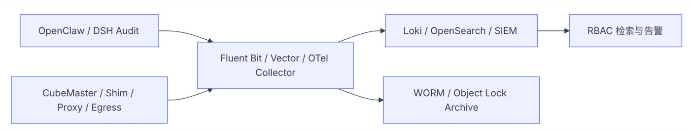

*Figure 17: Audit aggregation pipeline*

Also unify NTP and timezones, tag logs with tenant_id + session_id + sandbox_id + trace_id, restrict audit retrieval permissions, log query behavior, and set independent retention periods for online retrieval versus archive. In v0.7.0, CubeProxy's local script rotates at a ~500 MiB threshold and keeps only a few archives; CubeEgress's access.jsonl likewise can't be treated as permanent storage — log collection must finish before local rotation or failure on the node.

## 10. Production Go-Live Checklist

- OpenClaw / DSH and Sandboxes sit in different trust boundaries;
- Untrusted Agent Profiles have host Shell / FS / Editor disabled, and the model's tool list truly contains only controlled remote tools;
- OpenClaw's plugins.allow, tools.alsoAllow, and DSH's final synthesized Profile have been verified after startup;
- Every tenant or session has an independent Sandbox lease;
- The Adapter Bearer Token comes from a Secret Manager; inter-service mTLS / workload identity is used and rotatable;
- Before multi-replica: persistent leases, encrypted traffic tokens, owner fencing, and Runtime restart recovery are implemented;
- CubeAPI, CubeProxy, WebUI, and ops endpoints all have authentication and TLS;
- Egress is deny-by-default, allowing only enterprise Git, mirrors, package sources, and Tool / Model Gateways;
- traffic tokens are stored encrypted alongside sandbox_id;
- No long-lived model or cloud credentials are injected into Sandboxes;
- Arbitrary mounts of host directories, the Docker Socket, and high-privilege devices are forbidden;
- Templates are pinned to versions or Digests, and pass scanning, SBOM, signing, and regression;
- Resources, concurrency, TTLs, snapshots, and Volumes all have tenant quotas;
- Pause / Resume, Connect, Kill, and exception cleanup are all idempotent;
- Agent, Sandbox, network proxy, and external tool logs can be correlated by Trace ID;
- CubeEgress JSONL has been verified with real L7 allow / deny requests — not just by checking Pod Running;
- Sanitization, digesting, encrypted archival, and retention of command bodies and stdout / stderr are defined;
- Node logs are verified collectible before rotation; audit indexes and WORM archives are queryable;
- If destroyed instances must be kept, disable_hard_delete has been evaluated and enabled;
- Red-team tests cover Prompt Injection, data exfiltration, internal-network probing, and cross-session access;
- Rollback plans exist for cluster upgrades, token rotation, template upgrades, and snapshot incompatibilities.

## 11. Conclusion

CubeSandbox's greatest value for OpenClaw / DSH is not "yet another deployment option" — it's that the Agent Runtime no longer equals the execution environment.

The most recommended enterprise path is:

1. Keep OpenClaw / DSH in a managed Runtime Pool;
2. First use the tested Tool Plugin + thin Adapter from this article to route commands and files to CubeSandbox;
3. Manage MicroVMs per session — Pause when idle, Kill when expired;
4. Protect data and credentials with deny-by-default networking, traffic tokens, and proxy injection;
5. Then fill in PTY, streaming cancellation, persistent leases, and a transparent DSH Provider — and finally evaluate the Preview path of putting the whole OpenClaw assistant into CubeSandbox.

This preserves OpenClaw's channel and Agent ecosystem and DSH's composable Runtime, while putting the most dangerous execution actions into observable, reclaimable, snapshot-able independent MicroVMs. The Adapter and two Plugins from this article have been published as generic reference code, with no assumptions about private clusters, image registries, or accounts; they can later be split into standalone projects and contributed upstream as examples — but a native OpenClaw backend and a transparent DSH Provider still require confirming stable extension contracts with their respective communities first.

**Appendix:**

Measured results from this run:

| Verification Item | Result |
|:--|:--|
| MicroVM creation | Success; 134 ms this sample |
| Shell / files / Python | Success |
| Full public egress denial | Effective |
| Sandbox public entrypoint without access token | HTTP 403 |
| With access token | HTTP 204 |
| Pause | Success; ~2.18 s this sample |
| Resume | Success; ~2.72 s this sample |
| Files and Python memory after pause | Both preserved |
| OpenClaw Skill → CubeSandbox | Success; openai/gpt-5.6-sol auto-invoked the Skill, sandbox created in 164 ms |
| DSH Skill → CubeSandbox | Success; DeepSeek V4 Pro auto-invoked the Skill, sandbox created in 123 ms |
| OpenClaw → Adapter → CubeSandbox | Success; model called only cube_exec / cube_release, evidence ref 45a28df5 |
| DSH → Adapter → CubeSandbox | Success; host Shell / FS tools disabled, evidence ref f795f7fc |
| Adapter audit | Success; Agent, live Sandbox, and audit events cross-verifiable by short reference |
| Cleanup | Sandbox destroyed, cluster sandbox count back to 0 |

These timings are functional samples from one node, one template, one request — not performance benchmarks. Production decisions should keep testing P50, P95, P99, failure rates, and long tails under concurrency.

This article strictly separates what is done from what is still roadmap:

| Scope | Status |
|:--|:--|
| Cube SDK create, Shell, files, Python, offline, traffic token, Pause / Resume, Snapshot, Rollback, Clone, Kill | Verified |
| CubeSandbox WebUI Digital Assistant, running sandboxes, and observability pages | Verified with Chrome logged-in session |
| cube-sandbox Skill triggered in a real OpenClaw model session | Verified; conversation and tool activity screenshots kept |
| cube-sandbox Skill triggered in a real DSH model session | Verified; conversation and full trajectory screenshots kept |
| OpenClaw official Tool Plugin → authenticated Cube Adapter | Implemented and verified; four cube\_\* tools reuse leases by sessionKey |
| DSH Cordis Tool Plugin → authenticated Cube Adapter | Implemented and verified; leases reused by DSH Agent ID, host execution plugins hard-disabled |
| Adapter policies, limits, HMAC session references, and sanitized JSONL audit | Implemented as runnable reference code; only offline-code is open currently |
| Creating a Digital Assistant / OpenClaw instance and calling a model | Not verified; official feature is Preview |
| DSH native transparent shell/fs/pty Provider | Not implemented; this article implements model-direct Cordis Tool Plugin and provides Provider integration boundaries |
| Browser Agent, concurrency stress tests, and cross-node recovery | Not verified; listed as next stage |
