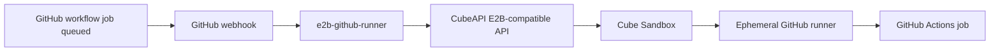

# GitHub Actions Self-Hosted Runner on Cube Sandbox

This guide shows how to run ephemeral GitHub Actions self-hosted runners in Cube Sandbox by using [`jimyag/e2b-github-runner`](https://github.com/jimyag/e2b-github-runner). The runner service listens for GitHub `workflow_job` webhook events, creates a Cube sandbox through the E2B-compatible API, registers an ephemeral runner inside that sandbox, and removes the sandbox when the job exits.

## Integration Target and Version

- Integration target: GitHub Actions self-hosted runner
- Adapter service: [`jimyag/e2b-github-runner`](https://github.com/jimyag/e2b-github-runner)
- Cube requirement: a reachable CubeAPI endpoint, default `http://<cube-host>:3000`
- Runner mode: repository-level or organization-level self-hosted runner



## Prerequisites

- A running Cube Sandbox deployment. See [Quick Start](../quickstart.md), [PVM Deployment](../pvm-deploy.md), or [Bare-Metal Deployment](../bare-metal-deploy.md).
- A Cube template that can run the GitHub Actions runner process. The template image should include basic build tools needed by your workflows, such as `bash`, `curl`, `tar`, `git`, and any language runtimes used by your jobs.
- Network access from `e2b-github-runner` to CubeAPI, and data-plane access to CubeProxy. For production, configure wildcard DNS and TLS as described in [HTTPS & Domain Resolution](../https-and-domain.md).
- A public HTTPS endpoint that GitHub can call for webhook delivery.
- A GitHub App or token with permission to receive `workflow_job` webhook events and create self-hosted runner registration tokens.

Before wiring the GitHub App or webhook, verify the Cube control plane and data plane separately:

```bash
# CubeAPI control plane
curl -fsS http://<cube-host>:3000/health

# CubeProxy HTTPS data plane port on the client host that runs e2b-github-runner
nc -vz <cube-proxy-host> 443

# Wildcard sandbox DNS must resolve to the CubeProxy host.
# Replace <sandbox-id> with an actual sandbox ID from your deployment.
getent hosts 49983-<sandbox-id>.cube.app
```

If CubeProxy is exposed on a non-default HTTPS port, such as `10443`, publish that port in the sandbox domain returned by CubeAPI:

```bash
export CUBE_API_SANDBOX_DOMAIN=cube.app:10443
sudo systemctl restart cube-sandbox-cube-api.service
```

This is required because E2B-compatible clients build sandbox data-plane URLs from the domain returned by CubeAPI. If the domain is only `cube.app`, clients will use the default HTTPS port `443` even when CubeProxy is actually listening on `10443`.

## GitHub App and Token Permissions

Prefer a GitHub App installation token over a long-lived personal access token. Install the app only on the repositories that should be allowed to launch Cube-backed runners.

Minimum permissions are split by function:

- Webhook delivery: subscribe to the `Workflow jobs` event. For GitHub Apps, GitHub requires at least read-level access to the `Actions` repository permission to receive `workflow_job` events.
- Repository-level runners: the REST API that creates repository runner registration and remove tokens currently requires `Administration` repository permission with `Read and write` access. This is broader than the webhook permission, so restrict the GitHub App installation or fine-grained token to the target repositories only.
- Organization-level runners: prefer `Self-hosted runners` organization permission with `Read and write` access instead of broad organization administration scopes.

The service uses GitHub's runner registration token APIs for the configured scope.

## Configure the Runner Service

Clone and configure the adapter service:

```bash
git clone https://github.com/jimyag/e2b-github-runner.git
cd e2b-github-runner
```

Required environment variables:

```bash
export E2B_API_URL="https://<cube-host>:3000"
export E2B_API_KEY="<cube-api-key-or-dummy>"
export E2B_DOMAIN="<cube-sandbox-domain>"
export SANDBOX_TEMPLATE_ID="<cube-template-id>"

export GITHUB_TOKEN="<github-token>"
export GITHUB_WEBHOOK_SECRET="<random-webhook-secret>"
```

For local unauthenticated deployments, `E2B_API_URL` can use `http://<cube-host>:3000`. For production, use HTTPS to protect the API key and sandbox management commands from network eavesdropping.

Generate a strong webhook secret instead of choosing a short human-readable string:

```bash
export GITHUB_WEBHOOK_SECRET="$(python3 -c 'import secrets; print(secrets.token_hex(32))')"
```

Use repository scope:

```bash
export RUNNER_SCOPE="repo"
export GITHUB_OWNER="<repo-owner>"
export GITHUB_REPO="<repo-name>"
```

Or use organization scope:

```bash
export RUNNER_SCOPE="org"
export GITHUB_ORG="<org-name>"
```

Common optional settings:

```bash
export HTTP_ADDR=":8080"
export STATE_DIR="./var/runners"
export RUNNER_LABELS="self-hosted,e2b"
export SANDBOX_TIMEOUT_SECONDS="3600"
export MAX_CONCURRENT_RUNNERS="1"
```

Notes:

- `E2B_API_URL` points to CubeAPI, not CubeProxy.
- `E2B_API_KEY` can be any non-empty value for a local unauthenticated Cube deployment. If Cube authentication is enabled, use a real key accepted by your auth callback.
- `E2B_DOMAIN` must match the sandbox domain published by CubeAPI. The default quick-start domain is usually `cube.app`; production deployments should use a domain with wildcard DNS. If CubeProxy uses a non-default HTTPS port, include the port, for example `cube.app:10443`.
- `RUNNER_LABELS` must match the labels used by your GitHub Actions workflow.

## Start the Runner Service

Run the service locally:

```bash
go run ./cmd/runnerd
```

Check the health endpoint:

```bash
curl -fsS http://127.0.0.1:8080/healthz
```

For production, run the service under a process manager or package it as a container. Keep `STATE_DIR` on persistent storage so control-plane logs survive service restarts.

## Expose the GitHub Webhook Endpoint

GitHub must be able to reach the service at:

```text
POST https://<public-host>/webhooks/github
```

For local testing, expose port `8080` with a tunnel:

```bash
ngrok http 8080
```

or:

```bash
cloudflared tunnel --url http://127.0.0.1:8080
```

For production, put the service behind your ingress or reverse proxy and terminate HTTPS there.

## Configure the GitHub Webhook

In the target repository or organization, add a webhook:

- Payload URL: `https://<public-host>/webhooks/github`
- Content type: `application/json`
- Secret: the exact value of `GITHUB_WEBHOOK_SECRET`
- Events: select `Workflow jobs`
- Active: enabled

The service only acts on `workflow_job` events. Other event types can be ignored.

## Use the Runner in a Workflow

Add a workflow that targets the configured labels:

```yaml
name: cube-runner-smoke

on:
  workflow_dispatch:

jobs:
  smoke:
    runs-on: [self-hosted, e2b]
    steps:
      - name: Print runner info
        run: |
          uname -a
          whoami
          pwd
```

Expected flow:

1. GitHub queues a job with labels `self-hosted` and `e2b`.
2. GitHub sends a `workflow_job.queued` webhook.
3. `e2b-github-runner` validates the webhook signature and creates a Cube sandbox.
4. The service requests a GitHub runner registration token and starts an ephemeral runner inside the sandbox.
5. GitHub assigns the job to the sandbox runner.
6. When the runner exits, the service cleans up the sandbox.

Successful GitHub Actions logs should show both the self-hosted runner identity and the sandbox metadata exported by the runner hooks:

```text
Runner name: 'e2b-80599715321'
Machine name: 'tpl-5095'
RUNNERD_JOB_STARTED
Notice: sandbox_id=a1c386f2ca3144f1868b1be93f0a9251 runner_request_id=80599715321 runner_name=e2b-80599715321
Run uname -a
Linux tpl-5095 6.6.1199-0009-03_2.0.1 ... x86_64 GNU/Linux
RUNNERD_JOB_COMPLETED
```

On the runner service side, a healthy request reaches the same milestones:

```text
workflow_job webhook parsed action=queued job_name=smoke labels=["self-hosted","e2b"]
matched runner profile profile=ubuntu-24-04
starting sandbox runner id=80599715321 runner_name=e2b-80599715321
sandbox runner started sandbox_id=a1c386f2ca3144f1868b1be93f0a9251 pid=9
runner is listening for jobs id=80599715321
workflow_job completed handled job_id=80599715321 status=completed
```

## Troubleshooting

Check active runner requests:

```bash
curl -fsS http://127.0.0.1:8080/runners | jq
```

Inspect per-request state and logs. The following paths assume the default `STATE_DIR=./var/runners`; if you set an absolute `STATE_DIR`, replace `./var/runners` with that directory:

```bash
cat ./var/runners/<request_id>/state.json
cat ./var/runners/<request_id>/control.log
cat ./var/runners/<request_id>/stdout.log
cat ./var/runners/<request_id>/stderr.log
```

Common issues:

| Symptom | Likely cause | Fix |
| --- | --- | --- |
| `invalid signature` | Webhook secret mismatch | Use the same value in GitHub and `GITHUB_WEBHOOK_SECRET` |
| Job stays queued | Workflow labels do not match `RUNNER_LABELS` | Use `runs-on: [self-hosted, e2b]` or update `RUNNER_LABELS` |
| Runner registration fails | GitHub token lacks runner permissions | Check repository `Administration: Read and write` or organization runner permissions |
| Sandbox creation fails | CubeAPI URL, API key, or template ID is wrong | Verify `E2B_API_URL`, `E2B_API_KEY`, and `SANDBOX_TEMPLATE_ID` |
| File upload fails with `dial tcp <proxy-ip>:443: connect: connection refused` | CubeProxy is listening on a non-default HTTPS port, but CubeAPI publishes a sandbox domain without that port | Set `CUBE_API_SANDBOX_DOMAIN=<domain>:<https-port>` and restart `cube-api` |
| Runner cannot reach GitHub | Sandbox image or network policy blocks outbound access | Allow outbound HTTPS to GitHub and include required tools in the template |
| Data-plane connection fails | Wildcard DNS or TLS is not configured | Follow [HTTPS & Domain Resolution](../https-and-domain.md) |
| `runner concurrency limit reached` | Active runner count reached `MAX_CONCURRENT_RUNNERS` | Increase the limit or wait for existing jobs to finish |

GitHub Actions job logs are visible in the normal Actions UI after the runner is registered and the job starts. Sandbox creation, webhook validation, runner registration, and cleanup errors are service-side control-plane logs, so check `STATE_DIR` and the `runnerd` process logs first.

When reporting issues upstream, include the smallest log set that shows each layer:

- GitHub delivery ID and `workflow_job` action, for example `workflow_job.queued`.
- Runner service logs from webhook receipt through sandbox startup or failure.
- The runner request control log or state file.
- CubeAPI and CubeProxy logs collected from the Cube host.
- The relevant Cube runtime environment, especially `CUBE_API_SANDBOX_DOMAIN`, `CUBE_PROXY_HTTP_PORT`, and `CUBE_PROXY_HTTPS_PORT`.

For one-click deployments, the diagnostic collector can gather the Cube-side logs and redacted configuration:

```bash
sudo /usr/local/services/cubetoolbox/scripts/cube-diag/collect-logs.sh \
  --module cube-api \
  --module cube-proxy \
  --module cubelet \
  --module runtime \
  --module env \
  --module configs \
  --lines 1000 \
  --dir /tmp/cube-diag-github-runner

cd /tmp
sudo tar czf cube-diag-github-runner.tar.gz cube-diag-github-runner
```

## References

- Sample repository: [`jimyag/e2b-github-runner`](https://github.com/jimyag/e2b-github-runner)
- Cube docs: [Quick Start](../quickstart.md), [HTTPS & Domain Resolution](../https-and-domain.md), [Authentication](../authentication.md)
- GitHub docs: [Using self-hosted runners in a workflow](https://docs.github.com/en/actions/hosting-your-own-runners/managing-self-hosted-runners/using-self-hosted-runners-in-a-workflow)
- GitHub docs: [Autoscaling with self-hosted runners](https://docs.github.com/en/actions/hosting-your-own-runners/autoscaling-with-self-hosted-runners)
- GitHub docs: [Webhook events and payloads](https://docs.github.com/en/webhooks/webhook-events-and-payloads)
