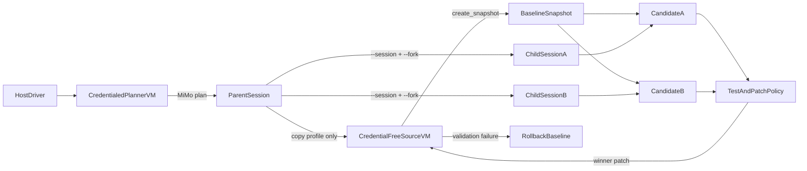

# MiMo Code Dual-Fork Rollout Reference Pattern

[中文文档](../../zh/guide/integrations/mimo-code.md)

This integration uses [MiMo Code](https://github.com/XiaomiMiMo/MiMo-Code)
session forking and CubeSandbox full-VM snapshots to run multiple implementation
candidates from one shared planning context.

The dual-fork lifecycle is a reusable reference pattern. The bundled
`normalize-slug` fixture is only a deterministic demonstration: task prompts,
test command, editable paths, and candidate strategies are supplied by an
external `task.json`.

The workflow does not merely run a coding agent inside a MicroVM. It creates a
speculative coding transaction:

1. MiMo analyzes a task in a short-lived credentialed planner.
2. The parent profile is copied into a credential-free source MicroVM.
3. CubeSandbox snapshots that complete source MicroVM.
4. Multiple candidate MicroVMs start from the same snapshot.
5. Each candidate forks the parent with `mimo run --session ... --fork`.
6. Deterministic tests and patch policy select a winner.
7. Only the winning patch is promoted to the source.
8. A failed final validation rolls the source back to its snapshot.

This directly implements the **execute Agent-generated code in sandboxes and
collect the results** use case: candidate MicroVMs execute fixed acceptance tests, and
the host retrieves bounded test output plus validated patch metadata before
promoting one result.

The runnable implementation is in
[`examples/mimo-code-integration`](https://github.com/TencentCloud/CubeSandbox/tree/master/examples/mimo-code-integration).

## Why pair the two fork models?

MiMo and CubeSandbox fork different state:

| Layer | Forked state |
| --- | --- |
| MiMo `--fork` | Conversation history, planning context, memory, and agent metadata |
| CubeSandbox snapshot | Guest memory, root filesystem, workspace, tools, and MiMo profile |

Using only a MiMo session fork does not isolate native processes or filesystem
writes. Using only a VM clone does not establish a separate conversation
branch. Pairing both gives every candidate the same initial knowledge and
runtime while keeping subsequent work independent.

The CubeSandbox lifecycle follows the same invariants as
[`07_clone_concurrent.py`](https://github.com/TencentCloud/CubeSandbox/blob/master/examples/snapshot-rollback-clone/07_clone_concurrent.py)
and
[`08_fork_three_axis.py`](https://github.com/TencentCloud/CubeSandbox/blob/master/examples/snapshot-rollback-clone/08_fork_three_axis.py):
multiple sandboxes inherit one snapshot, later writes stay isolated, and the
source remains usable. This integration adds the missing Agent layer by pairing
each candidate VM with a distinct MiMo conversation fork, then selecting and
promoting one tested patch.



## Tested components

| Component | Version or requirement |
| --- | --- |
| MiMo Code | `@mimo-ai/cli@0.1.7` |
| MiMo model | `mimo/mimo-v2.5-pro` |
| CubeSandbox base image | `ghcr.io/tencentcloud/cubesandbox-base:2026.16` |
| Python SDK | `cubesandbox>=0.6.0` |
| CubeSandbox platform | Snapshot/rollback and CubeEgress support |

The image build verifies that the pinned CLI exposes `mimo run --fork`.

## Security model

The short-lived planner and every candidate sandbox use default-deny internet
access. One exact CubeEgress rule allows `api.xiaomimimo.com` and injects the
real `api-key` outside the VM:

```python
Rule(
    name="allow_mimo_platform",
    match=Match(
        scheme="https",
        sni="api.xiaomimimo.com",
        host="api.xiaomimimo.com",
    ),
    action=Action(
        allow=True,
        audit="metadata",
        inject=[
            Inject(
                header="api-key",
                secret=MIMO_API_KEY,
                format="${SECRET}",
            )
        ],
    ),
)
```

The driver replaces the illustrative rule name with a random per-rollout name,
which lets evidence collection correlate audit records without copying traffic
from other sandboxes.

MiMo sees only a placeholder environment value. The source is separately
created default-deny without any credential rule. After the parent turn, only
the placeholder-bearing MiMo profile is transferred to the source, so its
snapshot request cannot persist the CubeEgress injection secret. The real key
is absent from:

- `$MIMOCODE_HOME`;
- `/workspace`;
- candidate patches and evidence;
- the credential-free baseline source snapshot.

MiMo sharing, telemetry, updates, external skills, model-manifest fetches, and
LSP downloads are disabled so the exact-host rule remains narrow.

## Run the integration

Build and import the pinned template:

```bash
export MIMO_IMAGE="<your-registry>/mimo-code-cube:0.1.7"
./examples/mimo-code-integration/build-template.sh
cubemastercli tpl watch --job-id <job_id>
```

Configure the host runner:

```bash
cd examples/mimo-code-integration
install -m 600 .env.example .env
python3 -m venv .venv
. .venv/bin/activate
pip install -r requirements.txt
```

Set `E2B_API_URL`, `E2B_API_KEY`, `CUBE_TEMPLATE_ID`, and `MIMO_API_KEY`.
Use HTTPS when a real CubeAPI key crosses an untrusted network.

Run two candidates in parallel:

```bash
python speculative_mimo_code.py \
  --task fixtures/normalize-slug/task.json \
  --candidates 2 \
  --concurrency 2 \
  --evidence-file output/speculative-success.json
```

A successful promotion prints `CUBE_MIMO_PROMOTION_OK`.

Exercise the transaction rollback path:

```bash
python speculative_mimo_code.py \
  --force-promotion-failure \
  --evidence-file output/speculative-rollback.json
```

This mode forces only the final source validation to fail. The source must
return to a clean baseline and print `CUBE_MIMO_ROLLBACK_OK`.

## Task profile and reuse boundary

The reference implementation separates task inputs from the transaction
lifecycle:

```text
fixtures/normalize-slug/
├── task.json
└── project/
    ├── .gitignore
    ├── README.md
    ├── app.py
    └── tests/test_app.py
```

`task.json` supplies `name`, `summary`, planning and implementation
instructions, a fixed test command and timeout, existing editable paths, named
candidate strategies, and `expect_baseline_failure`. The loader bounds file
count and size and rejects symlinks, unsafe paths, duplicates, and editable
paths absent from the fixture.

New applications reuse the same conversation fork, snapshot fan-out,
credential boundary, promotion, rollback, cleanup, and evidence contract. The
current evaluator is binary and ranks passing patches by changed lines. A later
`research-experiment` integration can add a metric-aware evaluator without
duplicating the surrounding infrastructure.

## Conversation-continuity proof

Before the snapshot, a plan-only turn in the planner receives a random token
while file edits and permission auto-approval are disabled. The driver verifies
both a clean Git status and absence of the token under `/workspace`, then
transfers the parent profile to the credential-free source.

Each candidate receives no token value in its new prompt. Its forked child
session must recover the token from the parent conversation and prove it in an
out-of-workspace report or a `CONTINUITY=...` NDJSON event. A missing proof gets
one same-session retry. This distinguishes full MiMo session inheritance from
ordinary filesystem cloning.

## Candidate policy and winner selection

The model does not decide which candidate wins. A candidate is eligible only
when:

- every eligible child's session ID differs from the parent and other eligible
  children;
- the continuity report or NDJSON marker is correct;
- fixed acceptance tests pass and are rerun unchanged on the source;
- every changed path is declared by the task profile;
- the patch is non-empty, textual, and below the size limit.

Eligible results are sorted by changed-line count and candidate name. The patch
is then checked with `git apply --check`, applied to the unchanged source, and
tested again.

## Failure semantics

- Candidate creation is all-or-nothing; partial siblings are killed.
- A failed candidate is recorded and does not prevent another valid candidate
  from winning.
- No valid candidate means no source mutation.
- Failed promotion validation calls `rollback(snapshot_id)` and verifies a
  clean source Git worktree.
- Planner, candidate, and source sandboxes plus the persistent snapshot are
  explicitly cleaned up on every path.
- Cleanup errors identify the leaked resource and fail an otherwise successful
  run.

## Supporting checks

The example retains two small supporting entry points:

```bash
# Verify the pinned template and MiMo NDJSON event contract.
python run_mimo_code.py

# Verify exact-host egress, CA trust, and placeholder-only VM credentials.
python network_policy.py
```

## Verification and evidence

Offline checks run without a model key or live cluster:

```bash
python -m unittest discover -s tests -v
python -m py_compile *.py tests/*.py \
  fixtures/normalize-slug/project/*.py \
  fixtures/normalize-slug/project/tests/*.py
bash -n build-template.sh collect_e2e_evidence.sh
```

On a live cluster:

```bash
./collect_e2e_evidence.sh
```

The collector runs promotion and forced-rollback scenarios. Evidence includes
source/candidate sandbox IDs, snapshot ID, parent/child session IDs, candidate
scores, CubeEgress boundary checks, final outcome, and final zero-resource
checks for IDs created by the run. It never records the real MiMo key.

## Operational guidance

- Limit candidate count to the cluster capacity; the example caps it at eight.
- Preinstall required toolchains so candidate tasks do not need broad package
  registry access.
- Treat MiMo profiles and snapshots as sensitive because they contain prompts,
  code, and command output.
- Snapshot deletion is independent from sandbox deletion. Always clean up both.
- `--dangerously-skip-permissions` is used only in disposable candidate
  MicroVMs. The parent planning turn does not use it.
- Use the fixed tests and patch policy as the trust boundary, not model claims.

## Troubleshooting

| Symptom | Cause | Resolution |
| --- | --- | --- |
| `mimo run` lacks `--fork` | Stale template | Rebuild the pinned image |
| MiMo Platform returns `401` / `403` | Missing, expired, or incorrectly injected API key | Check `MIMO_API_KEY`, the `api-key` injection rule, and the redacted CubeEgress audit |
| Template import cannot pull the image | Image was not pushed, registry credentials are unavailable to Cube nodes, or the architecture is wrong | Push an `linux/amd64` image to a registry every Cube node can pull from and configure registry credentials |
| Sandbox or MiMo command times out | Cluster capacity is exhausted or the task exceeds its limit | Reduce candidates, then raise `MIMO_SANDBOX_TIMEOUT` or `MIMO_AGENT_EXEC_TIMEOUT` as appropriate |
| Child ID equals parent ID | Fork was not honored | Inspect raw MiMo events and CLI version |
| Continuity proof fails | Parent state was not inherited | Check snapshot timing and `--session` |
| Candidate rejected for paths | Tests or files outside the task policy changed | Tighten the prompt or intentionally extend `allowed_paths` |
| No eligible candidate | All candidates failed tests/policy | Inspect candidate evidence |
| Promotion validation fails | Winner does not reproduce on source | Rollback is automatic |
| TLS verification fails | CubeEgress CA is unavailable | Configure `MIMO_NODE_EXTRA_CA_CERTS` |
| Requests return `403` or `000` | Exact-host policy rejected them | Use the MiMo Platform endpoint |
| Snapshot remains | Snapshot cleanup failed | Delete its template ID manually |

## References

- [MiMo Code sessions](https://mimo.xiaomi.com/mimocode/sessions)
- [Snapshot, Rollback & Clone](../snapshot-rollback-clone.md)
- [CubeEgress Security Proxy](../security-proxy.md)
- [Runnable example](https://github.com/TencentCloud/CubeSandbox/tree/master/examples/mimo-code-integration)
