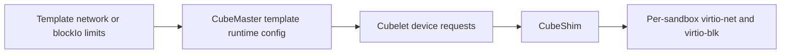
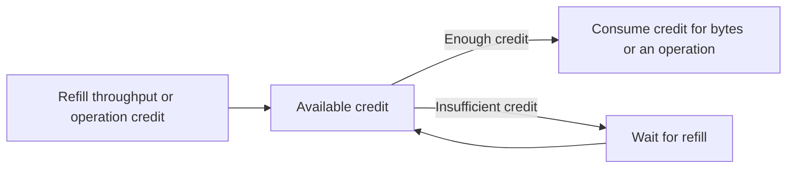

# QoS

Quality of Service (QoS) limits the network and block I/O consumption of an individual sandbox. In the current release, the feature is disabled by default and can only be configured when creating a template. The configured limits apply independently to every sandbox created from the template.

Network QoS only affects traffic rate and does not change which destinations a sandbox can reach. Block I/O QoS limits each sandbox block device without changing filesystem capacity or permissions.

## How it works

The QoS configuration flows from the template into the sandbox runtime, where CubeShim enforces it in the virtio-net and virtio-blk data paths:



Network QoS rate-limits two directions independently for each sandbox: upload from the sandbox to the external network, and download from the external network to the sandbox. The configured bandwidth and packet-processing rate ceilings apply separately to upload and download.

Block I/O QoS rate-limits each virtio-blk device independently. Reads and writes on the same device share the configured throughput and operation-rate buckets; the limits are not divided into separate read and write ceilings.



The underlying limiters use separate Token Buckets for throughput and operations. The throughput bucket consumes credit according to the number of bytes processed, while the operations bucket consumes credit for each operation. Credit is replenished at a fixed rate. Available credit permits short bursts; after the credit is exhausted, work waits for a refill. Short benchmarks may therefore exceed the configured value temporarily, while the average rate of a sustained test should remain close to the ceiling. The platform selects bucket capacity and refill behavior automatically; users only set the public limits.

QoS is runtime configuration and does not modify the template rootfs. Templates with identical filesystem inputs but different QoS settings can still reuse the same rootfs artifact.

## Configuration semantics

Users can configure network limits, block I/O limits, or both:

```json
{
  "network": {
    "bandwidthMbps": 100,
    "packetsPerSecond": 5000
  },
  "blockIo": {
    "throughputMiBps": 64,
    "iops": 1000
  }
}
```

At least one of `bandwidthMbps` and `packetsPerSecond` must be configured with an integer greater than zero in `network`. `bandwidthMbps` limits each sandbox to approximately the configured megabits per second, while `packetsPerSecond` limits virtio-net packet-processing operations per second. With segmentation or other offloads enabled, one operation can represent multiple wire packets, so the observed wire PPS can differ from the configured value. Upload and download use independent credit, and different sandboxes do not share credit.

At least one of `throughputMiBps` and `iops` must be configured in `blockIo`. `throughputMiBps` limits sustained block-device throughput in mebibytes per second, while `iops` limits block I/O operations per second. The same limits are applied independently to every virtio-blk device attached to the sandbox, and each device maintains its own credit.

The current release only supports configuring QoS when creating a template. Every sandbox created from that template receives the same limits, and sandbox creation cannot set or override QoS independently. A template without `qos` does not apply the network or block I/O limits described on this page.

## Scope and limitations

`bandwidthMbps` only limits the maximum network rate of an individual sandbox. Node-wide, tenant-wide, and NAT egress capacity are still determined by the underlying infrastructure. If the demand from active sandboxes exceeds the physical link capacity, the sandboxes will still compete for bandwidth.

Upload and download currently use the same configured bandwidth and packet-processing rate values; separate ceilings for the two directions are not supported. Block I/O limits are not separate for reads and writes. QoS also does not provide priority, guaranteed minimum throughput, or weighted scheduling.

## Configure a template

Set the limits through `--qos` or the CubeAPI request body when creating a template. The following examples configure network ceilings of 100 Mbps and 5,000 packet-processing operations/s, plus block I/O ceilings of 64 MiB/s and 1,000 IOPS.

### CLI inline JSON

```bash
cubemastercli tpl create-from-image \
  --image cube-sandbox-int.tencentcloudcr.com/cube-sandbox/sandbox-code:latest \
  --writable-layer-size 1G \
  --qos '{"network":{"bandwidthMbps":100,"packetsPerSecond":5000},"blockIo":{"throughputMiBps":64,"iops":1000}}'
```

In mainland China, use `cube-sandbox-cn.tencentcloudcr.com/cube-sandbox/sandbox-code:latest`.

### CLI JSON file

The configuration can also be stored in `qos.json`:

```json
{
  "network": {
    "bandwidthMbps": 100,
    "packetsPerSecond": 5000
  },
  "blockIo": {
    "throughputMiBps": 64,
    "iops": 1000
  }
}
```

Use the `@` prefix to read the file when creating the template:

```bash
cubemastercli tpl create-from-image \
  --image cube-sandbox-int.tencentcloudcr.com/cube-sandbox/sandbox-code:latest \
  --writable-layer-size 1G \
  --qos @qos.json
```

### CubeAPI

Pass the same `qos` object in the CubeAPI template creation request:

```http
POST /cubeapi/v1/templates
Content-Type: application/json
```

```json
{
  "image": "cube-sandbox-int.tencentcloudcr.com/cube-sandbox/sandbox-code:latest",
  "writableLayerSize": "1G",
  "qos": {
    "network": {
      "bandwidthMbps": 100,
      "packetsPerSecond": 5000
    },
    "blockIo": {
      "throughputMiBps": 64,
      "iops": 1000
    }
  }
}
```

CubeMaster validates `qos` before creating the template. Each configured section must contain at least one positive integer limit. Explicit zero values, negative or non-integer values, empty sections, and unknown fields are rejected.

## Inspect configuration and applied state

### Inspect template configuration

Use the CLI to inspect a template:

```bash
cubemastercli tpl info <template-id>
```

The corresponding CubeAPI endpoint is `GET /cubeapi/v1/templates/<template-id>`. A template with QoS configured returns:

```json
{
  "configuredQos": {
    "network": {
      "bandwidthMbps": 100,
      "packetsPerSecond": 5000
    },
    "blockIo": {
      "throughputMiBps": 64,
      "iops": 1000
    }
  }
}
```

### Inspect sandbox state

Use the CLI to inspect a sandbox:

```bash
cubemastercli cubebox info --sandboxid <sandbox-id>
```

The CLI displays `NETWORK_QOS`, `BLOCK_IO_QOS`, and `QOS_APPLIED`. The CubeAPI endpoint `GET /cubeapi/v1/sandboxes/<sandbox-id>` returns the corresponding `configuredQos` and `qosApplied` fields:

```json
{
  "configuredQos": {
    "network": {
      "bandwidthMbps": 100,
      "packetsPerSecond": 5000
    },
    "blockIo": {
      "throughputMiBps": 64,
      "iops": 1000
    }
  },
  "qosApplied": true
}
```

`configuredQos` is the QoS configuration expected from the template, while `qosApplied` indicates whether the sandbox runtime record contains at least one QoS annotation. It is an aggregate state and does not prove that every configured network and block I/O limiter reached the hypervisor. A normally created QoS sandbox should return `qosApplied=true`. If only `configuredQos` is present, investigate legacy data or a missing runtime record.

### Troubleshoot network QoS on the node

On the node hosting the sandbox, query network-agent for `persistMetadata.qos_enabled`:

```bash
curl -sS -X POST \
  --unix-socket /tmp/cube/network-agent.sock \
  -H 'Content-Type: application/json' \
  -d '{"sandboxID":"<sandbox-id>"}' \
  http://localhost/v1/network/get | jq '.persistMetadata.qos_enabled'
```

This metadata records that network QoS was included in the sandbox network setup request. It does not report block I/O QoS and is not part of the public API.

## Verify with iperf3

Create a template with network QoS, wait until the template reaches `READY`, and then create the sandbox under test from that template. Run the following client commands inside that sandbox.

iperf3 is not guaranteed to be installed on the server or in the sandbox image. Run `iperf3 --version` on both ends before testing. If the command is unavailable, install it with the package manager used by the operating system or image. For Debian or Ubuntu:

```bash
apt-get update
apt-get install -y iperf3
```

Start the server on a machine reachable from the sandbox:

```bash
iperf3 -s -p 5201
```

Confirm that the sandbox can reach the server IP and that the server firewall allows the selected TCP port. Resolve connectivity failures before using the result to evaluate network QoS.

Test upload and download separately:

```bash
# Sandbox upload to the server
iperf3 -c <server-ip> -p 5201 -t 10 -O 3 -P 4

# Sandbox download from the server
iperf3 -c <server-ip> -p 5201 -t 10 -O 3 -P 4 -R
```

Protocol overhead, short Token Bucket bursts, and the measurement window can affect the result. A 100 Mbps setting should normally measure close to 100 Mbps, but it does not need to be exact.

A template response containing `configuredQos` only confirms that the configuration was saved. Confirm bandwidth enforcement by checking that the sandbox returns `qosApplied=true` and that sustained upload and download tests remain close to the configured bandwidth ceiling. `iperf3` does not directly measure packet-processing operations per second; validate a PPS-only setting with a fixed-size packet workload, a packet counter on the test endpoint, and awareness that offloads can make wire PPS differ from the configured operation rate.

### Verify concurrent sandbox bandwidth limits

A single iperf3 server process normally handles one test at a time. Multiple clients connecting to the same server port may be processed serially and will not represent concurrent bandwidth usage. Start a separate server port for each sandbox:

```bash
for port in 5301 5302 5303 5304 5305; do
  iperf3 -s -p "$port" -D
done
```

Start the sandbox clients at the same time and assign them ports 5301 through 5305. If the template ceiling is 100 Mbps and the host and network have sufficient capacity, five sandboxes should each remain close to 100 Mbps, with aggregate throughput close to 500 Mbps.

The sum of the configured bandwidth ceilings must remain below the test link capacity. Otherwise, shared-link contention also affects the results, and a sandbox measuring below its configured ceiling does not by itself indicate that the bandwidth limiter is malfunctioning.

## Verify block I/O with fio

Create a template with block I/O QoS, wait until the template reaches `READY`, and then create the sandbox under test from that template.

fio is not guaranteed to be installed in the sandbox image. Run `fio --version` before testing and install it with the package manager used by the image if necessary. For Debian or Ubuntu, run `apt-get update && apt-get install -y fio`.

Run `lsblk` inside the sandbox and select a writable virtio-blk filesystem. Do not run a destructive raw-device test against the root device. The following file-based commands use `/tmp/qos-fio` and bypass the guest page cache:

```bash
# Sustained sequential write throughput
fio --name=block-qos-bw --filename=/tmp/qos-fio \
  --size=1G --rw=write --bs=1M --direct=1 --runtime=30 --time_based

# Random-read IOPS
fio --name=block-qos-iops --filename=/tmp/qos-fio \
  --size=1G --rw=randread --bs=4k --direct=1 --iodepth=32 \
  --runtime=30 --time_based

rm -f /tmp/qos-fio
```

The sustained throughput and IOPS should remain close to the configured ceilings after the initial Token Bucket credit is consumed. Files backed by virtio-fs or memory do not exercise the virtio-blk limiter and are not valid for this test.
