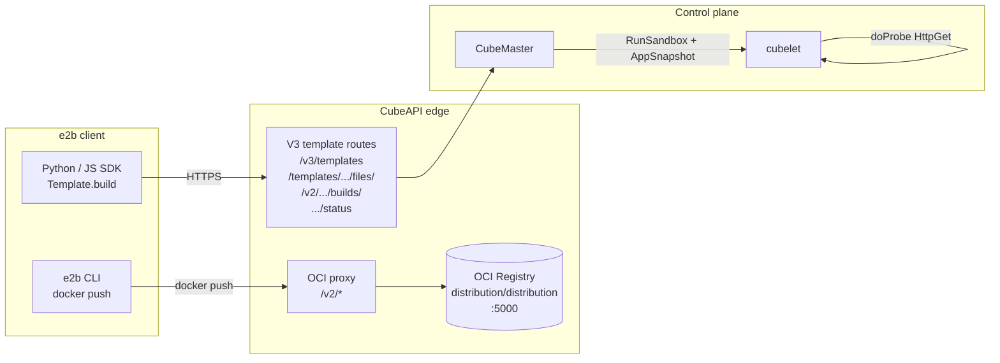

# Create Templates with the e2b SDK

CubeSandbox is wire-compatible with the [e2b](https://e2b.dev/) **V3 template and sandbox protocol**. Starting from a ready-made e2b-style image, this page walks through how to use the official e2b Python / JS SDK to **register → build → run** a template on a CubeSandbox cluster, plus the technical reference and best practices that go with it.

> Available in **CubeSandbox v0.2.3+**.
>
> - For the `cubemastercli` workflow, see [Create Templates from OCI Image](./template-from-image.md);
> - For adding envd to an existing image first, see [Bring Your Own Image](./bring-your-own-image.md).

---

## 1. Overall architecture

How the e2b SDK client, CubeAPI, CubeMaster, and the bundled OCI Registry cooperate:



Key points:

1. **CubeAPI** acts as the e2b V3 protocol edge, translating V3 calls into CubeMaster's internal `CreateTemplateFromImage` / build-job semantics.
2. **OCI Registry** is an independent sidecar (default `distribution/distribution` on `127.0.0.1:5000`); CubeAPI exposes `/v2/*` as a verbatim reverse proxy for `docker push`.
3. Once **CubeMaster + cubelet** see a `<registry>/<repo_prefix>/<templateID>:<buildID>` reference, the rest of the pipeline (OCI image → ext4 rootfs → temporary sandbox → probe → snapshot → register) is the same as any other build path.

---

## 2. Quick start

> Prerequisite: you already have an image **with envd (49983)** built per [Bring Your Own Image](./bring-your-own-image.md) and pushed to a registry the cluster can reach (the `from_image` reference below).

### 2.1 Install the SDK and configure the environment

```bash
pip install e2b python-dotenv
```

Drop CubeAPI's endpoint and your API key into a project-root `.env`:

```dotenv
E2B_API_KEY=your-cube-api-key            # any value if CubeAPI auth is disabled
E2B_DOMAIN=cube.example.com              # CubeAPI ingress (no scheme)
```

### 2.2 Define the template

```python
# build_template.py

from dotenv import load_dotenv
from e2b import Template, default_build_logger, wait_for_url

load_dotenv()

if __name__ == '__main__':
    template = (
        Template()
        .from_image("cube-sandbox-cn.tencentcloudcr.com/cube-sandbox/sandbox-code:latest")    # ← 也可以改成自己的镜像
        .set_start_cmd(
            "sudo /root/.jupyter/start-up.sh",
            wait_for_url("http://localhost:49999/health")   # <- 将被作用于probe探针
        )
    )
    Template.build(
        template,
        'template-tag-code',
        cpu_count=1,
        memory_mb=1024,
        on_build_logs=default_build_logger(),
    )
```

### 2.3 Build + use

```bash
python build_template.py
# Once "[7/7] READY" prints, you can create sandboxes
```

```python
# use_sandbox.py
from e2b import Sandbox

sbx = Sandbox(template="template-tag-code", timeout=120)
print(sbx.run_code("print('hello from cube sandbox')").text)
sbx.kill()
```

In the happy path the **first `run_code` works immediately — no `time.sleep` needed**. As long as `wait_for_url` blocked the build until the user process was actually ready, the snapshot already captures that ready state.

---

## 3. Technical reference

### 3.1 V3 protocol endpoint contract

CubeAPI exposes the four V3 endpoints the e2b SDK speaks:

| # | Method + path | Handler | Purpose |
|---|---|---|---|
| ① | `POST /v3/templates` | `templates_v3::v3_create_template` | Register a template + allocate the first build attempt; returns `{templateID, buildID, names, aliases, tags, public}` |
| ② | `GET /templates/{tid}/files/{hash}` | `templates_v3::v3_get_files_hash` | Cache probe before SDK uploads a build context tarball; CubeAPI always answers `present=true` so the SDK skips upload (the V3 flow currently consumes only `from_image`) |
| ③ | `POST /v2/templates/{tid}/builds/{bid}` | `templates_v3::v2_trigger_build` | Actually triggers the build: resolves `from_image` / `from_template` / a previously-pushed image and dispatches a `CreateTemplateFromImageReq` to CubeMaster |
| ④ | `GET /templates/{tid}/builds/{bid}/status` | `templates_v3::v3_get_build_status` | Polls build status; returns the strict `{buildID, templateID, status, logs[], logEntries[], reason?}` envelope the SDK expects |

End-to-end SDK call timeline:

```mermaid
sequenceDiagram
    participant SDK as e2b SDK
    participant CLI as e2b CLI / docker
    participant API as CubeAPI
    participant Reg as OCI Registry
    participant Master as CubeMaster
    participant Cubelet as cubelet

    SDK->>API: POST /v3/templates {name, cpuCount, memoryMB}
    API-->>SDK: 202 {templateID, buildID, ...}

    Note over SDK,Reg: Push only happens for Dockerfile builds;<br/>pure from_image flow skips ②③ and goes straight to ④
    SDK->>API: GET /templates/{tid}/files/{hash}
    API-->>SDK: 201 {present:true}
    CLI->>API: PUT /v2/<repo>/manifests/<bid>
    API->>Reg: forward
    Reg-->>API: 201 Created
    API->>API: mark_image_pushed(bid)
    API-->>CLI: 201 Created

    SDK->>API: POST /v2/templates/{tid}/builds/{bid}<br/>{fromImage, startCmd, readyCmd, ...}
    API->>API: parse_ready_url → probe_port/path
    API->>Master: CreateTemplateFromImage + Probe.HttpGet
    API-->>SDK: 202 Accepted

    loop poll every N seconds
      SDK->>API: GET /.../builds/{bid}/status?logsOffset=K
      API->>Master: get_template_build_status
      API-->>SDK: 200 {status, logs[], reason?}
    end

    Master->>Cubelet: AppSnapshot(req with Probe)
    Cubelet->>Cubelet: doProbe blocks until user process is ready
    Cubelet-->>Master: snapshot captures ready state
    Master-->>API: build READY
    API-->>SDK: status="ready"
```

### 3.2 OCI Registry reverse proxy

CubeAPI exposes `/v2/*` as a verbatim reverse proxy that forwards e2b CLI / docker push traffic to an upstream OCI Registry. Notable design points:

| Behaviour | Notes |
|---|---|
| **Bypasses `unified_auth`** | docker push uses the registry's own Basic / Bearer credentials, which are in a separate trust domain from CubeAPI's `Authorization: Bearer <api-key>`; therefore `/v2/*` does not run through `unified_auth`. |
| **240 s timeout** | A single layer-blob PUT can take minutes, so `/v2/*` lives on its own 240 s `TimeoutLayer`, separate from the default 30 s router (see `routes.rs::SNAPSHOT_LONG_ROUTE_TIMEOUT`). |
| **Hop-by-hop header stripping** | Per RFC 7230 §6.1, `connection` / `keep-alive` / `transfer-encoding` etc. are stripped on both directions to keep HTTP/1.1 implementations on either end happy. |
| **`mark_image_pushed` hook** | When `PUT /v2/<repo>/manifests/<tag>` succeeds, CubeAPI uses `<tag>` as the `buildID` and moves the matching BuildContext to the `Building` stage so the subsequent trigger-build call can dispatch immediately. |
| **Graceful degradation** | If `registry_upstream` is unset, every `/v2/*` request returns 503 `registry_disabled`; pure `from_image` flows still work in this deployment shape. |

The default deployment **enables** this stack out of the box (`deploy/one-click/scripts/one-click/up.sh`):

If there is no image repository, you can quickly start an image repository with `docker run -d -p 5000:5000 --restart always --name registry registry:3`.

```bash
cube-api \
  --registry-upstream     http://127.0.0.1:5000 \
  --registry-public-host  cube.app \
  --registry-pull-host    127.0.0.1:5000 \
  --registry-repo-prefix  e2b
```

See [Section 4 — Deployment Configuration](#_4-deployment-configuration) for details.

### 3.3 `wait_for_url` and the readiness probe

`wait_for_url(...)` is the key to the "create-and-immediately-use" property of templates. Semantically: **during template build**, wait for the URL to return 2xx **before** snapshotting — every sandbox restored from such a template comes back with the user process already serving traffic, so `sbx.run_code(...)` works immediately.

#### How the bridging works

The e2b SDK serialises `wait_for_url(...)` into a shell-form `readyCmd` (ultimately `curl ...`). CubeAPI does **not** run the shell — instead, in `services/templates.rs::v3_trigger_build` it does a lightweight parse:

1. Find an `http(s)://<host>:<port>[/<path>]` URL inside `readyCmd`;
2. Require `host` to be a loopback alias (`localhost` / `127.0.0.1` / `0.0.0.0` / `::1` / `[::1]`) — never invent a probe target pointing at the public internet;
3. Require an explicit, non-zero port;
4. On success, populate `probe_port` / `probe_path`, which `build_probe()` turns into a `Probe.HttpGet` and forwards to CubeMaster;
5. Cubelet **blocks** on this probe (`doProbe`) after container creation, only committing the snapshot once it returns 2xx.

The whole bridging is transparent — no extra SDK-side configuration needed.

#### Parsing rules at a glance

| `readyCmd` input | Parsed result | Notes |
|---|---|---|
| `wait_for_url("http://localhost:49999/health")` | `(49999, "/health")` | Canonical form |
| <code>curl -fsS http://127.0.0.1:8080/ready?retries=3 \|\| exit 1</code> | `(8080, "/ready")` | Query string is stripped |
| `until nc -z 0.0.0.0:3000; do sleep 0.2; done; curl http://0.0.0.0:3000` | `(3000, "/")` | Path defaults to `/` when omitted |
| `curl http://api.example.com:443/healthz` | ❌ `None` | Non-loopback hosts rejected |
| `curl http://localhost/health` | ❌ `None` | Port must be explicit |
| `curl http://127.0.0.1:0/` | ❌ `None` | Port must be > 0 |
| `/usr/local/bin/wait-for-it.sh --quiet` | ❌ `None` | No recognisable URL |

#### Three-tier source priority

`probe_port` is resolved in this order:

1. **Caller override** — `probePort` / `probePath` in the V3 request body;
2. **`readyCmd` parsing** — auto-extracted from `wait_for_url(...)` / `curl ...`;
3. **`exposedPorts[0]` + `/health`** — last-resort fallback (preserves legacy behaviour).

If any tier fires, `Probe.HttpGet` is generated. If all three are empty, **no probe is emitted** — sandbox creation returns the moment `Create` completes (today's behaviour); still works, but users may need a `time.sleep`.

#### Probe parameters (cubelet defaults)

| Field | Default | Meaning |
|---|---|---|
| `timeout_ms` | 30 000 | Total budget for the probe loop (30 s) |
| `period_ms` | 500 | Probe every 500 ms |
| `success_threshold` | 1 | First 2xx wins |
| `failure_threshold` | 60 | Up to 60 failures (~30 s) before giving up |

> If your user process needs more than 30 s to come up (rare), use `cubemastercli`'s explicit override path, or follow up with a CubeAPI extension that surfaces `probeTimeoutMs`.

### 3.4 Build state machine

CubeAPI keeps an in-memory `BuildRegistry` tracking every `(templateID, buildID)` lifecycle (`services/builds.rs`):

```
WaitingPush ──manifest PUT succeeds──► Building ──CubeMaster job terminal──► Ready / Error
```

| Stage | Meaning |
|---|---|
| `WaitingPush` | Template registered, registry credentials issued, waiting for client docker push |
| `Building` | manifest PUT succeeded / trigger-build received; CubeMaster pipeline running |
| `Ready` | Template build successful, sandboxes can use it |
| `Error` | Build failed; `reason.message` contains the CubeMaster error |

Each `BuildContext` also keeps: the original `CreateTemplateRequest` (replayed at trigger time), registry credentials, CubeMaster `jobID`, an append-only log buffer (capped at 10 000 lines, head-trimmed on overflow), and the V3-specific fields (`name` / `tags` / `cpuCount` / `memoryMB` / `aliases`).

CubeAPI restart loses the in-memory state — a deliberate trade-off: builds normally reach a terminal state in minutes, and a build truncated mid-flight is naturally retried by the SDK. When stronger consistency is needed, swap the `BuildRegistry` backend to durable storage (the trait abstraction is in place).

### 3.5 ID and timeout rules

#### `templateID`

Derived from `name` via UUIDv5 (DNS namespace), with the `tpl-` prefix:

```rust
fn stable_template_id(name: &str) -> String {
    let id = Uuid::new_v5(&Uuid::NAMESPACE_DNS, name.as_bytes());
    format!("tpl-{}", &id.simple().to_string()[..16])
}
```

- Same `name` always maps to the **same** `templateID`, matching e2b's "alias is also a primary key" semantics;
- Re-building the same template name reuses the `templateID`, avoiding stale templates in the control plane.

#### `buildID`

Allocated fresh on every `POST /v3/templates`: `bld-<uuid_v4_simple>`. Stateless, unguessable.

#### Timeout tiers

| Routes | Timeout | Reason |
|---|---|---|
| Default (e.g. `/v3/templates`, `.../builds/{bid}/status`) | 30 s | Regular synchronous calls |
| Long routes (`POST /sandboxes/:id/snapshots`, `POST /sandboxes/:id/rollback`, `DELETE /templates/:id`) | 240 s | Synchronous calls into cubelet's LVM/snapshot cleanup |
| OCI Registry proxy (`/v2/*`) | 240 s | Large layer-blob PUTs can take minutes |

This is implemented in `routes.rs` by wrapping each sub-router in its own `TimeoutLayer` and `Router::merge`-ing them together. The `merge_preserves_per_router_timeout_layers` unit test specifically guards this invariant.

---

## 4. Deployment configuration

### 4.1 One-click defaults

`deploy/one-click/scripts/one-click/up.sh` already starts CubeAPI with:

```bash
--registry-upstream     http://127.0.0.1:5000   # local distribution sidecar
--registry-public-host  cube.app                # docker push target advertised to clients
--registry-pull-host    127.0.0.1:5000          # CubeMaster node-side pull address
--registry-repo-prefix  e2b                     # image namespace
```

So out-of-the-box `e2b template build` + docker push **just work** in a standard deployment. For other deployment shapes, pass the corresponding flags below.

### 4.2 Full parameter reference

| CLI flag | Env var | Default | Meaning |
|---|---|---|---|
| `--registry-upstream URL` | `CUBE_API_REGISTRY_UPSTREAM` | *unset* | Upstream OCI Registry URL; when unset `/v2/*` returns 503 and dockerfile flows are rejected |
| `--registry-public-host HOST` | `CUBE_API_REGISTRY_PUBLIC_HOST` | request Host header | Hostname advertised to clients for docker push |
| `--registry-pull-host HOST` | `CUBE_API_REGISTRY_PULL_HOST` | upstream's host:port | Internal address CubeMaster nodes use to pull images |
| `--registry-repo-prefix PREFIX` | `CUBE_API_REGISTRY_REPO_PREFIX` | `e2b` | Repo namespace for pushed images |
| `--registry-token TOKEN` | `CUBE_API_REGISTRY_TOKEN` | `_anon` | The `registry.password` field returned by `POST /templates` |
| `--default-writable-layer-size SIZE` | `CUBE_API_DEFAULT_WRITABLE_LAYER_SIZE` | `1G` | Default `writable_layer_size` when the client doesn't provide one (CubeMaster validates this field as required) |
| `--sandbox-domain DOMAIN` | `CUBE_API_SANDBOX_DOMAIN` | `cube.app` | The `domain` field on sandbox API responses |
| `--auth-callback-url URL` | `AUTH_CALLBACK_URL` | *unset* | Callback URL for unified auth (see [Authentication](../authentication.md)) |

### 4.3 Hooking up a private / restricted OCI Registry

The most common case is pushing to your team's private registry. Three steps:

1. **Deploy a registry that speaks OCI Distribution v1** (CNCF `distribution/distribution`, Harbor, AWS ECR, GCR all qualify);
2. **CubeAPI side**: set `--registry-upstream` to point at it; `--registry-public-host` is whatever hostname users docker push to (typically your ingress);
3. **CubeMaster side**: make sure `--registry-pull-host` resolves on the cluster network — if the registry is on another machine, **don't** use `127.0.0.1`.

If the registry has htpasswd / token-server auth, the docker client's `Authorization` header is forwarded verbatim by CubeAPI — no special handling needed at the API layer.

---

## 5. Best practices

### 5.1 Image preparation

**Hard constraint**: any image used as a CubeSandbox template must have envd listening on `:49983` at startup. Two fastest paths:

| Path | Best for | How |
|---|---|---|
| **`FROM ghcr.io/tencentcloud/cubesandbox-base:2026.16`** | Greenfield business images | Base image ships with envd + `cube-entrypoint.sh`, which backgrounds envd for you |
| **`COPY --from=cubesandbox-base ...`** | Existing business images (e.g. `e2bdev/code-interpreter`) | Inject envd binary + entrypoint into your image, switch ENTRYPOINT to `cube-entrypoint.sh` |

Detailed Dockerfile templates, the `cube-entrypoint.sh` contract, and local smoke tests are in [Bring Your Own Image](./bring-your-own-image.md).

> ⚠️ **Don't use `e2bdev/code-interpreter:latest` directly**: it ships e2b's upstream init but not the envd CubeSandbox needs, so the build-time probe will hit `connection refused` and time out.

### 5.2 SDK usage

- **Always use the two-arg `set_start_cmd(cmd, wait_for_url(...))`** form so the build blocks on actual readiness;
- The `wait_for_url` URL must be of the form `http(s)://<loopback>:<port>[/<path>]` — host must be `localhost` / `127.0.0.1` / `0.0.0.0`;
- The `from_image(...)` reference must be **pullable from CubeMaster nodes**;
- `cpu_count` / `memory_mb` set the template default; override per `Sandbox(...)` call as needed;
- A build log line like `[dispatch-v3] readyCmd parsed → HttpGet probe on port=... path=...` confirms the bridging fired.

### 5.3 Sandbox usage

- **No `time.sleep` needed**: as long as the build's `wait_for_url` actually waited, the first `run_code` is immediately usable;
- Reusing a single sandbox across `run_code` calls is an order of magnitude cheaper than creating new sandboxes;
- Always `sbx.kill()` explicitly instead of relying on timeout reclamation.

---

## 6. Troubleshooting

| Symptom | Root cause | Fix |
|---|---|---|
| `BuildException: 404: b''` | CubeAPI lacks the V3 routes — likely v0.2.2 or earlier | Upgrade to v0.2.3+ |
| Build stuck in `PULLING_IMAGE` | CubeMaster nodes can't pull the image | Use a cluster-reachable registry; for private registries check `--registry-pull-host` |
| Build log says `readyCmd is recorded but not enforced` | URL parsing failed | Check that `wait_for_url` carries `http://localhost:<port>[/<path>]`, host is a loopback alias, port is explicit |
| Build log says `readyCmd parsed`, but build still times out | Probe runs but the user process really isn't ready | Verify locally: `docker run` and `curl 127.0.0.1:<port>/<path>`. Confirm `cube-entrypoint.sh` `exec`'s the user command rather than fork-and-exit |
| `Sandbox(template=...)` then `run_code` returns 502 | User process still warming up (probe ineffective) | Upgrade to v0.2.3+; confirm build log contains `readyCmd parsed → HttpGet probe`; check inter-node port reachability — see [Networking (CubeVS)](../../architecture/network.md) |
| `run_code` returns `404 not found` | envd is not running inside the sandbox | envd was not injected, or ENTRYPOINT was overridden — see [Bring Your Own Image](./bring-your-own-image.md#_3-alternative-injecting-envd-into-an-existing-image) |
| docker push returns `503 registry_disabled` | CubeAPI `--registry-upstream` is not set | Enable the OCI proxy per [Deployment Configuration](#_4-deployment-configuration) |
| docker push returns `request timeout` | layer blob upload exceeded the 240 s long timeout | Check upstream registry storage IO; or shrink layers (`--squash` / multi-stage builds) |

For more template-related issues see [Templates Troubleshooting](../troubleshooting/templates.md).

---

## 7. Further reading

- [Bring Your Own Image](./bring-your-own-image.md) — Dockerfile templates, `cube-entrypoint.sh` contract, local smoke tests
- [Create Templates from OCI Image](./template-from-image.md) — explicit `--probe` / `--probe-path` configuration via `cubemastercli`
- [Networking (CubeVS)](../../architecture/network.md) — how cross-node port forwarding works
- [Templates Troubleshooting](../troubleshooting/templates.md) — common build-time issues
- [Authentication](../authentication.md) — `unified_auth` middleware and API key configuration
