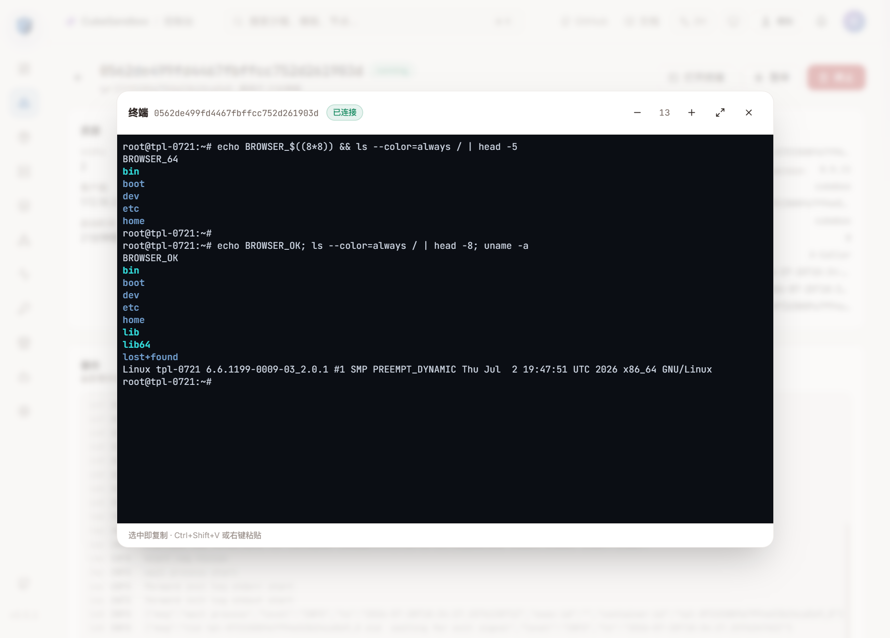

# WebUI Dashboard

The Cube Sandbox **Dashboard** is a built-in web console that lets you see what's running, manage sandboxes, build templates, and inspect cluster health — all from your browser, no CLI required.

> ⏱ Takes ~3 minutes to read. After that you can drive a cluster from a laptop.

## 1. Where do I open it?

The Dashboard is a static frontend served by an nginx container on the **control node**.

| Scenario | URL | Notes |
| --- | --- | --- |
| One-click / multi-node deploy | `http://<control-node-ip>:12088` | Default port, change via `WEB_UI_HOST_PORT` |
| Bare-metal deploy | `http://<server-ip>:12088` | Same port |
| Local development | `http://localhost:5173` | Vite dev server, proxies `/cubeapi` to `127.0.0.1:3000` |

::: tip Port 12088 vs CubeOps :3010
Port `12088` is the human-facing Dashboard (nginx). Behind it, **CubeOps** (the ops/admin service) listens on `:3010`. The Dashboard talks to CubeOps under two same-origin prefixes:
- `/opsapi/*` → CubeOps `/api/*` (admin endpoints, **restricted to localhost and Docker bridge networks**)
- `/cubeapi/v1/*` → CubeOps `/api/v1/sdk/*` (E2B-compatible SDK endpoints, JWT-authenticated, public)

You only ever need to open `12088` from your browser. Do **not** expose `:3010` directly to the public internet.
:::

If you don't know your control-node IP, run `ip -4 addr` on the server, or check `http://<hostname>:12088` on the same LAN.

## 2. The sidebar at a glance

Everything lives behind the 11 icons in the left rail. Hover any icon to see its name.

| # | Icon | Page | What it's for |
| --- | --- | --- | --- |
| 1 | 📊 | **Overview** | Cluster KPIs: running sandboxes, CPU/memory usage, healthy nodes |
| 2 | 📦 | **Sandboxes** | Live list of every micro-VM, with pause / resume / kill actions |
| 3 | 🧩 | **Templates** | Catalog of reusable sandbox snapshots; create new ones from OCI images |
| 4 | 🖥️ | **Nodes** | Fleet health: per-host CPU, memory, slot capacity |
| 5 | 🧬 | **Versions** | Component version matrix across nodes (kernel, agent, guest image) |
| 6 | 🌐 | **Network** | API gateway config and per-node rate limits |
| 7 | 📈 | **Observability** | Runtime status, sandbox health, template build overview |
| 8 | 🔑 | **API Keys** | SDK API key management (JWT-based since v0.6.0) |
| 9 | 🏪 | **Template Store** | Install official preset images to bootstrap templates |
| 10 | 🤖 | **AgentHub** | Recruit and manage AI agent instances running on Cube Sandbox |
| 11 | ⚙️ | **Settings** | Theme, language, cluster info, keyboard shortcuts |

::: tip New user? Start with **Overview**.
It shows everything important in one screen and refreshes automatically.
:::

## 3. Three things you'll do first

### 3.1 Check that the cluster is healthy

Open **Overview** (`/`). You should see four green-ish KPI cards:

- **Running Sandboxes** — how many micro-VMs are live
- **CPU / Memory Utilization** — cluster-wide pressure
- **Healthy Nodes** — `N/M` nodes reporting `Ready`

If any number is red, click into **Nodes** to see which host is unhappy.

### 3.2 Create a sandbox

1. Click **Sandboxes** in the left rail, then **+ New sandbox** (top-right).
2. Pick a template from the grid. Templates marked `STALE` are disabled — pick a `READY` one.
3. (Optional) Add a few `meta` key/value pairs as labels.
4. Click **Create**. Within a couple of seconds you'll be redirected to the sandbox's detail page, where you can watch its logs stream in real time.

To stop a sandbox, go to **Sandboxes**, find the row, and click the pause / kill button on the right.

### 3.3 Log in (JWT authentication)

The Dashboard uses **JWT-based authentication** (since v0.6.0, replacing the old `X-API-Key` scheme). On first visit you'll be redirected to the login page.

1. Enter your credentials. The default All-in-One account is `admin` / `admin` — **change this immediately in production** via Settings → Change Password.
2. On success you receive an access token (short-lived) and a refresh token (7 days). Tokens are stored in `localStorage` and sent as `Authorization: Bearer <jwt>`.
3. The admin endpoints (`/opsapi/*`) are **restricted to localhost and Docker bridge networks** at the nginx layer, so even with weak default credentials they are not reachable from the public internet. SDK endpoints (`/cubeapi/v1/*`) require a valid JWT.

::: details Token lifecycle
- **Access token**: 15 min TTL, `token_type=access`, audience `cubeops:access`.
- **Refresh token**: 7 day TTL, `token_type=refresh`, audience `cubeops:refresh`. Refresh tokens **cannot** be used as access tokens (enforced by `typ` + `aud` claims).
- Login is rate-limited: 5 failed attempts per minute per IP.
:::

## 4. Web Terminal

The Dashboard ships with a built-in **interactive terminal**, so you can drop into a running sandbox's shell straight from the browser — no SDK, no SSH.

### 4.1 Open a terminal

Two entry points, both disabled unless the sandbox is in the **running** state (hover the button for a tooltip explaining why):

- **Sandbox detail page** — the **Open Terminal** button in the header.
- **Sandboxes list** — the terminal icon in the row actions.

<!-- TODO: screenshot: terminal dialog -->

### 4.2 What you get

The dialog is a full [xterm.js](https://xtermjs.org/) terminal running a `/bin/bash` login shell as **root inside the sandbox**:

- ANSI colors and cursor control (vim, htop, and friends work)
- Copy/paste — `Ctrl+Shift+V` or right-click to paste; selecting text copies natively
- Scrollback, window-resize sync, fullscreen toggle, and font-size `+`/`-` controls

### 4.3 Sessions, reconnect, and idle timeout

- **Multiple sessions** — each terminal opens its own shell; sessions to different sandboxes can coexist.
- **Per-sandbox session cap** — a sandbox accepts at most 8 concurrent terminal sessions; further connections are rejected. Tune it with the CubeAPI env var `TERMINAL_MAX_SESSIONS_PER_SANDBOX` (default `8`). A global cap across all sandboxes also applies — `TERMINAL_MAX_SESSIONS_GLOBAL` (default `128`).
- **Reconnect** — on an abnormal disconnect, shell exit, or error, the dialog shows the status and offers a **Reconnect** button.
- **Idle timeout** — a session with no input and no shell output for 30 minutes is terminated server-side; any activity resets the timer, so a session streaming output (`tail -f`, a long build) is not cut off just because you are not typing. Tune it with the CubeAPI env var `TERMINAL_IDLE_TIMEOUT_SECS` (seconds, default `1800`).
- **Transport limits** — client WebSocket messages are capped at 64 KiB, and server-side writes carry a 10-second deadline.

### 4.4 Multi-container sandboxes

When a sandbox runs more than one container, the dialog header shows a **container selector** listing every container reported for the sandbox (the primary container is selected by default). Picking a container reconnects the session into that container's own environment — its filesystem, processes, and env vars.

How it works: every container created from a cube-base image starts its own `envd`, listening on port `49983 + <container index>` (the primary container keeps `49983`). Cubelet records the port in the container label `cube.envd-port`, CubeMaster exposes it as `envd_port` on the sandbox info API, and CubeAPI routes the terminal WebSocket to the selected container's port. A container whose image sets `ENVD_PORT` explicitly is honored instead of the convention. Non-browser clients get the same behavior with the `container` query parameter (container ID or name) on the terminal WebSocket URL.

Caveats:

- Only containers running `envd` (images based on `cube-base`) are terminal-capable; selecting anything else fails with a connection error.
- Sandboxes created before multi-container terminal support only expose the primary container — other containers are rejected with a clear "no terminal endpoint" message.
- On multi-node deployments, reaching a non-primary container's envd port **across hosts** requires that port to be exposed at sandbox creation time (the same mechanism that exposes `49983`); same-host routing works out of the box.

### 4.5 How it works

Browser xterm.js ⇄ WSS ⇄ CubeAPI (`GET /cubeapi/v1/sandboxes/{sandboxID}/terminal/ws`) ⇄ CubeProxy ⇄ `envd` (port `49983` for the primary container, `49983 + index` otherwise), which hosts the PTY inside the sandbox. When your deployment is behind TLS, the transport rides the same HTTPS/WSS encryption. The shell runs **root inside the selected container only** — the same permission boundary as SDK `exec` — and is not a path to the host.

### 4.6 Auth and audit

- **Auth modes** — CubeAPI supports two auth modes (plus fully open), and its unified auth middleware protects every route, the terminal included. Because browsers cannot set headers on a WebSocket handshake, the terminal endpoint validates the credential itself, mirroring the middleware's logic. See [Authentication](./authentication.md).
  - **Callback mode** (`AUTH_CALLBACK_URL` set): CubeAPI forwards the credential to your callback together with `X-Request-Path` and `X-Request-Method`; an HTTP 200 grants access. A callback that validates the WebUI login JWT therefore works for the terminal too. **The bundled deployments ship this opt-in:** point `AUTH_CALLBACK_URL` at CubeOps's built-in verifier (`POST /api/v1/auth/verify` — in one-click `http://127.0.0.1:3010/api/v1/auth/verify`; in Helm set `controlPlane.api.authCallbackUrl: "auto"`), which validates the WebUI login JWT and returns the verified username in `X-Auth-User` — see [Authentication](./authentication.md#callback-response-operator-identity-optional). Note the terminal is mounted under the `/cubeapi/v1` prefix (`GET /cubeapi/v1/sandboxes/{sandboxID}/terminal/ws`) — a callback that whitelists by path must allow that prefix.
  - **Simple-key mode** (`CUBE_API_KEY` set, callback unset): the credential must string-equal `CUBE_API_KEY`. **Known limitation:** the browser holds a CubeOps JWT, which is not the same value as `CUBE_API_KEY`, so the web terminal cannot authenticate in this mode and is unavailable — use callback mode (or no auth) if you need the terminal.
  - **Auth disabled (open mode)**: the terminal **fails closed** — with no auth backend configured, terminal handshakes are rejected with `403` by default, because an open terminal is a root shell into every sandbox. **This is the out-of-the-box state of one-click/Helm:** they ship CubeAPI without auth, so the terminal is unavailable until you either wire the CubeOps verifier above, or set `TERMINAL_ALLOW_UNAUTHENTICATED=true` to explicitly allow unauthenticated terminals for development — after which anyone who can reach the Dashboard can open a terminal into any running sandbox, so treat Dashboard access accordingly.
  - In every mode the session credential travels in the `Sec-WebSocket-Protocol` subprotocol header (`cube-terminal.<token>`), not in the URL — tokens never appear in URLs, server access logs, or browser history. Non-browser clients should send the standard `Authorization: Bearer <token>` header instead. The `token` query parameter still exists for CLI/curl use but is **disabled by default** (fronting proxies may log full URLs); enable it explicitly with `TERMINAL_TOKEN_QUERY_PARAM=true`. CubeAPI's own request log strips the query string from the terminal route.
- **Origin check** — CubeAPI rejects WebSocket upgrade requests whose `Origin` does not match the request host, so cross-origin browser connections get `403`. Scheme, hostname, and **effective port** must all agree: an `Origin` without an explicit port means its scheme default (80/443), so `Origin: http://example.com` no longer matches `Host: example.com:3000`. A `Host` without a port only matches a port-less `Origin`. If you front CubeAPI with a reverse proxy on a **non-default port**, forward the full authority so the port survives (`proxy_set_header Host $http_host;` in nginx); `proxy_set_header Host $host;` strips the port and non-default-port origins will be rejected. For multi-origin deployments set `TERMINAL_ALLOWED_ORIGINS` (comma-separated exact origins, e.g. `https://cube.example.com,https://admin.example.com:8443`) — when set, the `Origin` must equal one of the entries and the host-matching rules no longer apply. Clients that send no `Origin` (curl, CLI) are not checked.
- **Reverse-proxy requirements** — the terminal is a long-lived WebSocket, so a fronting proxy must use HTTP/1.1 with `Upgrade`/`Connection` header forwarding (`proxy_http_version 1.1; proxy_set_header Upgrade $http_upgrade; proxy_set_header Connection $connection_upgrade;`) and a `proxy_read_timeout` larger than the server-side idle timeout — the bundled nginx configs (one-click and Helm) use `7206s` against the default 1800 s idle timeout. Both bundled configs route `/cubeapi/v1/sandboxes/*/terminal/ws` directly to CubeAPI; the remaining `/cubeapi/v1/*` SDK calls go to CubeOps, which has no terminal route.
- **Tuning (CubeAPI env vars)** — `SANDBOX_PROXY_URL`: base URL of CubeProxy used to reach envd inside sandboxes (default `http://127.0.0.1`, correct for one-click where CubeProxy shares the host network; the Helm chart sets it to the CubeProxy Service automatically). `TERMINAL_IDLE_TIMEOUT_SECS` and `TERMINAL_MAX_SESSIONS_PER_SANDBOX` are covered in §4.3; `TERMINAL_MAX_SESSIONS_GLOBAL` caps concurrent terminal sessions across all sandboxes (default `128`, rejected beyond the cap with `429`). Security knobs from §4.6: `TERMINAL_ALLOW_UNAUTHENTICATED` (default `false`), `TERMINAL_TOKEN_QUERY_PARAM` (default `false`), `TERMINAL_ALLOWED_ORIGINS` (default empty).
- **Audit** — CubeAPI logs session open / close / timeout events with timestamp, operator identity, client IP, sandbox ID, target container (when a non-default container is selected), and shell PID. Rejected attempts (bad token, origin mismatch, sandbox not found or not running, session limit exceeded) are audited too, with the reason and client IP. The identity is split by trust level: the authoritative `user` comes only from the auth callback's `X-Auth-User` response header (`identity_source=auth_callback`); when it is absent, the `username` / `sub` claim of the authorized Bearer JWT is recorded separately as `claimed_user` (`identity_source=unverified_jwt_claim`) — a self-asserted hint, not verified identity. In simple-key and no-auth deployments both fields are empty — see [Authentication](./authentication.md#callback-response-operator-identity-optional). The bundled nginx configs overwrite `X-Forwarded-For` with `$remote_addr` on the terminal route so the audited client IP cannot be spoofed through a client-supplied forwarding header.

### 4.7 Known limitations

- In simple-key auth mode (`CUBE_API_KEY` without `AUTH_CALLBACK_URL`) the web terminal is unavailable — the browser's CubeOps JWT never equals `CUBE_API_KEY` (see §4.6).
- Sandboxes created with public-traffic restriction (`allowPublicTraffic=false` / traffic access token) can't use the web terminal — the traffic token isn't recoverable after creation, so the dialog shows a connection error.
- Terminal access authenticates the user but does **not** authorize per sandbox — any authenticated user can open a terminal on any sandbox. This matches the sandbox API's current posture (no per-user sandbox ownership yet) and is tracked as future multi-tenancy work.
- The sandbox image must include `envd` (all standard templates do).
- Multi-container sandboxes: only `envd`-based containers are selectable, and pre-existing sandboxes expose just the primary container — see §4.4.

## 5. Keyboard shortcuts

The Dashboard is keyboard-friendly. The big three:

| Key | Action |
| --- | --- |
| `⌘ K` / `Ctrl K` | Open the **Command Palette** — type a page name to jump there |
| `?` | Open **Settings → Shortcuts** (this list, but in-app) |
| `R` | Refetch every visible data panel |
| `Esc` | Close any open modal or the Command Palette |

## 6. Personalize it

Open **Settings** in the left rail:

- **Appearance → Theme** — Light, Dark, or follow your OS
- **Appearance → Language** — English or 简体中文
- **Cluster** — Read-only view of the CubeAPI endpoint, sandbox domain, default instance type, rate limit, and whether auth is on

The Command Palette's ⌘K input box and the topbar have quick toggles for the same.

## 7. FAQ

**Why a separate Dashboard, not just curl?**
Most operations (create-from-image, version matrix, node triage) are easier to discover and visualize in a UI. For automation, the Dashboard is just a thin client — every page is a call to `/cubeapi/v1/*`, which is the same E2B-compatible REST API you can hit with `curl` or the E2B SDK.

**Does the Dashboard store my data?**
It stores only one thing in your browser: the API key under `localStorage.cube.apiKey`. All other state (templates, sandboxes, logs) lives on the cluster.

**Can I change the port?**
Yes — set `WEB_UI_HOST_PORT` in `.env` before running `install.sh`. The change applies on next start of `cube-sandbox-webui.service`.

**Can I disable the Dashboard?**
Yes — set `WEB_UI_ENABLE=0` (or unset) in `.env`. The cluster keeps running; you just won't have the web UI. The E2B-compatible API on port `3000` is unaffected.

**Is the Dashboard open source? Can I run my own build?**
Yes — it lives in `web/` of the repo, built with Vite + React + TypeScript + Tailwind. See [Self-Build Deployment](./self-build-deploy.md) and the [`web/README.md`](https://github.com/TencentCloud/CubeSandbox/blob/master/web/README.md) for details.

## 8. Next steps

- [Quick Start](./quickstart.md) — if you haven't installed yet, get to a running Dashboard in minutes
- [Service Management](./service-management.md) — how to start/stop/restart the `cube-sandbox-webui.service` container
- [Authentication](./authentication.md) — turn on API keys if you haven't
- [HTTPS & Domain Resolution](./https-and-domain.md) — put the Dashboard behind TLS
- [Architecture Overview](../architecture/overview.md) — understand how CubeAPI, CubeMaster, Cubelet fit together behind the scenes
