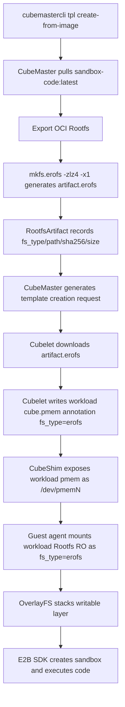

# KEP: Container Rootfs Support for EROFS

## Proposal Information

| Field | Content |
|------|------|
| Status | Draft |
| Related Issue | https://github.com/TencentCloud/CubeSandbox/issues/274 |
| Target Components | CubeMaster, Cubelet, CubeShim |
| Major API Changes | Container Rootfs artifact supports `erofs` |
| Default Behavior | Keep `ext4` |

## Release Signoff Checklist

- [ ] Design details cover CubeMaster, Cubelet, CubeShim, and Guest kernel prerequisites.
- [ ] Test plan covers unit tests, integration tests, end-to-end validation, and ext4 regression.
- [ ] Upgrade, downgrade, and rollback strategies are described.
- [ ] Production readiness issues cover enablement/disablement, observability, dependencies, scalability, and troubleshooting.
- [ ] User documentation synced for `create-from-image --rootfs-fs-type erofs` usage.

## Summary

Cube Sandbox currently primarily adopts `ext4` as the image format for container Rootfs artifacts. While this approach is mature and compatible, `ext4` is not the **optimal solution** in terms of image size, distribution bandwidth, and cold-start I/O overhead for high-density AI Agent sandbox scenarios.

This proposal introduces EROFS (Enhanced Read-Only File System) for container Rootfs artifacts:

- Container Rootfs artifacts support being built as `erofs` format from OCI images.
- CubeMaster, Cubelet, and CubeShim propagate the actual filesystem type via explicit `fs_type` metadata.
- Guest OS rootfs remains using the existing `ext4` scheme and will not be switched to EROFS in this proposal.
- Default behavior remains `ext4`, maintaining full compatibility with old templates, installers, and README paths.

Note: the following data is based on LZ4-compressed EROFS results (`mkfs.erofs -zlz4`).

| Object | ext4 | erofs | Gain |
|------|------|-------|------|
| Container Rootfs `sandbox-code:latest` | 4.7 GB | 2.6 GB | ~45% size reduction |

## Motivation

The base Rootfs in Cube Sandbox serves as an immutable lower layer at runtime, with actual writes handled by a writable layer. For this pattern, a read-only filesystem provides a **natural architectural fit**. EROFS significantly reduces distribution size through LZ4 transparent compression while providing immutable read-only semantics, effectively eliminating the risk of accidental writes or data drift in base images.

In scenarios where a single node hosts massive sandbox instances, image size and cold-start I/O directly impact node pull time, disk footprint, concurrent creation latency, and failure recovery speed. Supporting EROFS for container Rootfs enhances resource efficiency in high-density deployments without changing the upper-layer E2B SDK usage.

> [!IMPORTANT]
> **Trade-offs**: Compared to `ext4 + DAX`, compressed EROFS has the following downsides:
> 1. **No DAX Support**: No zero-copy feature; data must go through decompression and Page Cache.
> 2. **Resource Overhead**: Decompression consumes CPU, and Page Cache usage may increase memory pressure.
>
> `ext4 + DAX` remains the **performance baseline**. Decisions should be based on a balance between storage gains and performance overhead.

### Goals

- CubeMaster supports building `erofs` container Rootfs artifacts from OCI images.
- Explicitly pass the Rootfs artifact `fs_type` between CubeMaster, Cubelet, and CubeShim.
- Cubelet supports downloading, caching, verifying, and injecting EROFS pmem images.
- CubeShim generates correct Guest mount behavior based on the workload pmem's `fs_type`.
- Maintain compatibility with existing ext4 default behavior, old templates, and old installers.

### Non-Goals

- Do not change the runtime writable layer to EROFS. EROFS is only for the read-only base Rootfs.
- Do not support EROFS as a standard data volume.
- Do not modify the Guest OS rootfs format, Guest OS remains as ext4.
- Do not implement layered EROFS, cross-template deduplication, higher compression parameter tuning, or multi-version image reuse.

## Proposal

### User Stories

#### Story 1: Template Creator uses EROFS Container Rootfs

A template creator wants to create a smaller read-only base Rootfs based on the Code Interpreter image in the README:

```bash
cubemastercli tpl create-from-image \
  --image cube-sandbox-int.tencentcloudcr.com/cube-sandbox/sandbox-code:latest \
  --rootfs-fs-type erofs \
  --writable-layer-size 1G \
  --expose-port 49999 \
  --expose-port 49983 \
  --probe 49999
```

Once the template is READY, users still create sandboxes using the original E2B SDK method:

```bash
export E2B_API_URL="http://127.0.0.1:3000"
export E2B_API_KEY="dummy"
export CUBE_TEMPLATE_ID="<template-id>"
export SSL_CERT_FILE="/root/.local/share/mkcert/rootCA.pem"
```

```python
import os
from e2b_code_interpreter import Sandbox

with Sandbox.create(template=os.environ["CUBE_TEMPLATE_ID"]) as sandbox:
    result = sandbox.run_code("print('Hello from Cube Sandbox on EROFS!')")
    print(result)
```

#### Story 2: Node Ops troubleshoots container Rootfs format

A node ops person wants to quickly confirm whether a template uses EROFS. The system should provide clear metadata and observability info:

- `storage_media=erofs` is visible in the template request.
- Artifact annotations include `cube.master.rootfs.artifact.fs_type=erofs`.
- `fs_type=erofs` is included in the node's `cube.pmem` annotation.
- The workload pmem's `fstype=erofs` is visible from the node or guest, while `/` inside the container remains an Overlay writable view.

### Notes / Constraints / Caveats

- **Guest OS rootfs**: Out of scope for this proposal and continues using the existing ext4.
- **DAX Limitation**: EROFS compressed images do not use DAX by default. Compressed EROFS requires a decompression path and cannot simply reuse ext4's `ro,dax` mount options.
- **Guest kernel Requirements**: Must support EROFS and LZ4 to mount the workload pmem inside the Guest.
- **Fingerprint Conflict**: `ext4` and `erofs` artifacts must have different fingerprints to avoid accidental reuse of different formats for the same OCI image.
- **erofs-utils version baseline**: **The build environment must use a fixed `erofs-utils` version, currently recommended as `>= 1.5.0`**. In practice, it should match the version in the CI image, and `mkfs.erofs -V` output should be logged to avoid inconsistent artifacts across multiple Master nodes.
- **Preflight Check**: `mkfs.erofs` comes from `erofs-utils`; the build node needs an explicit preflight check, at least verifying the command exists, the version meets the baseline, LZ4 is supported, and xattrs are not disabled via `-x < 0`.

### Risks and Mitigations

| Risk | Impact | Mitigation |
|------|------|------|
| Guest kernel lacks EROFS/LZ4 built-in | workload pmem cannot be mounted | Check kernel config before build; e2e validation of Guest mount behavior. |
| `mkfs.erofs` missing | Master build fails | Preflight check with clear instructions to install `erofs-utils`. |
| `erofs-utils` version inconsistency | Same OCI image generates different checksums | Fix versions in CI and build nodes; preflight version comparison; record `mkfs.erofs` version in artifact metadata. |
| xattr/whiteout loss | Deleted files reappear in container, Overlay semantics broken | `mkfs.erofs` forbids `-x < 0`; add whiteout and opaque directory e2e. |
| ext4 and erofs artifact mixed up | Startup failure or checksum mismatch | Include fs type in fingerprint. |
| EROFS mount parameters incompatible | workload pmem mount fails | **`erofs` workload mount options only use `ro` in the first phase, strictly excluding `dax`**. |
| Old DB tables lack new fields | Read failure or empty fields | Explicitly treat empty `fs_type` as `ext4`; implement robust default values. |
| Compression causes CPU spike | CPU jitter during high-concurrency cold starts | Record P50/P95 latency, CPU, and IO in e2e; implement creation rate limiting if necessary. |

## Design Details

### End-to-End Workflow



### Data Model and Protocol Changes

#### ImageStorageMediaType

Add `erofs` enum to images proto for CubeMaster and Cubelet:

```proto
enum ImageStorageMediaType {
  docker = 0;
  ext4 = 1;
  erofs = 2;
}
```

`ImageSpec.storage_media` continues to use a string, with valid values `docker`, `ext4`, `erofs`. If missing, it follows current docker/registry pull logic; in old templates, missing fs type is treated as **automatic fallback** to `ext4`.

#### Artifact Metadata

The old fields in existing `RootfsArtifact` are:

| Old Field | Type | Description |
|------|------|------|
| `Ext4Path` | string | Old ext4 artifact path |
| `Ext4SHA256` | string | Old ext4 artifact SHA256 |
| `Ext4SizeBytes` | int64 | Old ext4 artifact file size |

Since the naming of these old fields is tightly coupled with ext4, they cannot naturally express `erofs` artifacts. **To support both `ext4` and `erofs` formats, the following generic fields are added**:

| Field | Type | Description |
|------|------|------|
| `fs_type` | string | `ext4` or `erofs`, treated as `ext4` if old data is empty. |
| `artifact_path` | string | Local artifact path, e.g., `rfs-xxx.erofs`. |
| `artifact_sha256` | string | artifact SHA256. |
| `artifact_size_bytes` | int64 | artifact file size. |

**Compatibility and Fallback Rules**:

1. The read path prioritizes the new generic fields.
2. If the new fields are empty, the system **automatically falls back** to the old fields `Ext4Path`, `Ext4SHA256`, `Ext4SizeBytes`.
3. The write path can fill the old fields simultaneously when `fs_type=ext4` to reduce compatibility risk.

#### Annotations

| Annotation | Description |
|------|------|
| `cube.master.rootfs.artifact.id` | artifact id |
| `cube.master.rootfs.artifact.url` | artifact download URL |
| `cube.master.rootfs.artifact.sha256` | artifact SHA256 |
| `cube.master.rootfs.artifact.size_bytes` | artifact file size |
| `cube.master.rootfs.artifact.fs_type` | `ext4` or `erofs` |
| `cube.master.rootfs.writable_layer_size` | writable layer size |

Cubelet reading priority:

1. `cube.master.rootfs.artifact.fs_type`
2. `ImageSpec.storage_media`
3. Default `ext4`

### CubeMaster Refactor

`cubemastercli tpl create-from-image` adds container Rootfs artifact parameter:

```bash
--rootfs-fs-type ext4|erofs
```

Server-side `CreateTemplateFromImageReq` adds `RootfsFsType string`, defaulting to `ext4`. This field only describes the format of the business Rootfs artifact built from the OCI image.

Server-side validation logic:

- Empty: System sets to `ext4`.
- Valid: `ext4`, `erofs`.
- Other: Returns parameter invalid error.

Template fingerprint must include `RootfsFsType` to avoid accidental reuse of different filesystem format artifacts for the same OCI image and writable layer parameters.

Build process abstraction:

```go
func createRootfsImage(ctx context.Context, fsType, rootfsDir, imagePath string) error
```

`ext4` branch maintains current logic:

```bash
truncate -s <size> artifact.ext4
mkfs.ext4 -F -d <rootfsDir> artifact.ext4
```

`erofs` branch uses:

```bash
mkfs.erofs -zlz4 -x1 artifact.erofs <rootfsDir>
```

> **The purpose of `-x1` is to explicitly ensure xattrs are not disabled when packaging the OCI rootfs directory, so whiteout/opaque-related markers or permission metadata such as `security.capability` written by `setcap` are not lost in the artifact**.

The following build log fields should be recorded:

| Field | Description |
|------|------|
| `rootfs_source_size_bytes` | Size of rootfs directory before packaging. |
| `artifact_size_bytes` | EROFS artifact size. |
| `compression_ratio` | `artifact_size_bytes / rootfs_source_size_bytes`. |
| `erofs_build_seconds` | `mkfs.erofs` execution duration, only for logs. |
| `mkfs_erofs_version` | `mkfs.erofs -V` output. |
| `mkfs_erofs_args` | Actual build arguments, at least including compression algorithm and xattr parameters. |

The writable layer is still created by existing `writable_layer_size` and not changed to EROFS. At runtime, it is still merged with the RO lowerdir via OverlayFS, presenting a writable root directory to the business side.

### Cubelet Refactor

Local cache path from fixed format:

```text
<base>/<instance_type>_os_image/<artifact_id>/<artifact_id>.ext4
```

Expanded to dynamic format:

```text
<base>/<instance_type>_os_image/<artifact_id>/<artifact_id>.<fs_type>
```

Suggested helper method addition:

```go
func GetRawImageFilePath(instanceType, imageID, fsType string) string
```

Old signature can be kept as an `ext4` wrapper. `EnsureImage` follows the artifact download path when identifying `storage_media=ext4|erofs`, not registry pull. SHA256 is strictly verified after download, and error messages should include fs type and artifact id.

Template distribution logic:

- `defaultTemplateImageSpec` keeps `StorageMedia`.
- `ensureDistributedTemplateImage` accepts both `ext4` and `erofs`.
- Injects the actual `FsType` when generating `cube.pmem`.

Example pmem annotation content:

```json
[
  {
    "file": "/data/.../rfs-xxx/rfs-xxx.erofs",
    "discard_writes": true,
    "source_dir": "/",
    "fs_type": "erofs",
    "size": 524288000,
    "id": "cube-container-pmem-0"
  }
]
```

### CubeShim Refactor

This proposal only handles workload `cube.pmem[*].fs_type` and does not change the Guest OS root cmdline.

The Guest OS root cmdline continues as is:

```text
root=/dev/pmem0 rootflags=dax,errors=remount-ro ro rootfstype=ext4
```

The `fs_type` of workload pmem determines the mount behavior in the guest:

- `ext4`: Continue using the existing `ro,dax` semantics.
- `erofs`: Guest agent storage `fstype=erofs`, mount options use only `ro` in the first phase, **must not include `dax`**.

**Explicit DAX Exclusion Logic**:

- **Since `-zlz4` compressed images do not support DAX, CubeShim must explicitly exclude `dax` when generating guest agent `Storage` if the workload pmem `fs_type == "erofs"` to prevent mount failure**.
- This exclusion logic is dynamically performed by `CubeShim` and does not depend on Cubelet injection.

Cloud Hypervisor does not need to recognize EROFS. It only passes pmem devices; the actual mount type is determined by the guest agent and Guest kernel.

**pmem Write Protection**:

- To prevent the Guest from writing to the host-cached `.erofs` base files, pmem configuration passed to Cloud Hypervisor must enable `discard_writes: true`.
- Current Cloud Hypervisor pmem execution protection semantic is `discard_writes`; if an explicit `readonly` field is exposed upstream or by the Cube wrapper later, it can be used on top without changing the upper-layer `fs_type` protocol.

### Guest Kernel Requirements

Although Guest OS rootfs continues to use ext4, the Guest kernel still needs to support EROFS/LZ4 to mount workload pmem:

```text
CONFIG_EROFS_FS=y
CONFIG_EROFS_FS_ZIP=y
CONFIG_EROFS_FS_ZIP_LZ4=y
```

Actual config names may vary slightly by kernel version; base it on current `configs/kernel-*.config` and build kernel version before implementation.

## Implementation Plan

Small, roll-backable steps are recommended:

1. **Protocol and Metadata**: Add `erofs` enum, artifact `fs_type`, annotation, fingerprint dimension, and legacy fallback mechanisms.
2. **CubeShim Semantic Correction**: Support excluding mount option `dax` when workload pmem `fs_type=erofs`.
3. **CubeMaster Build**: `create-from-image --rootfs-fs-type erofs` calls `mkfs.erofs -zlz4 -x1`, and writes generic artifact metadata.
4. **Cubelet Distribution**: Choose cache path and verify artifact based on `fs_type`, and inject workload pmem `fs_type` into `cube.pmem`.
5. **E2E Validation and Documentation**: Run through template creation, distribution, startup, and E2B SDK full lifecycle using README's `sandbox-code:latest`.

## Test Plan

### Prerequisite testing updates

- Add `mkfs.erofs` toolchain preflight test.
- Add Guest kernel config check or documented manual verification steps.
- Add old ext4 artifact compatibility test covering missing `fs_type` metadata.

### Unit tests

CubeMaster:

- `rootfs_fs_type` default is `ext4`.
- Invalid `rootfs_fs_type` is rejected.
- Fingerprint includes fs type; ext4 and erofs do not reuse the same artifact id.
- `createRootfsImage(ext4)` calls `mkfs.ext4`.
- `createRootfsImage(erofs)` calls `mkfs.erofs -zlz4 -x1`.
- `generateTemplateCreateRequest` writes `storage_media=erofs` and `artifact.fs_type=erofs` for erofs.
- Old `RootfsArtifact` without `fs_type` is read as `ext4`.

Cubelet:

- `storage_media=erofs` follows pmem artifact download path, strictly avoiding registry pull.
- Local path uses `.erofs` suffix.
- Returns clear error containing artifact id and fs type if SHA256 verification fails.
- `cube.pmem` annotation correctly injects `fs_type=erofs`.
- Ensure legacy ext4 paths remain fully compatible.

CubeShim:

- Guest OS root cmdline still contains `rootfstype=ext4`.
- guest agent storage `fstype=erofs` and mount options do not contain `dax` when workload pmem `fs_type=erofs`.
- Verify workload pmem `fs_type=erofs` does not accidentally change Guest OS root cmdline.

### Integration tests

- Build ext4 and erofs artifacts using a small local OCI image and compare metadata and distribution behavior.
- Build EROFS template using `sandbox-code:latest`.
- Run Cubelet distribution task, confirm node cache file existence and SHA256 verification.
- Verify mount type and options of workload EROFS pmem inside Guest, confirm no `dax`.
- **OverlayFS Whiteout Test**: Delete base system files from EROFS layer inside sandbox, then create files with same name; verify whiteout mechanism works without kernel errors.
- **High-Concurrency Pressure Test**: Concurrently create 100 EROFS sandboxes; record host CPU Load spike, memory usage curve, and creation P95 latency.

### e2e tests

Using README image as end-to-end example:

```bash
cubemastercli tpl create-from-image \
  --image cube-sandbox-int.tencentcloudcr.com/cube-sandbox/sandbox-code:latest \
  --rootfs-fs-type erofs \
  --writable-layer-size 1G \
  --expose-port 49999 \
  --expose-port 49983 \
  --probe 49999
```

Validation items:

- Job enters `READY`.
- Artifact info shows `fs_type=erofs`.
- `storage_media=erofs` appears in template creation request.
- E2B SDK can create sandbox and execute Python business code.
- Container `/` is still Overlay writable view; workload lower pmem shows `fstype=erofs` and options exclude `dax`.
- Writable layer is writable, e.g., `echo ok > /tmp/erofs-check`.
- Original README ext4 process still succeeds when `--rootfs-fs-type` is not passed.

## Open Questions

- Real-world measured P95/P99, CPU overhead, and memory pressure for `erofs + lz4` vs `ext4 + DAX` in 100-concurrent creation scenarios still need to be aligned.
- Current Guest kernel EROFS/LZ4 config names need to be confirmed based on actual kernel version.

## Graduation Criteria

Alpha / Experimental Phase:

- No behavior change for ext4 default path.
- `sandbox-code:latest` EROFS template can be created and run code end-to-end.
- Unit tests cover protocol, metadata, paths, mount behavior, and compatibility fallback.

Beta / Optional by Default Phase:

- Multi-node distribution and retry paths are stable.
- Upgrade, rollback, and mixed-deployment scenarios for EROFS and ext4 are fully verified.
- Performance data covers size, distribution time, creation P50/P95, CPU, and IO.
- Documentation covers template-side config and troubleshooting manuals.

GA / Stable Phase:

- EROFS is a recommended option for template Rootfs.
- Monitoring and troubleshooting info is sufficient to quickly locate and isolate common failure modes.
- Old ext4 compatibility strategy remains valid.

## Upgrade / Downgrade Strategy

Upgrade:

- New version reads old DB records; artifacts without `fs_type` are treated as ext4.
- Old ext4 templates remain creatable, distributable, and recoverable after upgrade.
- EROFS only takes effect after explicit configuration.

Downgrade:

- Created EROFS templates are not guaranteed to run on older versions that don't recognize `storage_media=erofs` and `fs_type=erofs`.
- **Stop creating new EROFS templates before downgrade, or ensure ext4 templates are kept as rollback targets**.

Rollback:

- **Container Rootfs rollback**: Re-build template with `--rootfs-fs-type ext4`, or switch business to existing ext4 template.
- Do not delete erofs metadata from data layer; keep it for recovery and troubleshooting.

## Version Skew Strategy

New CubeMaster, Old Cubelet:

- CubeMaster might generate `storage_media=erofs`, which old Cubelet won't recognize and will fail. Block EROFS task delivery based on node capability before distribution.

New Cubelet, Old CubeMaster:

- Cubelet continues running under old ext4 logic. Defaults to `ext4` if `fs_type` is missing via system fallback.

Old CubeShim, New Cubelet:

- Cubelet might write `fs_type=erofs`, while old CubeShim still handles it with old ext4 mount logic or fails to mount correctly. Node capability must include CubeShim support status.

Old Guest kernel, New components:

- Components might correctly distribute EROFS artifact, but guest kernel cannot mount workload pmem. Preflight and node readiness should check kernel version base.

## Production Readiness Review

### Feature Enablement and Rollback

Enablement:

- **Container Rootfs**: Pass `--rootfs-fs-type erofs` explicitly during template creation.

Disablement:

- **Container Rootfs**: Do not attach `--rootfs-fs-type` parameter; system automatically falls back to ext4.

Default behavior change:

- **No**. Still defaults to ext4.

Node rebuild required:

- **No node rebuild required**, but strictly requires node component and guest kernel support.

### Rollout, Upgrade and Rollback Planning

Possible failure points:

- Build node lacks `mkfs.erofs`.
- Guest kernel lacks EROFS/LZ4 support.
- CubeMaster/Cubelet/CubeShim version mismatch.
- Old ext4 file exists in node cache but metadata points to erofs.
- CPU overhead introduced by compressed EROFS during high-concurrency cold starts.

Suggested rollout order:

1. Enable EROFS container Rootfs template on a single node.
2. Distribute EROFS templates to multiple nodes for verification.
3. Gradually expand to production nodes.

Rollback metrics:

- Artifact build failure rate increases.
- Distribution failure rate increases.
- Sandbox creation P95 degrades significantly.
- workload pmem mount failure.
- Node CPU, IO wait, or disk errors increase significantly.


### Dependencies

- **Build nodes**: Require a fixed version of `erofs-utils`, providing `mkfs.erofs`, LZ4, and xattr support.
- **Guest kernel**: Requires built-in EROFS/LZ4 support.
- **Cloud Hypervisor**: Only needs to continue supporting pmem passing; no extra EROFS semantics needed.

### Scalability

New API calls:

- **None**. No new cross-component RPC types; only extend existing request fields, enums, annotations, and metadata.

New API objects:

- **None**. No new independent API objects.

Resource usage changes:

- Expected decrease in disk and network transmission.
- EROFS build phase may increase CPU consumption.
- Runtime reads from compressed EROFS introduce additional decompression CPU overhead.
- High-concurrency cold start needs comparison of P95, CPU, and IO between ext4 and erofs.

### Troubleshooting

Common failures and troubleshooting:

| Symptom | Troubleshooting Path |
|------|------|
| `mkfs.erofs` not found | Check if build node has `erofs-utils` installed via package manager. |
| workload pmem mount failure | Check guest kernel config, CubeShim mount parameters, `fs_type` in `cube.pmem`. |
| `wrong fs type` | Check artifact `fs_type`, file suffix, and annotations. |
| Template distribution failure | Check download URL, token, SHA256, Cubelet local cache path. |
| Performance degradation | Compare CPU usage, IO wait, sandbox create P95, artifact size. |

Guest internal verification commands:

```bash
mount | grep erofs
cat /proc/filesystems | grep erofs
```

## Implementation History

- 2026-05-15: Issue #274 proposed support for EROFS Rootfs and Guest OS images.
- 2026-05-16: Design narrowed to "**EROFS support for container Rootfs only, Guest OS remains ext4 to ensure kernel base stability**".

## Drawbacks

- Introduction of `fs_type` increases complexity as build, distribution, cache, and mount paths all need to be compatible with multiple formats.
- EROFS compressed images may shift some IO costs to CPU decompression costs.
- **Guest kernel still needs to support EROFS/LZ4**, making deployment prerequisites stricter than a pure ext4 scheme.
- Older components do not recognize EROFS, requiring capability or version checks to avoid mixed deployment failures.

## Alternatives

### Alternative A: Continue using only ext4

Simplest to implement, best compatibility, and current ext4 rootfs can continue using DAX to bypass the Page Cache and reduce duplicate memory usage.

**Disadvantage**: Cannot obtain size and distribution gains from compression, nor read-only immutable semantics. Since `erofs -zlz4` does not support DAX, `ext4 + DAX` should be treated as the **Performance Baseline** rather than just a legacy scheme. EROFS should be the recommended path only if benchmarks prove its storage gains far outweigh CPU/memory overhead.

Mandatory comparison data:

| Metric | `ext4 + DAX` | `erofs + lz4` | Decision Basis |
|------|--------------|---------------|----------|
| Artifact Size | Required | Required | Quantify distribution and disk gain. |
| Node Distribution Duration | Required | Required | Judge node pull/distribution gain. |
| Single Sandbox Boot Latency P50/P95 | Required | Required | Judge if single instance cold start regresses. |
| 100 Sandbox Concurrent Create P50/P95/P99 | Required | Required | Judge if high-concurrency creation leads to system overload. |
| Host CPU Peak / Average | Required | Required | Capture CPU overhead introduced by LZ4 decompression. |
| Host/Guest Memory, Page Cache Pressure | Required | Required | Observe Guest Page Cache and memory pressure changes after losing DAX. |
| Workload First Command Latency | Required | Required | Observe business-perceivable startup time. |

Recommended decision thresholds:

- `erofs + lz4` size should decrease by at least 30%, otherwise gains are insufficient.
- 100 concurrency creation P95 should not regress more than 10% compared to `ext4 + DAX`.

### Alternative B: Use uncompressed EROFS and evaluate DAX

Uncompressed EROFS can be used as an alternative to `erofs + lz4`. It preserves EROFS read-only immutable semantics but gives up size compression; its advantage is that it can theoretically support DAX.

This path is not preferred for now because its size advantage almost disappears without compression. It should only be considered when memory is extremely constrained and image immutability requirements are very high.

### Alternative C: Expanding to Guest OS rootfs

Given that all sandboxes on a node share a single Guest OS rootfs, the storage gains from compression are negligible. Furthermore, compressed EROFS is incompatible with DAX. Therefore, this is excluded from the current scope.

### Alternative D: Infer fs type via filename suffix

Not adopted as the sole mechanism. Filenames assist troubleshooting, but actual behavior must rely on explicit metadata like artifact annotations to avoid logic errors.
