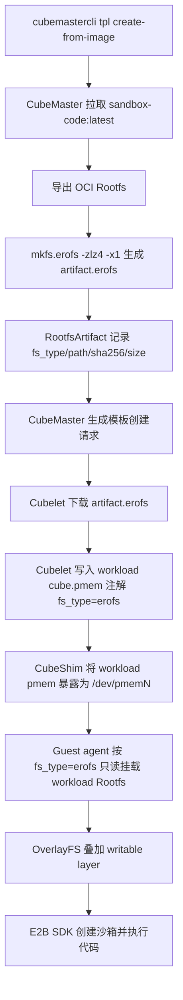

# KEP: 容器 Rootfs 支持 EROFS

## 提案信息

| 字段 | 内容 |
|------|------|
| 状态 | Draft |
| 关联 Issue | https://github.com/TencentCloud/CubeSandbox/issues/274 |
| 目标组件 | CubeMaster, Cubelet, CubeShim |
| 主要接口变化 | 容器 Rootfs artifact 支持 `erofs` |
| 默认行为 | 保持 `ext4` |

## Release Signoff Checklist

- [ ] 设计细节已覆盖 CubeMaster、Cubelet、CubeShim 和 Guest kernel 前置要求。
- [ ] 测试计划覆盖单测、集成测试、端到端验证和 ext4 回归。
- [ ] 升级、降级、回滚策略已说明。
- [ ] 生产可用性问题已覆盖启停、观测、依赖、扩展性和故障排查。
- [ ] 用户文档已同步 `create-from-image --rootfs-fs-type erofs` 的用法。

## Summary

Cube Sandbox 目前主要采用 `ext4` 作为容器 Rootfs artifact 格式。该方案成熟且兼容性好，但在只读、高密度、高并发冷启动的 AI Agent 沙箱场景下，`ext4` 的镜像体积、分发带宽和冷启动 I/O 成本并非**最优解**。

本提案为容器 Rootfs artifact 引入 EROFS (Enhanced Read-Only File System)：

- 容器 Rootfs artifact 支持从 OCI 镜像构建为 `erofs` 格式。
- CubeMaster、Cubelet、CubeShim 通过显式 `fs_type` metadata 传递真实文件系统类型。
- Guest OS rootfs 保持现有 `ext4` 方案，不在本提案中切换到 EROFS。
- 默认仍为 `ext4`，旧模板、旧安装包和 README 原路径保持兼容。


说明：以下数据基于 LZ4 压缩 EROFS 结果（`mkfs.erofs -zlz4`）。

| 对象 | ext4 | erofs | 收益 |
|------|------|-------|------|
| 容器 Rootfs `sandbox-code:latest` | 4.7 GB | 2.6 GB | 约 45% 体积下降 |

## Motivation

Cube Sandbox 的基础 Rootfs 在运行时作为不可变 lower layer 使用，实际写入由 writable layer 承接。对这种模式而言，只读文件系统具备**天然的架构契合度**。EROFS 通过 LZ4 透明压缩显著降低分发体积，并提供只读不可变语义，有效规避基础镜像被误写或产生数据漂移的风险。

在单机承载大量沙箱实例时，镜像体积和冷启动 I/O 直接影响节点拉取耗时、磁盘占用、并发创建延迟及故障恢复速度。引入 EROFS 支持可在不改变上层 E2B SDK 使用方式的前提下，显著提升高密度部署下的资源效率。

> [!IMPORTANT]
> **权衡与限制**：相比成熟的 `ext4 + DAX` 方案，压缩版 EROFS 的劣势在于：
> 1. **DAX 缺失**：不支持 DAX，数据读取必须经过解压和 Page Cache，无零拷贝特性。
> 2. **资源开销**：解压消耗 CPU，且 Page Cache 占用可能增加内存压力。
>
> `ext4 + DAX` 仍是**性能标杆**。建议根据业务收益权衡后再决定是否切换。

### Goals

- CubeMaster 支持从 OCI 镜像构建 `erofs` 容器 Rootfs artifact。
- CubeMaster、Cubelet、CubeShim 之间显式传递 Rootfs artifact 的 `fs_type`。
- Cubelet 支持下载、缓存、校验和注入 EROFS pmem 镜像。
- CubeShim 根据 workload pmem 的 `fs_type` 生成正确的 Guest mount 行为。
- 保持现有 ext4 默认行为、旧模板和旧安装包兼容。

### Non-Goals

- 不把运行时 writable layer 改成 EROFS。EROFS 仅用于只读基础 Rootfs。
- 不实现 EROFS 作为普通数据 volume。
- 不修改 Guest OS rootfs 格式，Guest OS 保持 ext4。
- 不实现分层 EROFS、跨模板去重、更高压缩率参数调优或多版本镜像复用。

## Proposal

### 用户故事

#### Story 1: 模板创建者使用 EROFS 容器 Rootfs

模板创建者希望基于 README 中的 Code Interpreter 镜像创建更小的只读基础 Rootfs：

```bash
cubemastercli tpl create-from-image \
  --image cube-sandbox-int.tencentcloudcr.com/cube-sandbox/sandbox-code:latest \
  --rootfs-fs-type erofs \
  --writable-layer-size 1G \
  --expose-port 49999 \
  --expose-port 49983 \
  --probe 49999
```

模板 READY 后，用户仍按原 E2B SDK 方式创建沙箱：

```bash
export E2B_API_URL="http://127.0.0.1:3000"
export E2B_API_KEY="dummy"
export CUBE_TEMPLATE_ID="<template-id>"
export SSL_CERT_FILE="/root/.local/share/mkcert/rootCA.pem"
```

```python
import os
from e2b_code_interpreter import Sandbox

with Sandbox.create(template=os.environ["CUBE_TEMPLATE_ID"]) as sandbox:
    result = sandbox.run_code("print('Hello from Cube Sandbox on EROFS!')")
    print(result)
```

#### Story 2: 节点运维排查容器 Rootfs 格式

节点运维希望快速确认一个模板是否使用 EROFS。系统应提供明确的 metadata 和可观测信息：

- 模板请求中可以看到 `storage_media=erofs`。
- Artifact annotations 中包含 `cube.master.rootfs.artifact.fs_type=erofs`。
- 节点 `cube.pmem` 注解中包含 `fs_type=erofs`。
- 节点或 Guest 内可以看到 workload pmem 的 `fstype=erofs`，容器内 `/` 仍是 Overlay 可写视图。

### Notes / Constraints / Caveats

- **Guest OS rootfs**：不在本提案范围内，继续使用现有 ext4。
- **DAX 限制**：EROFS 压缩镜像默认不使用 DAX。压缩 EROFS 需要解压路径，不能简单复用 ext4 的 `ro,dax` 挂载选项。
- **Guest kernel 要求**：必须支持 EROFS 和 LZ4，才能在 Guest 内挂载 workload pmem。
- **指纹冲突**：`ext4` 与 `erofs` artifact 必须有不同 fingerprint，避免同一 OCI 镜像错误复用不同格式产物。
- **erofs-utils 版本基线**：**构建环境必须固定 `erofs-utils` 版本，当前建议基线为 `>= 1.5.0`**。实际落地时应以 CI 镜像中的版本为准，并记录 `mkfs.erofs -V` 输出，避免多 Master 节点生成不一致的 artifact。
- **Preflight 检查**：`mkfs.erofs` 来自 `erofs-utils`，构建节点需要显式 preflight，至少检查命令存在、版本满足基线、支持 LZ4，并且未通过 `-x < 0` 禁用 xattrs。

### Risks and Mitigations

| 风险 | 影响 | 缓解 |
|------|------|------|
| Guest kernel 未内建 EROFS/LZ4 | workload pmem 无法挂载 | 构建前检查 kernel config；端到端验证 Guest mount 行为。 |
| `mkfs.erofs` 不存在 | Master 构建失败 | Preflight 明确提示安装 `erofs-utils`。 |
| `erofs-utils` 版本不一致 | 同一 OCI 镜像生成不同 checksum | CI 和构建节点固定版本；preflight 比对版本；artifact metadata 记录 `mkfs.erofs` 版本。 |
| xattr/whiteout 丢失 | 容器内出现本应被删除的文件，Overlay 语义错误 | `mkfs.erofs` 禁止 `-x < 0`；增加 whiteout 和 opaque directory e2e。 |
| ext4 与 erofs artifact 误复用 | 启动失败或 checksum 不一致 | Fingerprint 纳入 fs type。 |
| EROFS mount 参数不兼容 | workload pmem mount 失败 | **`erofs` workload mount options 第一阶段只使用 `ro`，剔除 `dax`**。 |
| 旧 DB 表无新字段 | 读取失败或字段为空 | 明确 `fs_type` 为空时等价于 `ext4`；实现健壮的 Default 值填充器。 |
| 压缩导致 CPU 开销上升 | 高并发冷启动 CPU 抖动 | e2e 中记录 P50/P95 创建延迟、CPU 使用和 IO 等指标；必要时实施创建限流。 |

## Design Details

### 端到端链路



### 数据模型与协议变更

#### ImageStorageMediaType

CubeMaster 与 Cubelet 的 images proto 增加 `erofs` 枚举：

```proto
enum ImageStorageMediaType {
  docker = 0;
  ext4 = 1;
  erofs = 2;
}
```

`ImageSpec.storage_media` 继续使用字符串承载，合法值为 `docker`、`ext4`、`erofs`。缺失时沿用当前 docker/registry pull 逻辑；旧模板中没有 fs type 时系统自动 fallback 为 `ext4` 处理。

#### Artifact 元数据

现有 `RootfsArtifact` 中的老字段为：

| 老字段 | 类型 | 说明 |
|------|------|------|
| `Ext4Path` | string | 旧 ext4 artifact 路径 |
| `Ext4SHA256` | string | 旧 ext4 artifact SHA256 |
| `Ext4SizeBytes` | int64 | 旧 ext4 artifact 文件大小 |

由于这些老字段的命名与 ext4 强绑定，无法自然表达 `erofs` artifact。**为支持 `ext4` 与 `erofs` 双格式，新增以下通用字段**：

| 字段 | 类型 | 说明 |
|------|------|------|
| `fs_type` | string | `ext4` 或 `erofs`，旧数据为空时视为 `ext4`。 |
| `artifact_path` | string | 本地 artifact 路径，例如 `rfs-xxx.erofs`。 |
| `artifact_sha256` | string | artifact SHA256。 |
| `artifact_size_bytes` | int64 | artifact 文件大小。 |

**兼容与回退规则**：

1. 读路径优先使用新通用字段。
2. 新字段为空时，系统**自动回退**到老字段 `Ext4Path`、`Ext4SHA256`、`Ext4SizeBytes`。
3. 写路径在 `fs_type=ext4` 时可以同时回填老字段，降低兼容风险。

#### 注解

| 注解 | 说明 |
|------|------|
| `cube.master.rootfs.artifact.id` | artifact id |
| `cube.master.rootfs.artifact.url` | artifact 下载 URL |
| `cube.master.rootfs.artifact.sha256` | artifact SHA256 |
| `cube.master.rootfs.artifact.size_bytes` | artifact 文件大小 |
| `cube.master.rootfs.artifact.fs_type` | `ext4` 或 `erofs` |
| `cube.master.rootfs.writable_layer_size` | writable layer 大小 |

Cubelet 读取优先级：

1. `cube.master.rootfs.artifact.fs_type`
2. `ImageSpec.storage_media`
3. 默认 `ext4`

### CubeMaster 改造

`cubemastercli tpl create-from-image` 新增容器 Rootfs artifact 参数：

```bash
--rootfs-fs-type ext4|erofs
```

服务端 `CreateTemplateFromImageReq` 增加 `RootfsFsType string`，默认 `ext4`。该字段仅用于描述从 OCI image 构建出的业务 Rootfs artifact 格式。

服务端校验逻辑：

- 空值：系统设定为 `ext4`。
- 合法值：`ext4`、`erofs`。
- 其他值：返回参数非法错误。

模板 fingerprint 需要包含 `RootfsFsType`，避免在同一 OCI 镜像、同一 writable layer 参数下错误复用不同文件系统格式的 artifact。

构建流程抽象为：

```go
func createRootfsImage(ctx context.Context, fsType, rootfsDir, imagePath string) error
```

`ext4` 分支保持当前逻辑：

```bash
truncate -s <size> artifact.ext4
mkfs.ext4 -F -d <rootfsDir> artifact.ext4
```

`erofs` 分支使用：

```bash
mkfs.erofs -zlz4 -x1 artifact.erofs <rootfsDir>
```

> **`-x1` 的目的，是在打包 OCI rootfs 目录时显式保证 xattrs 不被禁用，避免 `setcap` 写入的 `security.capability` 等权限元数据在 artifact 中丢失**。

实现时需要记录以下构建日志字段：

| 字段 | 说明 |
|------|------|
| `rootfs_source_size_bytes` | 打包前 rootfs 目录大小。 |
| `artifact_size_bytes` | EROFS artifact 大小。 |
| `compression_ratio` | `artifact_size_bytes / rootfs_source_size_bytes`。 |
| `erofs_build_seconds` | `mkfs.erofs` 执行耗时，仅用于日志排查。 |
| `mkfs_erofs_version` | `mkfs.erofs -V` 输出。 |
| `mkfs_erofs_args` | 实际构建参数，至少包含压缩算法和 xattr 参数。 |

可写层仍由现有 `writable_layer_size` 创建，不改为 EROFS。运行时仍通过 OverlayFS 把只读 lowerdir 与 writable upperdir/workdir 合并，业务侧感知到的依然是可写根目录。

### Cubelet 改造

本地缓存路径从固定格式：

```text
<base>/<instance_type>_os_image/<artifact_id>/<artifact_id>.ext4
```

扩展为动态格式：

```text
<base>/<instance_type>_os_image/<artifact_id>/<artifact_id>.<fs_type>
```

建议新增辅助方法：

```go
func GetRawImageFilePath(instanceType, imageID, fsType string) string
```

旧签名可保留为 `ext4` wrapper。`EnsureImage` 识别 `storage_media=ext4|erofs` 时均走 artifact 下载路径，不进入 registry pull。下载完成后严格校验 SHA256，错误信息应包含 fs type 和 artifact id。

模板分发逻辑：

- `defaultTemplateImageSpec` 保留 `StorageMedia`。
- `ensureDistributedTemplateImage` 同时接受 `ext4` 和 `erofs`。
- 生成 `cube.pmem` 时注入真实的 `FsType`。

示例 pmem 注解内容：

```json
[
  {
    "file": "/data/.../rfs-xxx/rfs-xxx.erofs",
    "discard_writes": true,
    "source_dir": "/",
    "fs_type": "erofs",
    "size": 524288000,
    "id": "cube-container-pmem-0"
  }
]
```

### CubeShim 改造

本提案仅处理 workload `cube.pmem[*].fs_type`，不改变 Guest OS root cmdline。

Guest OS root cmdline 继续保持现状：

```text
root=/dev/pmem0 rootflags=dax,errors=remount-ro ro rootfstype=ext4
```

Workload pmem 的 `fs_type` 决定 Guest 内的挂载行为：

- `ext4`：继续使用现有 `ro,dax` 语义。
- `erofs`：Guest agent storage `fstype=erofs`，mount options 第一阶段只使用 `ro`，**不得附带 `dax`**。

**DAX 显式剔除逻辑**：

- **由于 `-zlz4` 压缩镜像不支持 DAX，CubeShim 生成 Guest agent `Storage` 时，若 workload pmem 的 `fs_type == "erofs"`，必须显式剔除 `dax` 参数，以防 Guest Kernel 挂载失败**。
- 这一剔除逻辑由 `CubeShim` 动态完成，不依赖 Cubelet 的注入。

Cloud Hypervisor 不需要识别 EROFS。它仅负责传入 pmem 设备；真正的挂载类型由 Guest agent 和 Guest kernel 决定。

**pmem 写保护**：

- 为了防止 Guest 写入宿主机缓存的 `.erofs` 基础文件，CubeShim 传递给 Cloud Hypervisor 的 pmem 配置必须启用 `discard_writes: true`。
- 当前 Cloud Hypervisor pmem 配置的可执行保护语义是 `discard_writes`；若后续上游或 Cube wrapper 暴露显式 `readonly` 字段，可以在不改变上层 `fs_type` 协议的前提下叠加使用。

### Guest Kernel 要求

虽然 Guest OS rootfs 继续使用 ext4，但 Guest kernel 仍需支持 EROFS/LZ4 格式，才能正确挂载 workload pmem：

```text
CONFIG_EROFS_FS=y
CONFIG_EROFS_FS_ZIP=y
CONFIG_EROFS_FS_ZIP_LZ4=y
```

实际配置项名称可能随 kernel 版本不同略有差异，实施前以当前 `configs/kernel-*.config` 和构建 kernel 版本为准。

## Implementation Plan

建议按可回退、小步快跑的方式推进：

1. **协议与 metadata**：增加 `erofs` 枚举、artifact `fs_type`、annotation、fingerprint 维度和旧数据回退机制。
2. **CubeShim 语义修正**：支持 workload pmem `fs_type=erofs` 时动态剔除挂载选项中的 `dax`。
3. **CubeMaster 构建**：`create-from-image --rootfs-fs-type erofs` 调用 `mkfs.erofs -zlz4 -x1`，并写入通用 artifact metadata。
4. **Cubelet 分发**：按 `fs_type` 选择缓存路径、校验 artifact，并将 workload pmem `fs_type` 注入 `cube.pmem`。
5. **端到端验证与文档**：使用 README 中的 `sandbox-code:latest` 跑通模板创建、分发、启动和 E2B SDK 全链路。

## Test Plan

### Prerequisite testing updates

- 增加 `mkfs.erofs` 工具链的 preflight 测试。
- 增加 Guest kernel config 检查或文档化的人工核验步骤。
- 增加旧 ext4 artifact 兼容性测试，覆盖无 `fs_type` 元数据的遗留数据。

### Unit tests

CubeMaster：

- `rootfs_fs_type` 默认值应为 `ext4`。
- 非法 `rootfs_fs_type` 请求必须被拒绝。
- Fingerprint 必须包含 fs type，确保 ext4 与 erofs 不会共用同一个 artifact id。
- `createRootfsImage(ext4)` 路径调用 `mkfs.ext4`。
- `createRootfsImage(erofs)` 路径调用 `mkfs.erofs -zlz4 -x1`。
- `generateTemplateCreateRequest` 对 erofs 写入 `storage_media=erofs` 与 `artifact.fs_type=erofs`。
- 旧 `RootfsArtifact` 缺失 `fs_type` 时按 `ext4` 读取。

Cubelet：

- `storage_media=erofs` 走 pmem artifact 下载流程，严禁走 registry pull。
- 本地路径后缀名应使用 `.erofs`。
- SHA256 校验失败时返回清晰的包含 artifact id 和 fs type 的错误信息。
- `cube.pmem` 注解中正确注入 `fs_type=erofs`。
- 确保 ext4 旧路径依然兼容。

CubeShim：

- Guest OS root cmdline 仍保留 `rootfstype=ext4`。
- workload pmem `fs_type=erofs` 时 Guest agent storage `fstype=erofs`，且挂载选项不含 `dax`。
- 验证 workload pmem 的 `fs_type=erofs` 不会误改动 Guest OS 的根启动参数。

### Integration tests

- 使用本地轻量化 OCI 镜像构建 ext4 和 erofs 两种 artifact，比对元数据与分发行为。
- 使用 `sandbox-code:latest` 构建正式的 EROFS 模板。
- 运行 Cubelet 分发任务，确认节点缓存文件物理存在并通过 SHA256 校验。
- 在 Guest 内验证 workload EROFS pmem 的挂载类型和挂载选项，确认无 `dax`。
- **OverlayFS Whiteout 测试**：在沙箱内删除 EROFS 层自带的基础系统文件，随后创建同名文件，验证 whiteout 机制是否正常工作且无内核报错。
- **高并发压力测试**：并发创建 100 个 EROFS 沙箱，记录宿主机 CPU Load 尖峰、内存使用曲线以及创建 P95 延迟。

### e2e tests

以 README 镜像作为端到端验证样例：

```bash
cubemastercli tpl create-from-image \
  --image cube-sandbox-int.tencentcloudcr.com/cube-sandbox/sandbox-code:latest \
  --rootfs-fs-type erofs \
  --writable-layer-size 1G \
  --expose-port 49999 \
  --expose-port 49983 \
  --probe 49999
```

验证项：

- Job 状态成功进入 `READY`。
- Artifact 元数据显式显示 `fs_type=erofs`。
- `storage_media=erofs` 正确出现在模板创建请求中。
- E2B SDK 能正常创建沙箱并执行 Python 业务代码。
- 容器内 `/` 依然是 Overlay 可写视图；从节点或 Guest 视角看 workload lower pmem 显示为 `fstype=erofs` 且不含 `dax`。
- Writable layer 依然可写，例如执行 `echo ok > /tmp/erofs-check`。
- 不传 `--rootfs-fs-type` 时，README 原有的 ext4 流程依然成功。

## Open Questions

- `erofs + lz4` 与 `ext4 + DAX` 在 100 并发创建场景下的 P95/P99 延迟、CPU 开销和内存占用数据需进一步实测对齐。
- 当前 Guest kernel 的 EROFS/LZ4 config 具体名称需结合实际内核版本进行二次核验。

## Graduation Criteria

Alpha / 实验阶段：

- ext4 默认路径无任何行为变更。
- `sandbox-code:latest` EROFS 模板能端到端创建并成功运行代码。
- 单测覆盖协议、元数据、路径、挂载行为及兼容性回退。

Beta / 默认可选阶段：

- 多节点分发与重试逻辑表现稳定。
- EROFS 与 ext4 的平滑升级、回滚、混部场景通过全面验证。
- 性能数据完整覆盖体积、分发耗时、创建 P50/P95、CPU 负载和 IO 指标。
- 技术文档覆盖模板侧配置指引及常见故障排障手册。

GA / 稳定阶段：

- EROFS 成为模板 Rootfs 的官方推荐选项。
- 监控与排障体系足够成熟，能快速定位并隔离常见失败模式。
- 旧 ext4 兼容策略长期持续有效。

## Upgrade / Downgrade Strategy

升级：

- 新版本读取旧数据库记录时，缺失 `fs_type` 的 artifact 统一按 ext4 处理。
- 升级后现有的 ext4 旧模板继续保持可创建、可分发、可恢复的状态。
- EROFS 仅在模板创建时显式指定后生效。

降级：

- 已创建的 EROFS 模板无法在旧版本组件上运行，因为旧版本无法识别 `storage_media=erofs` 和 `fs_type=erofs`。
- **降级前应停止创建新的 EROFS 模板，或确保保留有 ext4 模板作为回退目标**。

回滚：

- **容器 Rootfs 回滚**：重新使用 `--rootfs-fs-type ext4` 构建模板，或直接切换业务流量到已有的 ext4 template。
- 数据层保留 erofs 元数据不删除，用于可能的恢复与故障追溯。

## Version Skew Strategy

CubeMaster 新、Cubelet 旧：

- CubeMaster 生成的 `storage_media=erofs` 任务，旧版 Cubelet 因无法识别将导致失败。分发前应基于节点 Capability 列表拦截 EROFS 任务的下发。

Cubelet 新、CubeMaster 旧：

- Cubelet 继续沿用旧的 ext4 逻辑运行。元数据缺失 `fs_type` 时系统默认回退为 ext4。

CubeShim 旧、Cubelet 新：

- Cubelet 可能下发 `fs_type=erofs`，但旧版 CubeShim 仍按 ext4 挂载逻辑处理或导致挂载失败。节点 Capability 必须准确反映 CubeShim 的支持状态。

Guest kernel 旧、组件新：

- 组件可能正确分发了 EROFS artifact，但 Guest kernel 无法挂载 workload pmem。Preflight 和节点 Readiness 阶段应严格核查内核版本底座。

## Production Readiness Review

### Feature Enablement and Rollback

启用方式：

- **容器 Rootfs**：模板创建时显式传递 `--rootfs-fs-type erofs`。

禁用方式：

- **容器 Rootfs**：不附加 `--rootfs-fs-type` 参数，系统自动回退到 ext4。

默认行为是否变化：

- **否**。默认依然为 ext4 方案。

是否需要节点重建：

- **毋须重建节点**，但严格要求节点组件版本和 Guest kernel 的功能支持。

### Rollout, Upgrade and Rollback Planning

潜在失败点：

- 构建节点缺失 `mkfs.erofs` 工具。
- Guest kernel 缺少 EROFS/LZ4 驱动支持。
- CubeMaster/Cubelet/CubeShim 版本偏斜。
- 节点缓存中存在同名旧 ext4 文件但元数据已指向 erofs。
- 压缩 EROFS 在极端高并发场景下导致的 CPU 开销上升。

建议灰度顺序：

1. 单节点试点开启 EROFS 容器 Rootfs 模板。
2. 小规模多节点分发 EROFS 模板验证。
3. 逐步全量扩大到生产集群。

回滚指标：

- 模板构建失败率异常升高。
- 镜像分发超时或失败率显著升高。
- Sandbox 创建 P95 延迟出现明显劣化。
- Workload pmem 挂载失败。
- 宿主机 CPU Load、IO Wait 或磁盘错误监控显著飘红。

### Dependencies

- **构建节点**：需要固定版本的 `erofs-utils`，提供 `mkfs.erofs`、LZ4 和 xattr 支持。
- **Guest kernel**：需要内建 EROFS/LZ4 格式支持。
- **Cloud Hypervisor**：仅需继续提供透明的 pmem 传递能力，无需额外的 EROFS 语义感知。

### Scalability

新增 API 调用：

- **无**。不新增跨组件 RPC 类型，仅在现有请求字段、枚举、Annotations 和 Metadata 中进行扩展。

新增 API 对象：

- **无**。不引入独立的 API 对象。

资源使用变化：

- 磁盘占用与网络分发带宽预计显著下降。
- EROFS 构建阶段可能会有瞬间的 CPU 峰值。
- 压缩 EROFS 运行时读取会带来额外的解压 CPU 开销。
- 高并发冷启动场景需重点对比 ext4 与 erofs 的 P95 延迟。

### Troubleshooting

常见故障与排查手册：

| 现象 | 排查路径 |
|------|------|
| `mkfs.erofs` not found | 检查构建节点是否通过 `apt/yum` 安装了 `erofs-utils`。 |
| workload pmem 挂载失败 | 检查 Guest 内核配置、CubeShim 挂载参数及 `cube.pmem` 中的 `fs_type`。 |
| `wrong fs type` 报错 | 检查 artifact `fs_type`、物理文件后缀及相关 Annotations。 |
| 模板分发失败 | 检查 Artifact 下载 URL、Token、SHA256 校验及 Cubelet 本地路径权限。 |
| 性能劣化 | 横向比对 CPU 使用率、IO Wait、Sandbox 创建 P95 及 Artifact 体积。 |

Guest 内验证命令：

```bash
mount | grep erofs
cat /proc/filesystems | grep erofs
```

## Implementation History

- 2026-05-15: Issue #274 提出支持 EROFS Rootfs 与 Guest OS 镜像。
- 2026-05-16: 设计方案经过技术委员会评审，收敛为“**仅容器 Rootfs 支持 EROFS，Guest OS 保持 ext4 方案以确保内核底座稳定性**”。

## Drawbacks

- 引入 `fs_type` 维度后，构建、分发、缓存和挂载路径均需兼容多格式，代码复杂度略有上升。
- EROFS 压缩镜像本质上是“以 CPU 换 IO”，在 CPU 密集型节点上可能引入竞争。
- **Guest kernel 仍需增加驱动支持**，部署前置条件比纯粹的 ext4 方案略显严格。
- 旧版组件无法识别 EROFS，混部场景下必须依赖调度器或节点 Capability 进行任务路由隔离。

## Alternatives

### 方案 A：继续仅使用 ext4

实现最为简单，兼容性极佳，且当前 ext4 rootfs 能持续使用 DAX 绕过 Page Cache，从而减少重复内存占用。

**缺点**：无法享受压缩带来的存储与分发体积大幅削减，也缺乏只读文件系统原生的数据保护语义。考虑到 `erofs -zlz4` 暂不支持 DAX，`ext4 + DAX` 应被视作**性能标杆（Performance Baseline）**而非单纯的落后方案。只有当 Benchmarks 证明 EROFS 在存储节省上的收益远超 CPU/内存开销时，才应将其设为默认推荐。

必须采集的对比数据：

| 指标 | `ext4 + DAX` | `erofs + lz4` | 决策依据 |
|------|--------------|---------------|----------|
| Artifact Size | 必填 | 必填 | 量化分发速度与磁盘成本收益。 |
| Node Distribution Duration | 必填 | 必填 | 评估大规模节点并发拉取的压力。 |
| Single Sandbox Boot Latency P50/P95 | 必填 | 必填 | 判断单实例冷启动是否存在显著退化。 |
| 100 Sandbox Concurrent Create P50/P95/P99 | 必填 | 必填 | 判断高并发解压是否导致系统过载。 |
| Host CPU Peak / Average | 必填 | 必填 | 捕获 LZ4 解压引入的 CPU 开销。 |
| Host/Guest Memory, Page Cache Pressure | 必填 | 必填 | 观察失去 DAX 后的 Guest Page Cache 与内存压力变化。 |
| Workload First Command Latency | 必填 | 必填 | 站在业务视角评估真实的可用时间。 |

推荐判定门槛：

- `erofs + lz4` 的体积必须至少下降 30%，否则收益不足以抵消 CPU 开销风险。
- 100 并发下的创建 P95 不得比 `ext4 + DAX` 劣化超过 10%。

### 方案 B：使用无压缩 EROFS 并评估 DAX

无压缩 EROFS 可作为 `erofs + lz4` 的备选方案。它保留了 EROFS 的只读不可变语义，但放弃了体积压缩；优势在于理论上能支持 DAX。

该路线暂不作为首选，因为如果不进行压缩，其体积优势几乎消失。只有在内存极度受限且对镜像安全性要求极高时，才考虑引入。

### 方案 C：扩展到 Guest OS rootfs

由于单节点内所有沙箱实例共用同一个 Guest OS rootfs，压缩带来的存储收益并不显著。此外，压缩格式的 EROFS 无法利用 DAX 特性，故暂不考虑。

### 方案 D：通过文件名后缀推断 fs type

不采用作为唯一判断依据。文件名后缀仅作为运维辅助展示，核心业务逻辑必须强制依赖 Artifact Annotations 等显式元数据，避免脚本分支逻辑因后缀误判导致线上事故。
