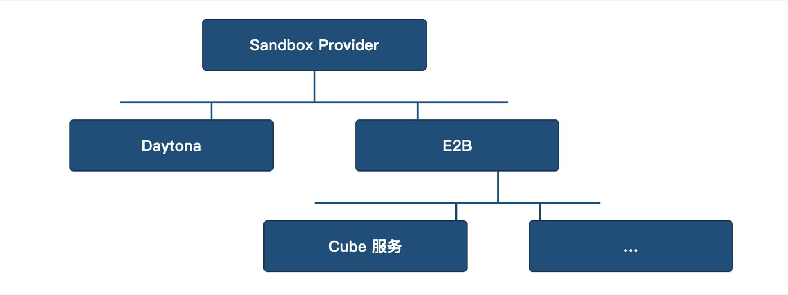

# 从 Daytona 到 Cube Sandbox：联想云端 Agent 的沙箱迁移与演进

访谈对象｜联想 AI 研发工程师 · 李健

**编者按｜** 把一个云端 Agent 产品的沙箱从 Daytona 换成 Cube，看起来只是换了一个更快的工具。但真正做下来会发现，迁移会改变三件事：沙箱的部署形态（SaaS → 自托管）、沙箱的启动模型（每次会话重建 → 快照恢复）、以及更本质的——沙箱在产品架构中的角色（从"工具执行容器"到"独立运行环境"）。

联想研究院 AI Lab 的云端 Agent 产品经历了两个阶段：1.0 把沙箱当作"每次会话起一个、用完即弃"的隔离执行环境；2.0 把守护进程和 Agent 整体放进沙箱，让沙箱成为一个可以备份、可以回退的独立运行节点。两个阶段之间，沙箱的使用模式发生了根本性的变化。本文详细记录了联想云端 Agent 从 Daytona 迁移到 Cube 的完整过程，以供其他迁移者参考。

## 一、迁移背景与选型

联想研究院 AI Lab 的云端 Agent 是一个通用产品，用户通过会话与 Agent 交互，Agent 在执行任务时涉及代码执行、文件操作、浏览器自动化等动作。出于数据安全和操作安全考虑，这些动作被放到沙箱中执行——每个会话启动时都会拉起一个新沙箱。

联想研究院 AI Lab 早期选用的是 Daytona 沙箱。但随着功能完善，沙箱内预装软件越来越多（Playwright、noVNC 等），启动时间最终超过 10 秒。工程团队做过一系列优化，压到 5 秒左右，但代价是代码复杂度大幅上升。且 5 秒仍然不够快，尤其是后续规划中有批量并发场景，这个延迟会被放大成严重瓶颈。此外，Daytona SaaS 版还有网络限制，需要用企业 VPN 才能访问。

启动慢、网络受限、SaaS 成本，三个问题叠加，AI Lab 团队开始找替代方案。

选型的核心关注点有两个：第一，国产化，希望技术栈纯国产化；第二，启动和并发性能。联想研究院 AI Lab 随后对 Cube 性能做了系列对比，验证在相同配置下，Cube 的沙箱启动能从 10 秒以上直接压缩到 100 毫秒以下。

成本上省去 SaaS 服务费用，网络上本地部署免去了需要企业 VPN 才能访问的问题。于是，AI Lab 正式开始了从 Daytona 向 Cube 的迁移。

## 二、迁移过程：三步走及适配层策略

迁移的真正工作量不在 Cube 这端，而在"解除与 Daytona 的耦合"——Daytona 和 E2B（Cube 兼容）的 API 不兼容，没法做简单的接口替换。联想研究院 AI Lab 的整体迁移分三步走：

**第一步：解除强绑定。** 开发时虽然注意了沙箱接口隔离，但实际代码中仍有不少地方与 Daytona 耦合，例如沙箱创建参数、生命周期管理、文件操作等调用方式都带有 Daytona 特有约定。这一步要做的，是把所有直接耦合的代码找出来，抽象成中立的接口定义。

**第二步：做适配层。** 过渡阶段，AI Lab 做了一个 SDK 层的适配层，同时支持 Daytona 和 E2B 接口。因为 Cube 本身兼容 E2B 接口，适配层已经预留好了接入点。

具体实现上，适配层定义了一个统一的 Sandbox Provider 基类，Daytona 和 E2B 两套接口分别继承自这个基类，也就是实现了两种接口的调用。一种接口是 Daytona，它从原有代码里抽取出来，保留原有调用逻辑；另一部分实现了 E2B 接口。由于二者在功能上大部分能对齐，所以共享同一套抽象方法，上层业务代码调用统一的 Provider 接口，不感知底层差异。运行时具体走哪个接口，由配置文件指定实现完成——底层可以挂 Daytona，也可以挂 Cube 服务（Cube 兼容 E2B 接口），未来要接入更多沙箱服务时，新增 Provider 即可，对上层业务零侵入。

*图 1：适配层架构，Sandbox Provider 继承关系*

**第三步：完成适配层与 Cube 对接。** 适配层就位后，最后一步是把底层的 E2B 兼容接口对接到 Cube。由于 Cube 本身兼容 E2B 接口，这一步工作量相对可控。

*图 2：完整迁移流程图*

## 三、迁移中的实践与踩坑

迁移到 Cube 后，原先 Daytona 沙箱里预装的 Playwright、noVNC 等一整套软件需要重新制作成模板。这个过程出乎意料地顺利——借助 AI 辅助，先生成 Docker 镜像，再转成 Cube 模板，几乎一个命令就完成了。相比 Daytona 时期走 SaaS 流程的模板制作，Cube 本地部署后迭代速度明显更快，调试也方便，可以大胆尝试各种预装组合：往模板里塞不同类型的 Agent、加各种工具和软件，试错成本很低。

李健表示，1.0 版本上线后，显性收益最先体现：启动速度从 10 秒以上压到 100 毫秒以下，用户几乎无感等待；SaaS 费用省掉，VPN 问题也随之消失。隐性收益则在调试体验上，本地部署后可以直接查看沙箱状态、日志和资源占用，模板迭代变成了一个快速试错的过程。

唯一踩到的坑是 Volume 功能。在 Daytona 时期，团队通过 Volume 功能映射 S3 桶实现沙箱间的文件共享。迁到 Cube 后，Cube 本身也有挂载能力，但早期版本存在一个严重限制：不同沙箱不能共同修改同一个挂载的文件夹，否则沙箱休眠时会导致快照损坏。这对联想研究院 AI Lab 的业务场景影响很大，2.0 模式下，多个沙箱需要共享同一份数据，共享写入是刚需。Cube 在后续发布的 v0.6.0 中改进了这一机制，目前多沙箱共享挂载已经可以正常工作。

## 四、从 1.0 到 2.0：沙箱角色的转变

1.0 稳定运行后，产品演进到 2.0。从 1.0 到 2.0，不是简单的功能迭代，而是沙箱使用模式的根本变化。

1.0 阶段，沙箱是"工具执行容器"，每次会话起一个新沙箱，用完即弃，无状态、短生命周期；2.0 阶段，沙箱变成了"独立运行环境"。

2.0 的架构源自一个现实约束。原来的设计是在用户本地电脑上装守护进程，服务端通过它控制本地 AI Agent。但这个设计有两个局限：有些用户需要更干净的本地环境，不想在本地装一堆 Agent 依赖；有些用户根本没有适合部署 Agent 的电脑。解决方案是把守护进程和 Agent 整体放进 Cube 沙箱——服务端通过另一个守护进程与部署 Cube 沙箱的服务器交互，沙箱内运行着守护进程加 Agent，形成一个干净的独立环境。即使没有合适的电脑，也能通过沙箱把系统跑起来。

这个转变的真正价值在于，沙箱不再是用完即弃的执行容器，而是一个可以长期运行、可以备份、可以回退的独立节点。2.0 的典型场景是：任务进行到某个节点时，用户可能想尝试不同的后续方向，这时打一个快照，后续走不通就回退重新开始。这种"备份-回退"能力在 1.0 的用完即弃模式下根本用不上，但在 2.0 模式下成了核心能力——它让沙箱从"跑完就扔"变成了"可以反复试探的实验场"。

但 2.0 模式也带来了一个新问题。多个沙箱长期运行在服务器上，每个里面都有正在进行的任务，而服务器偶尔需要重启——重启之后，没有做过快照的沙箱就消失了。李健提到，这个问题也是联想研究院 AI Lab 应用当前版本 Cube 遇到的最大的疑惑，希望能重点解决服务器重启后沙箱不丢的问题。

这确实是 Cube 当前的一个架构约束。沙箱基于 MicroVM 加快照恢复，运行时状态在内存中，重启即清空；文件系统数据可以通过 Volume 持久化，但内存里的进程状态和会话上下文，目前只能靠手动或定时打快照来保存。

但好消息是，Cube 计划在 **v0.7.0 推出跨机恢复——关机前先把沙箱暂停，迁移到另一台机器上恢复，相当于把"重启即丢失"变成"重启前可迁移"。** 如涉及类似需求的企业或团队，欢迎持续关注 Cube 即将发布的 v0.7.0。

**在功能落地之前，2.0 场景下还需要业务侧自己做一层定时快照调度来兜底。**

## 五、给后来者的建议

谈到对准备从 Daytona 迁移的团队的建议，李健反馈："其实没有想象的麻烦，我们的迁移还是比较顺利的，功能方面基本都能覆盖住 Daytona 的功能。"从这次迁移的经验来看，有几个点值得提前准备，希望能给正在评估迁移的同行提供参考：

- **接口解耦是最大的工作量。** Daytona 和 Cube/E2B 的 API 不兼容，迁移前最好先梳理一遍所有与沙箱交互的代码，把直接耦合的部分抽象成中立接口。
- **迁移的关键是做适配层，而非直接替换。** 过渡阶段同时支持两套接口，可以在迁移过程中保持业务连续性，降低风险。
- **模板制作成本很低，大胆尝试。** Cube 本地部署后，借助 AI 辅助，镜像制作几乎是一个命令的事。不要被"重建预装环境"这个预期吓到。
- **提前规划 Volume 和快照策略。** 如果业务场景涉及长期运行的沙箱（类似 2.0 模式），需要在迁移前就想好持久化策略——哪些数据需要 Volume 持久化、哪些沙箱需要定时快照、重启后如何恢复。这些问题在 1.0 模式下不会暴露，但在 2.0 模式下会成为核心风险。

## 写在最后

这次迁移最值得记录的，不是"启动速度从 10 秒压到 100 毫秒"这个数字，更值得记录的是，换一个沙箱平台这件事，最终推动了产品架构的演进。

1.0 阶段，沙箱是一个"每次会话起一个"的隔离执行容器。迁到 Cube 之后，因为启动快、部署灵活、模板制作成本低，团队很自然地开始探索"能不能把更多东西放进沙箱"——于是有了 2.0 的"守护进程 + Agent 整体入沙箱"架构，沙箱从"工具执行容器"变成了"独立运行环境"。从"用完即弃"到"长期运行"，沙箱的生命周期管理复杂度会上升一个台阶。这个问题不只是 Cube 要解决的，也是所有想把沙箱当运行环境用的团队需要共同面对的。

*感谢联想 AI 工程师李健老师接受 Cube 项目组访谈并对本文内容的贡献。*
