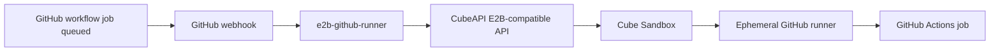

# 在 Cube Sandbox 上运行 GitHub Actions 自托管 Runner

本文介绍如何通过 [`jimyag/e2b-github-runner`](https://github.com/jimyag/e2b-github-runner)，在 Cube Sandbox 中按需启动临时 GitHub Actions self-hosted runner。该服务接收 GitHub `workflow_job` webhook，通过 Cube 的 E2B 兼容 API 创建沙箱，在沙箱内注册 ephemeral runner，并在 job 结束后清理沙箱。

## 集成对象与版本

- 集成对象：GitHub Actions self-hosted runner
- 适配服务：[`jimyag/e2b-github-runner`](https://github.com/jimyag/e2b-github-runner)
- Cube 要求：可访问的 CubeAPI 地址，默认 `http://<cube-host>:3000`
- Runner 模式：仓库级或组织级 self-hosted runner



## 前置条件

- 已部署 Cube Sandbox。可参考[快速开始](../quickstart.md)、[PVM 部署](../pvm-deploy.md)或[裸金属部署](../bare-metal-deploy.md)。
- 一个可运行 GitHub Actions runner 进程的 Cube 模板。模板镜像中应包含工作流需要的基础工具，例如 `bash`、`curl`、`tar`、`git`，以及 job 需要的语言运行时。
- `e2b-github-runner` 能访问 CubeAPI，并能通过 CubeProxy 访问沙箱数据面。生产环境请按[HTTPS 证书与域名解析](../https-and-domain.md)配置泛域名解析和 TLS。
- 一个 GitHub 可访问的公网 HTTPS webhook 地址。
- 一个具备创建 self-hosted runner registration token 权限的 GitHub token。

## GitHub Token 权限

仓库级 runner 推荐使用 fine-grained personal access token：

- Repository access：只选择目标仓库。
- Repository permissions：将 `Administration` 设为 `Read and write`。

组织级 runner 需要 token 具备管理组织 self-hosted runner 的权限。服务会根据配置的 scope 调用 GitHub runner registration token API。

## 配置 Runner 服务

克隆并配置适配服务：

```bash
git clone https://github.com/jimyag/e2b-github-runner.git
cd e2b-github-runner
```

必需环境变量：

```bash
export E2B_API_URL="http://<cube-host>:3000"
export E2B_API_KEY="<cube-api-key-or-dummy>"
export E2B_DOMAIN="<cube-sandbox-domain>"
export SANDBOX_TEMPLATE_ID="<cube-template-id>"

export GITHUB_TOKEN="<github-token>"
export GITHUB_WEBHOOK_SECRET="<random-webhook-secret>"
```

使用仓库级 runner：

```bash
export RUNNER_SCOPE="repo"
export GITHUB_OWNER="<repo-owner>"
export GITHUB_REPO="<repo-name>"
```

或使用组织级 runner：

```bash
export RUNNER_SCOPE="org"
export GITHUB_ORG="<org-name>"
```

常用可选配置：

```bash
export HTTP_ADDR=":8080"
export STATE_DIR="./var/runners"
export RUNNER_LABELS="self-hosted,e2b"
export SANDBOX_TIMEOUT_SECONDS="3600"
export MAX_CONCURRENT_RUNNERS="1"
```

说明：

- `E2B_API_URL` 指向 CubeAPI，不是 CubeProxy。
- 本地未启用鉴权的 Cube 部署中，`E2B_API_KEY` 可以填任意非空字符串。若 Cube 已启用鉴权，请填入认证回调服务认可的真实 key。
- `E2B_DOMAIN` 必须与 CubeAPI 对外返回的沙箱域名一致。快速体验通常是 `cube.app`；生产环境建议使用已配置 wildcard DNS 的自有域名。
- `RUNNER_LABELS` 必须与 GitHub Actions workflow 中的 `runs-on` 标签一致。

## 启动 Runner 服务

本地启动服务：

```bash
go run ./cmd/runnerd
```

检查健康状态：

```bash
curl -fsS http://127.0.0.1:8080/healthz
```

生产环境建议使用进程管理器或容器化方式运行，并将 `STATE_DIR` 放在持久化存储上，避免服务重启后丢失控制面日志。

## 暴露 GitHub Webhook 地址

GitHub 需要能访问服务的 webhook endpoint：

```text
POST https://<public-host>/webhooks/github
```

本地测试可以用 tunnel 暴露 `8080` 端口：

```bash
ngrok http 8080
```

或：

```bash
cloudflared tunnel --url http://127.0.0.1:8080
```

生产环境建议通过已有 ingress 或反向代理暴露服务，并在入口处终止 HTTPS。

## 配置 GitHub Webhook

在目标仓库或组织中新增 webhook：

- Payload URL：`https://<public-host>/webhooks/github`
- Content type：`application/json`
- Secret：与 `GITHUB_WEBHOOK_SECRET` 完全一致
- Events：选择 `Workflow jobs`
- Active：启用

服务只处理 `workflow_job` 事件，其他事件可忽略。

## 在 Workflow 中使用 Runner

添加一个使用目标标签的 workflow：

```yaml
name: cube-runner-smoke

on:
  workflow_dispatch:

jobs:
  smoke:
    runs-on: [self-hosted, e2b]
    steps:
      - name: Print runner info
        run: |
          uname -a
          whoami
          pwd
```

预期流程：

1. GitHub 创建一个包含 `self-hosted` 和 `e2b` 标签的 queued job。
2. GitHub 发送 `workflow_job.queued` webhook。
3. `e2b-github-runner` 校验 webhook 签名并创建 Cube 沙箱。
4. 服务向 GitHub 申请 runner registration token，并在沙箱内启动 ephemeral runner。
5. GitHub 将 job 分配给沙箱内的 runner 执行。
6. runner 退出后，服务清理对应沙箱。

## 排查

查看活跃 runner 请求：

```bash
curl -fsS http://127.0.0.1:8080/runners | jq
```

查看单个请求的状态和日志：

```bash
cat var/runners/<request_id>/state.json
cat var/runners/<request_id>/control.log
cat var/runners/<request_id>/stdout.log
cat var/runners/<request_id>/stderr.log
```

常见问题：

| 现象 | 可能原因 | 处理方式 |
| --- | --- | --- |
| `invalid signature` | Webhook secret 不一致 | 确认 GitHub webhook 和 `GITHUB_WEBHOOK_SECRET` 使用同一个值 |
| job 一直 queued | workflow 标签和 `RUNNER_LABELS` 不匹配 | 使用 `runs-on: [self-hosted, e2b]` 或修改 `RUNNER_LABELS` |
| runner 注册失败 | GitHub token 缺少 runner 权限 | 检查仓库 `Administration: Read and write` 或组织 runner 管理权限 |
| 沙箱创建失败 | CubeAPI 地址、API key 或模板 ID 错误 | 检查 `E2B_API_URL`、`E2B_API_KEY` 和 `SANDBOX_TEMPLATE_ID` |
| runner 无法访问 GitHub | 沙箱镜像或网络策略阻止出站访问 | 放通到 GitHub 的 HTTPS 出站访问，并在模板中安装必要工具 |
| 数据面连接失败 | wildcard DNS 或 TLS 未配置 | 按[HTTPS 证书与域名解析](../https-and-domain.md)配置 |
| `runner concurrency limit reached` | 活跃 runner 数达到 `MAX_CONCURRENT_RUNNERS` | 提高并发限制或等待已有 job 完成 |

runner 注册成功且 job 开始执行后，workflow step 日志会正常显示在 GitHub Actions 页面中。沙箱创建、webhook 校验、runner 注册和清理错误属于服务控制面日志，应优先检查 `STATE_DIR` 和 `runnerd` 进程日志。

## 参考资料

- 示例仓库：[`jimyag/e2b-github-runner`](https://github.com/jimyag/e2b-github-runner)
- Cube 文档：[快速开始](../quickstart.md)、[HTTPS 证书与域名解析](../https-and-domain.md)、[鉴权](../authentication.md)
- GitHub 文档：[Using self-hosted runners in a workflow](https://docs.github.com/en/actions/hosting-your-own-runners/managing-self-hosted-runners/using-self-hosted-runners-in-a-workflow)
- GitHub 文档：[Autoscaling with self-hosted runners](https://docs.github.com/en/actions/hosting-your-own-runners/autoscaling-with-self-hosted-runners)
- GitHub 文档：[Webhook events and payloads](https://docs.github.com/en/webhooks/webhook-events-and-payloads)
