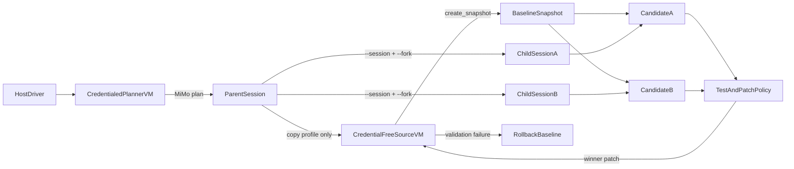

# MiMo Code 双分叉 Rollout 参考模式

[English](../../../guide/integrations/mimo-code.md)

本集成把 [MiMo Code](https://github.com/XiaomiMiMo/MiMo-Code) 的会话分叉与
CubeSandbox 完整 VM 快照结合，让多个实现候选从同一个规划上下文出发。

其中双分叉生命周期是可复用的参考模式；随附的 `normalize-slug` fixture 只是
确定性演示。任务提示、测试命令、可编辑路径和候选策略均由外部 `task.json`
提供。

它不只是把 Coding Agent 放进 MicroVM，而是建立一套推测式编码事务：

1. MiMo 在短生命周期且带凭证的规划沙箱中分析任务。
2. 父会话 profile 被复制到不带凭证的源 MicroVM。
3. CubeSandbox 为这个完整源 MicroVM 创建快照。
4. 多个候选 MicroVM 从同一个快照启动。
5. 每个候选通过 `mimo run --session ... --fork` 分叉父会话。
6. 确定性测试和补丁策略选择获胜者。
7. 只有获胜补丁会提升到源沙箱。
8. 最终验证失败时，源沙箱回滚到基线快照。

这直接实现了**用沙箱执行 Agent 生成的代码并回收结果**用例：候选 MicroVM
执行固定验收测试，Host 回收有长度限制的测试输出和已验证补丁元数据，再提升
一个结果。

可运行实现位于
[`examples/mimo-code-integration`](https://github.com/TencentCloud/CubeSandbox/tree/master/examples/mimo-code-integration)。

## 为什么要配对两种分叉？

MiMo 与 CubeSandbox 分叉的是不同状态：

| 层级 | 分叉内容 |
| --- | --- |
| MiMo `--fork` | 对话历史、规划上下文、记忆和 Agent 元数据 |
| CubeSandbox snapshot | Guest 内存、根文件系统、工作区、工具链和 MiMo profile |

只分叉 MiMo 会话不能隔离原生进程和文件写入；只克隆 VM 又不能形成独立对话
分支。两者组合后，每个候选拥有相同的初始知识与运行环境，后续工作则完全隔离。

CubeSandbox 生命周期遵循
[`07_clone_concurrent.py`](https://github.com/TencentCloud/CubeSandbox/blob/master/examples/snapshot-rollback-clone/07_clone_concurrent.py)
与
[`08_fork_three_axis.py`](https://github.com/TencentCloud/CubeSandbox/blob/master/examples/snapshot-rollback-clone/08_fork_three_axis.py)
相同的约束：多个沙箱继承同一快照、后续写入保持隔离、源沙箱仍可继续使用。
本集成补上 Agent 层，为每个候选 VM 配对独立 MiMo 对话分叉，再选择并提升一个
通过测试的补丁。



## 已测试组件

| 组件 | 版本或要求 |
| --- | --- |
| MiMo Code | `@mimo-ai/cli@0.1.7` |
| MiMo 模型 | `mimo/mimo-v2.5-pro` |
| CubeSandbox 基础镜像 | `ghcr.io/tencentcloud/cubesandbox-base:2026.16` |
| Python SDK | `cubesandbox>=0.6.0` |
| CubeSandbox 平台 | 支持 snapshot/rollback 与 CubeEgress |

镜像构建会验证固定 CLI 是否提供 `mimo run --fork`。

## 安全模型

短生命周期规划沙箱与所有候选沙箱都使用默认拒绝互联网访问。唯一的
CubeEgress 精确规则允许 `api.xiaomimimo.com`，并在 VM 外注入真实
`api-key`：

```python
Rule(
    name="allow_mimo_platform",
    match=Match(
        scheme="https",
        sni="api.xiaomimimo.com",
        host="api.xiaomimimo.com",
    ),
    action=Action(
        allow=True,
        audit="metadata",
        inject=[
            Inject(
                header="api-key",
                secret=MIMO_API_KEY,
                format="${SECRET}",
            )
        ],
    ),
)
```

驱动会把示例规则名替换为每轮随机名称，使证据收集器无需复制其他沙箱流量
即可关联本轮审计记录。

MiMo 在 VM 内只能看到占位环境变量。源沙箱则使用默认拒绝网络且完全不带凭证
规则。父轮次结束后，只有含占位符的 MiMo profile 会传入源沙箱，因此快照
创建请求不会持久化 CubeEgress 注入密钥。真实密钥不会出现在：

- `$MIMOCODE_HOME`；
- `/workspace`；
- 候选补丁与证据；
- 不带凭证的源基线快照。

示例同时禁用 MiMo 分享、遥测、更新、外部 skill、模型清单与 LSP 下载，使
精确域名规则保持最小范围。

## 运行集成

构建并导入固定版本模板：

```bash
export MIMO_IMAGE="<your-registry>/mimo-code-cube:0.1.7"
./examples/mimo-code-integration/build-template.sh
cubemastercli tpl watch --job-id <job_id>
```

配置 Host 驱动：

```bash
cd examples/mimo-code-integration
install -m 600 .env.example .env
python3 -m venv .venv
. .venv/bin/activate
pip install -r requirements.txt
```

设置 `E2B_API_URL`、`E2B_API_KEY`、`CUBE_TEMPLATE_ID` 和 `MIMO_API_KEY`。
真实 CubeAPI key 穿越不可信网络时必须使用 HTTPS。

并行运行两个候选：

```bash
python speculative_mimo_code.py \
  --task fixtures/normalize-slug/task.json \
  --candidates 2 \
  --concurrency 2 \
  --evidence-file output/speculative-success.json
```

成功提升时输出 `CUBE_MIMO_PROMOTION_OK`。

验证事务回滚路径：

```bash
python speculative_mimo_code.py \
  --force-promotion-failure \
  --evidence-file output/speculative-rollback.json
```

该模式只会强制最终源验证失败。源工作区必须恢复为干净基线，并输出
`CUBE_MIMO_ROLLBACK_OK`。

## 任务 profile 与复用边界

参考实现将任务输入与事务生命周期分离：

```text
fixtures/normalize-slug/
├── task.json
└── project/
    ├── .gitignore
    ├── README.md
    ├── app.py
    └── tests/test_app.py
```

`task.json` 提供 `name`、`summary`、规划和实现说明、固定测试命令及超时、
已存在的可编辑路径、具名候选策略和 `expect_baseline_failure`。加载器限制
文件数量与大小，并拒绝符号链接、不安全路径、重复项和基线中不存在的可编辑
路径。

新应用会复用相同的会话分叉、快照扇出、凭证边界、提升、回滚、清理和证据
契约。当前评估器为二元测试，并按改动行数排序通过补丁。后续
`research-experiment` 集成可以新增指标评估器，无需重复外围基础设施。

## 对话连续性证明

创建快照前，规划沙箱中的只规划父轮次会收到随机令牌，同时禁止文件编辑和
权限自动批准。驱动验证 Git 状态为空、确认 `/workspace` 下没有令牌，再把父
会话 profile 传入不带凭证的源沙箱。

候选的新提示不会包含令牌值。分叉后的子会话必须从父对话恢复令牌，并通过
工作区之外的报告或 `CONTINUITY=...` NDJSON 事件证明；缺少证明时会在同一
子会话重试一次。这能区分完整 MiMo 会话继承与普通文件系统克隆。

## 候选策略与获胜者选择

模型无权决定谁获胜。候选只有满足以下条件才有资格：

- 每个合格子会话 ID 与父会话及其他合格子会话不同；
- 连续性报告或 NDJSON 标记正确；
- 固定验收测试通过，并在源沙箱原样重跑；
- 所有改动路径都由任务 profile 声明；
- 补丁非空、为文本且低于大小限制。

合格结果按改动行数和候选名排序。补丁随后通过 `git apply --check`，应用到
未修改的源沙箱，并再次执行相同测试。

## 失败语义

- 候选创建为全有或全无，部分成功的兄弟沙箱会被杀死。
- 单个候选失败会被记录，但不会阻止其他有效候选获胜。
- 没有有效候选时，源沙箱不会被修改。
- 提升验证失败会调用 `rollback(snapshot_id)` 并验证源 Git 工作区干净。
- 每条路径都会显式清理规划、候选与源沙箱以及持久快照。
- 清理错误会报告泄漏资源 ID，并使原本成功的流程失败。

## 辅助检查

示例保留两个小型辅助入口：

```bash
# 验证固定模板与 MiMo NDJSON 事件契约。
python run_mimo_code.py

# 验证精确出口、CA 信任与 VM 内只有占位凭证。
python network_policy.py
```

## 验证与证据

离线检查不需要模型 key 或真实集群：

```bash
python -m unittest discover -s tests -v
python -m py_compile *.py tests/*.py \
  fixtures/normalize-slug/project/*.py \
  fixtures/normalize-slug/project/tests/*.py
bash -n build-template.sh collect_e2e_evidence.sh
```

真实集群上运行：

```bash
./collect_e2e_evidence.sh
```

收集器会运行补丁提升与强制回滚两个场景。证据包括源/候选沙箱 ID、快照 ID、
父/子会话 ID、候选评分、CubeEgress 边界检查、最终结果，以及本轮资源 ID
全部清理的检查，但绝不记录真实 MiMo key。

## 运维建议

- 候选数量应服从集群容量；示例最多允许八个。
- 预装任务需要的工具链，避免为候选开放包仓库。
- MiMo profile 和快照包含提示、代码与命令输出，应按敏感数据处理。
- snapshot 删除与 sandbox 删除相互独立，必须同时清理。
- `--dangerously-skip-permissions` 仅用于可丢弃候选 MicroVM，父规划轮不会使用。
- 信任边界应是固定测试和补丁策略，而不是模型的文字声明。

## 排错

| 现象 | 原因 | 处理 |
| --- | --- | --- |
| `mimo run` 缺少 `--fork` | 模板过旧 | 重新构建固定镜像 |
| MiMo Platform 返回 `401` / `403` | API key 缺失、过期或未正确注入 | 检查 `MIMO_API_KEY`、`api-key` 注入规则和脱敏 CubeEgress 审计 |
| 模板导入无法拉取镜像 | 镜像未推送、Cube 节点无仓库凭证或架构错误 | 推送 `linux/amd64` 镜像到所有 Cube 节点可访问的仓库，并配置仓库凭证 |
| 沙箱或 MiMo 命令超时 | 集群容量不足或任务超过限制 | 减少候选数，再按需增大 `MIMO_SANDBOX_TIMEOUT` 或 `MIMO_AGENT_EXEC_TIMEOUT` |
| 子 ID 与父 ID 相同 | 分叉未生效 | 检查原始 MiMo 事件和 CLI 版本 |
| 连续性证明失败 | 未继承父状态 | 检查快照时机与 `--session` |
| 路径策略拒绝候选 | 修改了测试或任务策略之外的文件 | 收紧提示，或有意扩展 `allowed_paths` |
| 没有有效候选 | 所有候选测试或策略失败 | 查看候选证据 |
| 提升验证失败 | 结果无法在源复现 | 流程会自动回滚 |
| TLS 验证失败 | 缺少 CubeEgress CA | 配置 `MIMO_NODE_EXTRA_CA_CERTS` |
| 请求返回 `403` 或 `000` | 精确域名规则拒绝 | 使用 MiMo Platform endpoint |
| 仍有快照残留 | 快照清理失败 | 手动删除对应 template ID |

## 参考资料

- [MiMo Code 会话](https://mimo.xiaomi.com/mimocode/sessions)
- [Snapshot、Rollback 与 Clone](../snapshot-rollback-clone.md)
- [CubeEgress 安全代理](../security-proxy.md)
- [可运行示例](https://github.com/TencentCloud/CubeSandbox/tree/master/examples/mimo-code-integration)
