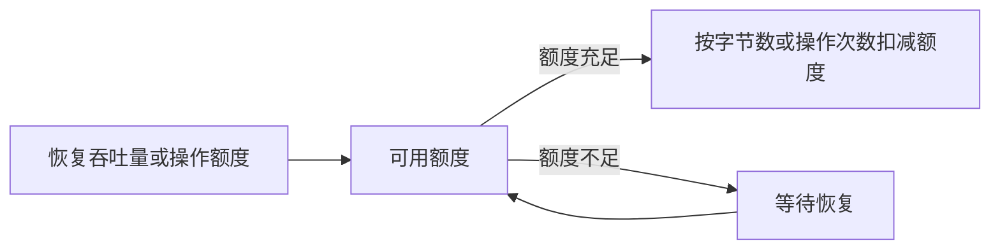

# QoS

服务质量（Quality of Service，QoS）用来限制单个沙箱的网络和块设备 I/O 消耗。当前版本中，该功能默认关闭，只能在创建模板时配置。模板中的限制会分别应用到每个沙箱。

网络 QoS 只影响流量速率，不改变沙箱的网络可达范围。块设备 I/O QoS 限制每个沙箱块设备的吞吐量和操作速率，不改变文件系统容量或权限。

## 工作原理

QoS 配置从模板进入沙箱运行时，最后由 CubeShim 在 virtio-net 和 virtio-blk 数据路径中执行：


网络 QoS 会分别限制每个沙箱的两个方向：上传从沙箱发往外部网络，下载从外部网络进入沙箱。配置的带宽上限和数据包处理速率上限会独立应用到上传和下载。

块设备 I/O QoS 会分别限制沙箱中的每个 virtio-blk 设备。同一设备的读取和写入共享配置的吞吐量桶和操作速率桶，不单独设置读写上限。



底层分别使用吞吐量和操作速率 Token Bucket。吞吐量桶按处理的字节数扣减额度，操作速率桶每处理一次操作扣减一次额度。额度按固定速率恢复；桶里有余量时允许短时突发，额度耗尽后需要等待恢复。因此，很短的测速可能暂时超过配置值，持续测试的平均速率应接近配置上限。额度大小和恢复速度由平台自动设置，用户只需要填写公开的限制值。

QoS 是运行时配置，不会修改模板的 rootfs。文件系统输入相同时，不同 QoS 配置仍可复用同一份 rootfs artifact。

## 配置语义

用户可以配置网络限制、块设备 I/O 限制，或者同时配置两者：

```json
{
  "network": {
    "bandwidthMbps": 100,
    "packetsPerSecond": 5000
  },
  "blockIo": {
    "throughputMiBps": 64,
    "iops": 1000
  }
}
```

`network` 中的 `bandwidthMbps` 和 `packetsPerSecond` 至少配置一个，且值必须是大于 0 的整数。`bandwidthMbps` 限制每个沙箱的每秒兆比特数，`packetsPerSecond` 限制每秒 virtio-net 数据包处理操作数。如果启用了分段等卸载功能，一个操作可能对应多个线上数据包，因此实际线上 PPS 可能与配置值不同。上传和下载分别使用独立额度，不同沙箱之间也不共享额度。

`blockIo` 中的 `throughputMiBps` 和 `iops` 至少配置一个。`throughputMiBps` 限制持续块设备吞吐量，单位为 MiB/s；`iops` 限制每秒块设备 I/O 操作数。同一组限制会独立应用到沙箱的每个 virtio-blk 设备，每个设备分别维护自己的额度。

当前版本只支持在创建模板时配置 QoS。使用该模板创建的每个沙箱都会应用相同的限制，创建沙箱时不能单独设置或覆盖 QoS。模板未配置 `qos` 时，不会设置本页介绍的网络或块设备 I/O 限制。

## 使用边界

`bandwidthMbps` 只限制单个沙箱的最大网络速率。节点级、租户级或 NAT 出口的总带宽仍由底层基础设施决定；所有活跃沙箱的需求超过实际链路容量时，沙箱之间仍会竞争带宽。

当前上传和下载使用相同的带宽和数据包处理速率配置，暂不支持分别设置两个方向的上限。块设备 I/O 也不区分读取和写入限制。QoS 不提供优先级、最低保障吞吐量或权重调度。

## 配置模板

创建模板时通过 `--qos` 或 CubeAPI 请求体设置限制。下面示例配置了每个沙箱上传、下载各 100 Mbps 和 5000 个数据包处理操作/秒的上限，同时配置每个块设备 64 MiB/s 和 1000 IOPS 的上限。

### CLI 内联 JSON

```bash
cubemastercli tpl create-from-image \
  --image cube-sandbox-cn.tencentcloudcr.com/cube-sandbox/sandbox-code:latest \
  --writable-layer-size 1G \
  --qos '{"network":{"bandwidthMbps":100,"packetsPerSecond":5000},"blockIo":{"throughputMiBps":64,"iops":1000}}'
```

### CLI JSON 文件

也可以把配置保存为 `qos.json`：

```json
{
  "network": {
    "bandwidthMbps": 100,
    "packetsPerSecond": 5000
  },
  "blockIo": {
    "throughputMiBps": 64,
    "iops": 1000
  }
}
```

创建模板时使用 `@` 前缀读取文件：

```bash
cubemastercli tpl create-from-image \
  --image cube-sandbox-cn.tencentcloudcr.com/cube-sandbox/sandbox-code:latest \
  --writable-layer-size 1G \
  --qos @qos.json
```

### CubeAPI

通过 CubeAPI 创建模板时，在请求中传入同一个 `qos` 对象：

```http
POST /cubeapi/v1/templates
Content-Type: application/json
```

```json
{
  "image": "cube-sandbox-cn.tencentcloudcr.com/cube-sandbox/sandbox-code:latest",
  "writableLayerSize": "1G",
  "qos": {
    "network": {
      "bandwidthMbps": 100,
      "packetsPerSecond": 5000
    },
    "blockIo": {
      "throughputMiBps": 64,
      "iops": 1000
    }
  }
}
```

CubeMaster 会在创建模板前校验 `qos`。每个已配置的部分必须至少包含一个大于 0 的整数限制。显式传入 0、负数、非整数、空配置部分或未知字段时，请求会被拒绝。

## 查看配置与应用状态

### 查看模板配置

使用 CLI 查询模板：

```bash
cubemastercli tpl info <template-id>
```

CubeAPI 对应 `GET /cubeapi/v1/templates/<template-id>`。配置了 QoS 的模板会返回：

```json
{
  "configuredQos": {
    "network": {
      "bandwidthMbps": 100,
      "packetsPerSecond": 5000
    },
    "blockIo": {
      "throughputMiBps": 64,
      "iops": 1000
    }
  }
}
```

### 查看沙箱状态

使用 CLI 查询沙箱：

```bash
cubemastercli cubebox info --sandboxid <sandbox-id>
```

CLI 会显示 `NETWORK_QOS`、`BLOCK_IO_QOS` 和 `QOS_APPLIED`。CubeAPI 的 `GET /cubeapi/v1/sandboxes/<sandbox-id>` 返回对应的 `configuredQos` 和 `qosApplied` 字段：

```json
{
  "configuredQos": {
    "network": {
      "bandwidthMbps": 100,
      "packetsPerSecond": 5000
    },
    "blockIo": {
      "throughputMiBps": 64,
      "iops": 1000
    }
  },
  "qosApplied": true
}
```

`configuredQos` 表示模板期望使用的 QoS 配置，`qosApplied` 表示沙箱运行时记录中是否至少包含一个 QoS annotation。这是聚合状态，不能证明配置的网络和块设备 I/O limiter 都已传递到 hypervisor。正常创建的 QoS 沙箱应返回 `qosApplied=true`。如果只有 `configuredQos`，需要排查旧数据或运行时记录缺失。

### 节点网络 QoS 排障

在沙箱所在节点上，可以查询 network-agent 的 `persistMetadata.qos_enabled`：

```bash
curl -sS -X POST \
  --unix-socket /tmp/cube/network-agent.sock \
  -H 'Content-Type: application/json' \
  -d '{"sandboxID":"<sandbox-id>"}' \
  http://localhost/v1/network/get | jq '.persistMetadata.qos_enabled'
```

该 metadata 表示沙箱网络初始化请求中已携带网络 QoS。它不反映块设备 I/O QoS，也不属于公开 API。

## 使用 iperf3 验证

先创建带网络 QoS 的模板并等待模板进入 `READY` 状态，再使用该模板创建待测沙箱。下面的客户端命令都在这个沙箱内执行。

iperf3 不一定预装在服务端或沙箱镜像中。测试前先在两端运行 `iperf3 --version`；如果命令不存在，按系统或镜像使用的包管理器安装。例如 Debian/Ubuntu 可以执行：

```bash
apt-get update
apt-get install -y iperf3
```

在沙箱能够访问的机器上启动服务端：

```bash
iperf3 -s -p 5201
```

确认沙箱能够访问服务端 IP，并且服务端防火墙已放通所选 TCP 端口。如果连接失败，应先解决连通性问题，再判断网络 QoS 是否生效。

分别测试上传和下载：

```bash
# 沙箱上传到服务端
iperf3 -c <server-ip> -p 5201 -t 10 -O 3 -P 4

# 沙箱从服务端下载
iperf3 -c <server-ip> -p 5201 -t 10 -O 3 -P 4 -R
```

测试结果会受到协议开销、Token Bucket 短时突发和测量窗口影响。100 Mbps 的配置通常会测得接近 100 Mbps，不要求精确相等。

模板返回 `configuredQos` 只能说明配置已经保存。带宽限速需要确认沙箱返回 `qosApplied=true`，并且持续上传、下载测试接近配置的带宽上限。`iperf3` 不能直接测量数据包处理操作数；如果只配置 PPS，应使用固定大小的数据包工作负载，并在测试端点通过报文计数器验证，同时注意卸载功能可能导致线上 PPS 与配置的操作速率不同。

### 验证多沙箱并发带宽限制

一个 iperf3 server 进程通常一次只处理一个测试。多个客户端连接同一个 server 端口时，测试可能被串行执行，无法反映并发带宽。测试多个沙箱时，为每个沙箱启动独立端口：

```bash
for port in 5301 5302 5303 5304 5305; do
  iperf3 -s -p "$port" -D
done
```

同时启动沙箱客户端，分别连接 5301 到 5305。如果模板配置为 100 Mbps，并且宿主机和网络容量足够，5 个沙箱应各自接近 100 Mbps，总吞吐接近 500 Mbps。

多沙箱测试还需要保证配置的带宽上限之和不超过测试链路容量。否则，结果会同时受到共享链路竞争影响，不能只根据单个沙箱低于配置上限判断带宽 limiter 是否正常。

## 使用 fio 验证块设备 I/O

先创建带块设备 I/O QoS 的模板并等待模板进入 `READY` 状态，再使用该模板创建待测沙箱。

fio 不一定预装在沙箱镜像中。测试前先运行 `fio --version`；如果命令不存在，按镜像使用的包管理器安装。Debian 或 Ubuntu 可以执行 `apt-get update && apt-get install -y fio`。

先在沙箱中执行 `lsblk`，选择位于可写 virtio-blk 文件系统中的测试目录。不要直接对根块设备执行破坏性测试。下面的命令使用 `/tmp/qos-fio` 文件，并绕过 guest page cache：

```bash
# 持续顺序写吞吐量
fio --name=block-qos-bw --filename=/tmp/qos-fio \
  --size=1G --rw=write --bs=1M --direct=1 --runtime=30 --time_based

# 随机读 IOPS
fio --name=block-qos-iops --filename=/tmp/qos-fio \
  --size=1G --rw=randread --bs=4k --direct=1 --iodepth=32 \
  --runtime=30 --time_based

rm -f /tmp/qos-fio
```

初始 Token Bucket 额度耗尽后，持续吞吐量和 IOPS 应接近配置上限。virtio-fs 或内存中的文件不会经过 virtio-blk limiter，不能用于这项验证。
