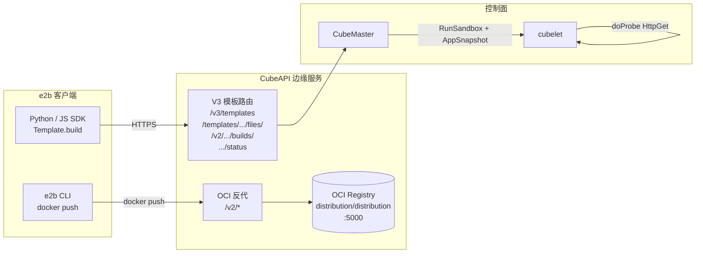
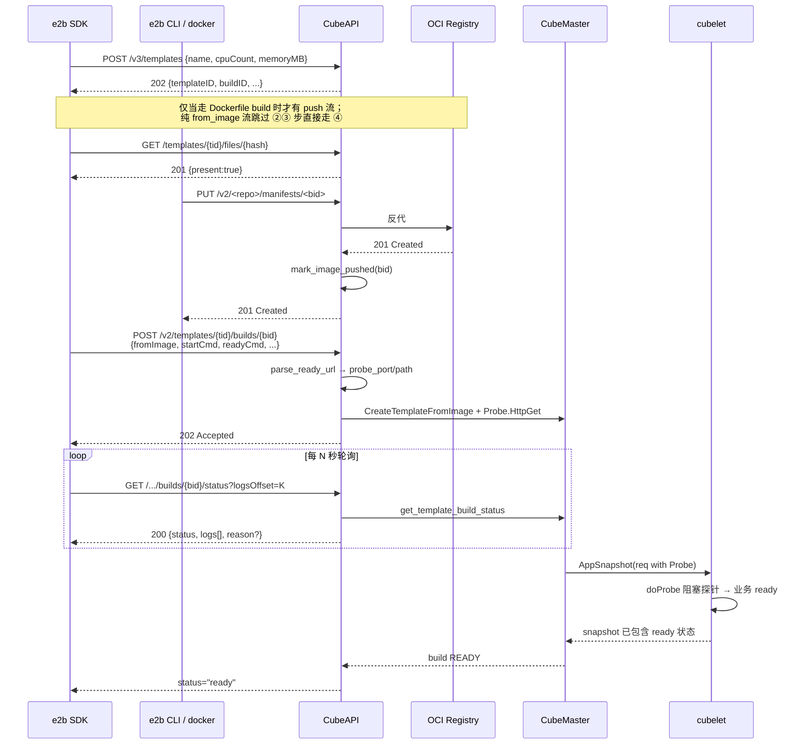

# 通过 e2b SDK 创建模板

CubeSandbox 在协议层完整兼容了 [e2b](https://e2b.dev/) **V3 模板与沙箱协议**。本文从一份"现成的 e2b 风格镜像"出发，讲清楚如何使用 e2b 官方 Python / JS SDK 在 CubeSandbox 集群上 **创建模板 → 构建 → 创建沙箱执行代码** 的完整路径，并给出技术参考和最佳实践。

> 适用版本：CubeSandbox **v0.2.3+**。
>
> - 如果你想用 `cubemastercli` 命令行制作模板，请参考[从 OCI 镜像制作模板](./template-from-image.md)；
> - 如果你只是想给现有镜像加上 envd，请先读[自带镜像接入 (envd)](./bring-your-own-image.md)。

---

## 一、整体架构

e2b SDK 客户端、CubeAPI、CubeMaster、bundled OCI Registry 之间的协作关系：



要点：

1. **CubeAPI** 充当 e2b V3 协议的"协议边缘"，把 V3 调用翻译成 CubeMaster 内部的 `CreateTemplateFromImage` / 构建作业语义。
2. **OCI Registry** 是一个独立的 sidecar（默认 `distribution/distribution`，监听 `127.0.0.1:5000`），CubeAPI 用 `/v2/*` 路由原样反向代理 docker push 流量。
3. **CubeMaster + cubelet** 收到 `<registry>/<repo_prefix>/<templateID>:<buildID>` 形式的镜像引用后，再走 OCI 镜像 → ext4 rootfs → 创建临时 sandbox → 探活 → 快照 → 注册的常规流水线。

---

## 二、快速开始

> 前置：你已经按 [自带镜像接入](./bring-your-own-image.md) 准备好了一个**自带 envd（49983）**的镜像，并推送到了一个集群可达的 OCI Registry（即下面这个 `from_image` 中的镜像）。

### 2.1 安装 SDK 并配置环境

```bash
pip install e2b python-dotenv
```

把 CubeAPI 入口和 API Key 写进项目根的 `.env` 文件：

```dotenv
E2B_API_KEY=e2b_0000000000000000000000000000000000000000 # 如果 CubeAPI 没启用鉴权，这里填任意值
E2B_API_URL=http://localhost:3000
SSL_CERT_FILE="/root/.local/share/mkcert/rootCA.pem"
```

### 2.2 写模板定义

```python
# build_template.py

from dotenv import load_dotenv
from e2b import Template, default_build_logger, wait_for_url

load_dotenv()

if __name__ == '__main__':
    template = (
        Template()
        .from_image("cube-sandbox-cn.tencentcloudcr.com/cube-sandbox/sandbox-code:latest")    # ← 也可以改成自己的镜像
        .set_start_cmd(
            "sudo /root/.jupyter/start-up.sh",
            wait_for_url("http://localhost:49999/health")   # <- 将被作用于probe探针
        )
    )
    Template.build(
        template,
        'template-tag-code',
        cpu_count=1,
        memory_mb=1024,
        on_build_logs=default_build_logger(),
    )
```

### 2.3 构建 + 使用

```bash
python build_template.py
# 看到 "[7/7] READY" 后即可创建沙箱
```

```python
# use_sandbox.py
from e2b import Sandbox

sbx = Sandbox(template="template-tag-code", timeout=120)
print(sbx.run_code("print('hello from cube sandbox')").text)
sbx.kill()
```

正常情况下：**第一次 `run_code` 立即可用，不需要 `time.sleep`**——只要构建期 `wait_for_url` 真的等到业务 ready，沙箱恢复完成那一刻业务进程就已在监听。

---

## 三、技术参考

### 3.1 V3 协议端点契约

CubeAPI 暴露下列 4 个 V3 协议端点（与 e2b 上游 SDK 一一对应）：

| 顺序 | 方法 + 路径 | Handler | 作用 |
|---|---|---|---|
| ① | `POST /v3/templates` | `templates_v3::v3_create_template` | 注册模板 + 分配第一次 build attempt，返回 `{templateID, buildID, names, aliases, tags, public}` |
| ② | `GET /templates/{tid}/files/{hash}` | `templates_v3::v3_get_files_hash` | SDK 上传 build context 前的缓存探测；CubeAPI 当前固定返回 `present=true` 让 SDK 跳过上传（V3 流目前只走 `from_image`） |
| ③ | `POST /v2/templates/{tid}/builds/{bid}` | `templates_v3::v2_trigger_build` | 真正触发构建：解析 `from_image` / `from_template` / 已推送镜像，组装 `CreateTemplateFromImageReq` 派发到 CubeMaster |
| ④ | `GET /templates/{tid}/builds/{bid}/status` | `templates_v3::v3_get_build_status` | 轮询构建状态，返回 e2b 严格匹配的 `{buildID, templateID, status, logs[], logEntries[], reason?}` 信封 |

整条 SDK 调用链时序：



### 3.2 OCI Registry 反代

CubeAPI 通过一组 `/v2/*` 路由把 e2b CLI / docker push 的流量原样反代到上游 OCI Registry。关键设计：

| 行为 | 说明 |
|---|---|
| **绕过 unified_auth** | docker push 用的是 registry 自己签发的 Basic / Bearer，与 CubeAPI 的 `Authorization: Bearer <api-key>` 不在同一个域，因此 `/v2/*` 路径不走 `unified_auth` 中间件。 |
| **240 s 超时** | 单个 layer blob PUT 可能耗时数分钟，因此 `/v2/*` 路径独享一组 240 s 的 `TimeoutLayer`，与默认的 30 s 路由分开（详见 `routes.rs::SNAPSHOT_LONG_ROUTE_TIMEOUT`）。 |
| **Hop-by-hop 头剥离** | 转发前后都按 RFC 7230 §6.1 剥掉 `connection` / `keep-alive` / `transfer-encoding` 等连接级头，保证两端 HTTP/1.1 实现兼容。 |
| **`mark_image_pushed` 钩子** | 当 `PUT /v2/<repo>/manifests/<tag>` 成功时，CubeAPI 用 `<tag>` 作为 `buildID` 标记对应的 BuildContext 进入 `Building` 阶段，让随后的 trigger build 调用可以无缝衔接。 |
| **未配置时降级** | 若 `registry_upstream` 未配置，`/v2/*` 一律返回 503 `registry_disabled`；这种部署形态下纯 `from_image` 流仍可工作。 |

部署时**默认开启**这条链路（`deploy/one-click/scripts/one-click/up.sh` 中已配置）：

如果没有镜像仓库，可以通过`docker run -d -p 5000:5000 --restart always --name registry registry:3`快速启动一个镜像仓库

```bash
cube-api \
  --registry-upstream     http://127.0.0.1:5000 \
  --registry-public-host  cube.app \
  --registry-pull-host    127.0.0.1:5000 \
  --registry-repo-prefix  e2b
```

详见下文[四、运维配置](#四运维配置)。

### 3.3 `wait_for_url` 与就绪探针桥接

`wait_for_url(...)` 是模板"创建即可用"语义的关键。它的语义是：**模板构建期间** 等到指定 URL 返回 2xx **再** 对沙箱做快照——这样所有从该模板恢复的沙箱都已经"业务在监听"，SDK `sbx.run_code(...)` 立即可用。

#### 桥接逻辑

e2b SDK 把 `wait_for_url(...)` 序列化为一段 shell 形式的 `readyCmd`（最终是 `curl ...`）。CubeAPI 不直接执行这段 shell，而是在 `services/templates.rs::v3_trigger_build` 中做一次轻量解析：

1. 在 `readyCmd` 中找 `http(s)://<host>:<port>[/<path>]` 形式的 URL；
2. 校验 `host` 必须是 loopback 别名（`localhost` / `127.0.0.1` / `0.0.0.0` / `::1` / `[::1]`）—— 防止意外把探针指向外部服务；
3. 校验端口必须显式给出且 ≠ 0；
4. 解析成功 → 自动填入 `probe_port` / `probe_path`，由 `build_probe()` 生成原生 `Probe.HttpGet` 透传给 CubeMaster；
5. cubelet 在容器创建后 **阻塞性** 轮询该探针（`doProbe`），直到 2xx 才 commit 快照。

整条链路对用户完全透明，SDK 端**不需要**额外配置。

#### 解析规则一览

| `readyCmd` 输入 | 解析结果 | 备注 |
|---|---|---|
| `wait_for_url("http://localhost:49999/health")` | `(49999, "/health")` | 标准用法 |
| <code>curl -fsS http://127.0.0.1:8080/ready?retries=3 \|\| exit 1</code> | `(8080, "/ready")` | query string 自动剥掉 |
| `until nc -z 0.0.0.0:3000; do sleep 0.2; done; curl http://0.0.0.0:3000` | `(3000, "/")` | 路径缺省时填 `/` |
| `curl http://api.example.com:443/healthz` | ❌ `None` | 非 loopback 主机会被拒绝 |
| `curl http://localhost/health` | ❌ `None` | 必须显式给出端口 |
| `curl http://127.0.0.1:0/` | ❌ `None` | 端口必须 > 0 |
| `/usr/local/bin/wait-for-it.sh --quiet` | ❌ `None` | 没有可识别的 URL |

#### 三级优先级

`probe_port` 的来源按以下优先级解析：

1. **caller 显式设置** — V3 请求体中的 `probePort` / `probePath`；
2. **`readyCmd` 解析** — 自动从 `wait_for_url(...)` / `curl ...` 中抽取；
3. **`exposedPorts[0]` + `/health`** — 兜底（与 e2b 历史行为兼容）。

任意一级生效即生成 `Probe.HttpGet`；三级全部失效则**不生成探针**，退化为"`Create` 一返回就视为 ready"行为，仍可工作但 SDK 端可能需要 `time.sleep`。

#### 探针参数（cubelet 默认行为）

| 字段 | 默认值 | 含义 |
|---|---|---|
| `timeout_ms` | 30 000 | 整个探针流程的总预算（30 秒） |
| `period_ms` | 500 | 每 500 ms 探一次 |
| `success_threshold` | 1 | 第一次 2xx 即视为 ready |
| `failure_threshold` | 60 | 最多 60 次失败（约 30 s）后宣告失败 |

> 业务启动需要超过 30 秒（罕见）时，可以走 `cubemastercli` 显式覆盖路径，或在后续向 CubeAPI 增加 `probeTimeoutMs` 字段。

### 3.4 Build 状态机

CubeAPI 在内存里维护一个 `BuildRegistry` 来跟踪每个 `(templateID, buildID)` 的生命周期（`services/builds.rs`）：

```
WaitingPush ─push manifest成功─► Building ─CubeMaster job终态─► Ready / Error
```

| 阶段 | 含义 |
|---|---|
| `WaitingPush` | template 已注册，registry 凭据已签发，等待客户端 docker push |
| `Building` | manifest PUT 成功 / 触发 build 调用收到，CubeMaster 流水线运行中 |
| `Ready` | 模板构建成功，可被沙箱使用 |
| `Error` | 构建失败，`reason.message` 中包含 CubeMaster 的错误 |

`BuildContext` 同时保留：原始 `CreateTemplateRequest`（重放用）、registry 凭据、CubeMaster `jobID`、append-only 日志缓冲（最多 10 000 行，溢出滚动）、SDK 期望的 V3 字段（`name` / `tags` / `cpuCount` / `memoryMB` / `aliases`）。

CubeAPI 重启会丢失内存状态——这是一个有意识的取舍：build 流通常在数分钟内到达终态，启动失败的 build SDK 会自然重试。需要更强一致性时，可以把 `BuildRegistry` 后端切到持久化存储（trait 已留好抽象点）。

### 3.5 ID 与超时规则

#### `templateID`

由 `name` 通过 UUIDv5（DNS 命名空间）派生，前缀 `tpl-`：

```rust
fn stable_template_id(name: &str) -> String {
    let id = Uuid::new_v5(&Uuid::NAMESPACE_DNS, name.as_bytes());
    format!("tpl-{}", &id.simple().to_string()[..16])
}
```

- 同一个 `name` 永远映射到**同一个** `templateID`，与 e2b 的 "alias 也是主键" 语义一致；
- 重复构建同名模板会复用 `templateID`，避免在控制面留下孤立模板。

#### `buildID`

每次 `POST /v3/templates` 现场分配：`bld-<uuid_v4_simple>`，无状态、不可猜测。

#### 超时分级

| 路由 | 超时 | 原因 |
|---|---|---|
| 默认（如 `/v3/templates` / `.../builds/{bid}/status`） | 30 s | 普通同步调用 |
| 长路由（`POST /sandboxes/:id/snapshots`、`POST /sandboxes/:id/rollback`、`DELETE /templates/:id`） | 240 s | 同步调用 cubelet 的 LVM/快照清理 |
| OCI Registry 反代（`/v2/*`） | 240 s | 大 layer blob PUT 可能数分钟 |

在 `routes.rs` 中通过把不同子 router 用各自的 `TimeoutLayer` 包起来再 `Router::merge` 实现——`merge_preserves_per_router_timeout_layers` 单测专门覆盖了这个 invariant。

---

## 四、运维配置

### 4.1 一键部署默认值

`deploy/one-click/scripts/one-click/up.sh` 启动 CubeAPI 时已经默认带上：

```bash
--registry-upstream     http://127.0.0.1:5000   # 同机 distribution sidecar
--registry-public-host  cube.app                # 对外 docker push 域名
--registry-pull-host    127.0.0.1:5000          # CubeMaster 节点拉镜像地址
--registry-repo-prefix  e2b                     # 镜像 namespace
```

意味着标准部署下 e2b CLI 的 `docker push` **开箱可用**。如果你用别的方式部署，请按下表把对应参数显式传给 `cube-api`。

### 4.2 完整参数表

| CLI 参数 | 环境变量 | 默认 | 含义 |
|---|---|---|---|
| `--registry-upstream URL` | `CUBE_API_REGISTRY_UPSTREAM` | *unset* | 上游 OCI Registry 的 URL；未设置时 `/v2/*` 返回 503，dockerfile 流被拒 |
| `--registry-public-host HOST` | `CUBE_API_REGISTRY_PUBLIC_HOST` | 取请求 Host 头 | 对客户端公布的 docker push 主机名 |
| `--registry-pull-host HOST` | `CUBE_API_REGISTRY_PULL_HOST` | upstream 的 host:port | CubeMaster 节点拉镜像用的内部地址 |
| `--registry-repo-prefix PREFIX` | `CUBE_API_REGISTRY_REPO_PREFIX` | `e2b` | 推送镜像的 repo namespace |
| `--registry-token TOKEN` | `CUBE_API_REGISTRY_TOKEN` | `_anon` | `POST /templates` 响应里 `registry.password` 字段 |
| `--default-writable-layer-size SIZE` | `CUBE_API_DEFAULT_WRITABLE_LAYER_SIZE` | `1G` | 客户端没传 `writable_layer_size` 时的默认值（CubeMaster 强校验该字段） |
| `--sandbox-domain DOMAIN` | `CUBE_API_SANDBOX_DOMAIN` | `cube.app` | 沙箱响应里 `domain` 字段 |
| `--auth-callback-url URL` | `AUTH_CALLBACK_URL` | *unset* | 启用统一鉴权时回调 URL（详见[鉴权](../authentication.md)） |

### 4.3 私有 / 受限 OCI Registry 接入

最常见的场景是把 docker push 推到团队的私有 registry。三步配置：

1. **部署一个支持 OCI Distribution v1 的 registry**（CNCF `distribution/distribution`、Harbor、AWS ECR、GCR 都行）；
2. CubeAPI 端：`--registry-upstream` 指向该 registry，`--registry-public-host` 是用户 docker push 的目标主机名（通常你的 ingress 域名）；
3. CubeMaster 端：确保 `--registry-pull-host` 指向 CubeMaster 节点能拉到镜像的内网地址（如果 registry 在另一台机器上，**不要**用 `127.0.0.1`）。

如果 registry 自带 htpasswd / token server 鉴权，docker 客户端的 `Authorization` 头会被 CubeAPI 原样透传到上游——不需要在 CubeAPI 这一层做特殊处理。

---

## 五、最佳实践

### 5.1 镜像准备

**强约束**：任何用作 CubeSandbox 模板的镜像，启动后必须在 `:49983` 上有 envd 监听。两条最快的路径：

| 路径 | 适合 | 操作 |
|---|---|---|
| **`FROM ghcr.io/tencentcloud/cubesandbox-base:2026.16`** | 全新业务镜像 | base 镜像已预装 envd + `cube-entrypoint.sh`，自动后台拉起 envd |
| **`COPY --from=cubesandbox-base ...`** | 已有业务镜像（如 `e2bdev/code-interpreter`） | 把 envd 二进制和入口脚本注入现有镜像，再把 ENTRYPOINT 换成 `cube-entrypoint.sh` |

详细的 Dockerfile 样板、`cube-entrypoint.sh` 契约、本地 smoke test 见 [自带镜像接入](./bring-your-own-image.md)。

> ⚠️ **不要直接拿 `e2bdev/code-interpreter:latest` 制作模板**：它只有 e2b 上游的 init，没有 CubeSandbox 需要的 envd，模板创建时探针会以 `connection refused` 一路失败到超时。

### 5.2 SDK 用法

- **始终用 `set_start_cmd(cmd, wait_for_url(...))` 二参形式**，让构建期阻塞到业务 ready；
- `wait_for_url` 的 URL 必须 `http(s)://<loopback>:<port>[/<path>]` 形式，host 必须是 `localhost` / `127.0.0.1` / `0.0.0.0` 之一；
- `from_image(...)` 中的镜像引用必须是 **CubeMaster 节点能 pull 到** 的 registry；
- `cpu_count` / `memory_mb` 是模板默认资源，可在 `Sandbox(...)` 调用时按需覆盖；
- 看到 build log 中出现 `[dispatch-v3] readyCmd parsed → HttpGet probe on port=... path=...` 即代表桥接成功。

### 5.3 沙箱使用

- **不需要 `time.sleep`**：只要构建期 `wait_for_url` 真的等到 ready，沙箱第一次 `run_code` 直接可用；
- 多次调用 `sbx.run_code(...)` 复用同一个沙箱比反复创建新沙箱开销小一个量级；
- 用完显式 `sbx.kill()` 而不是依赖超时回收。

---

## 六、故障排查

| 现象 | 根因 | 处理 |
|---|---|---|
| `BuildException: 404: b''` | CubeAPI 没有 V3 路由，多半是 v0.2.2 及更早版本 | 升级到 v0.2.3+ |
| build 卡在 `PULLING_IMAGE` | CubeMaster 节点拉不到镜像 | 用集群可达的 registry；私有 registry 检查 `--registry-pull-host` |
| build 日志出现 `readyCmd is recorded but not enforced` | URL 没被解析出来 | 检查 `wait_for_url` 是否写成 `http://localhost:<port>[/<path>]`，host 必须是 loopback，端口必须显式 |
| build 日志出现 `readyCmd parsed`，但 build 仍超时失败 | 探针在跑、但业务真的没 ready | 在镜像里 `docker run` 后 `curl 127.0.0.1:<port>/<path>` 本地验证；确认 `cube-entrypoint.sh` 是 `exec` 业务而不是 fork-and-exit |
| `Sandbox(template=...)` 后立即 `run_code` 报 502 | 业务还在启动中（探针没真正生效）| 先升级到 v0.2.3+；再确认 build 日志里有 `readyCmd parsed → HttpGet probe`；最后检查跨节点端口连通性，参见[CubeVS 网络模型](../../architecture/network.md) |
| `run_code` 报 `404 not found` | sandbox 内 envd 没起来 | 镜像里没注入 envd 或 ENTRYPOINT 被覆盖；按 [自带镜像接入](./bring-your-own-image.md#_3-备选-往现有镜像里注入-envd) 处理 |
| docker push 报 `503 registry_disabled` | CubeAPI 未配置 `--registry-upstream` | 按 [运维配置](#四运维配置) 启用 OCI Registry 反代 |
| docker push 报 `request timeout` | layer blob 上传慢、超过 240 s 长超时 | 检查上游 registry 的存储后端 IO；或临时把 layer 切小（`--squash` / 多阶段构建） |

更多模板共性问题见 [模板相关排障](../troubleshooting/templates.md)。

---

## 七、进一步阅读

- [自带镜像接入 (envd)](./bring-your-own-image.md) — Dockerfile 模板、`cube-entrypoint.sh` 契约、本地 smoke test
- [从 OCI 镜像制作模板](./template-from-image.md) — `cubemastercli` 路径下的 `--probe` / `--probe-path` 显式探针配置
- [CubeVS 网络模型](../../architecture/network.md) — 跨节点端口转发原理
- [模板相关排障](../troubleshooting/templates.md) — 模板构建常见故障
- [鉴权](../authentication.md) — `unified_auth` 中间件与 API key 配置
