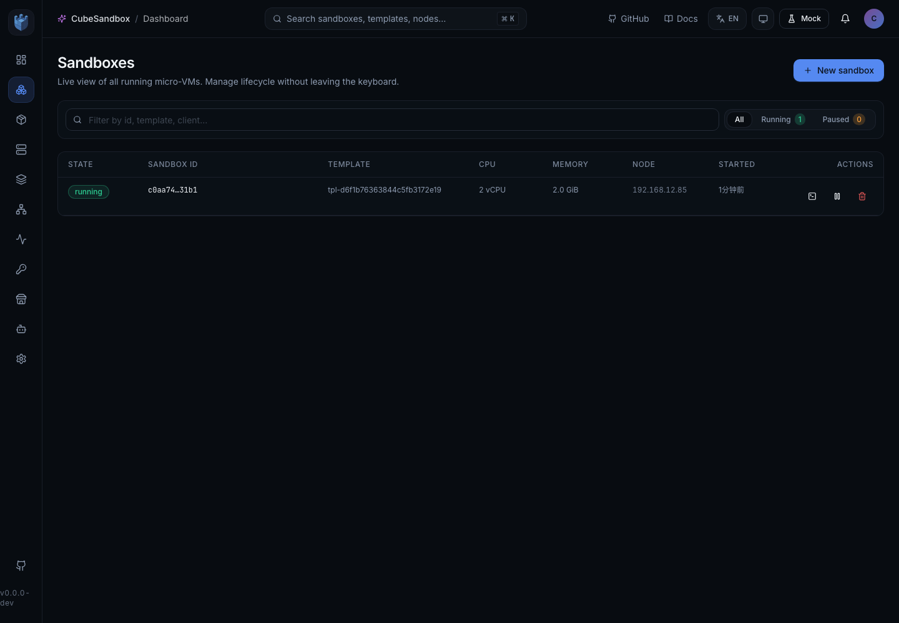
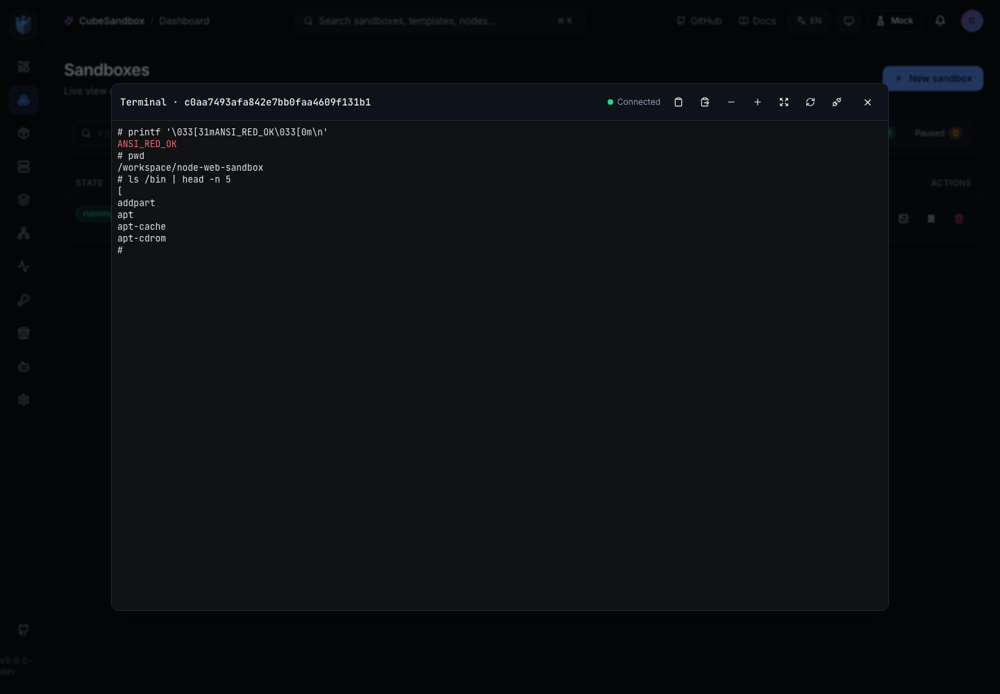

# WebUI 终端登录

CubeSandbox WebUI 支持从沙箱列表或详情页直接打开运行中沙箱的交互式 Shell。浏览器通过 WebSocket 连接 CubeAPI，CubeAPI 再桥接到底层 EnvD PTY 进程接口，不另起一套执行机制。

## 使用要求

- 目标沙箱必须存在且处于 `running` 状态。
- 浏览器必须能通过 WebUI 同源地址访问 CubeAPI。
- 如果启用了 WebUI 登录，需要当前 WebUI 会话 token。
- 如果启用了 CubeAPI auth callback，终端 WebSocket 需要携带 API Key 或 Bearer token，CubeAPI 会复用相同鉴权回调校验访问权限。
- 生产环境应通过 HTTPS 暴露 WebUI/CubeAPI，使终端通道使用 WSS。

## 打开终端

1. 打开 WebUI。
2. 进入 **Sandboxes / 沙箱** 页面。
3. 找到运行中的沙箱并点击 **打开终端**。
4. 执行命令，例如：

```bash
ls
top
ping -c 1 127.0.0.1
```

终端支持 ANSI 颜色、光标控制、粘贴、滚动回溯和窗口尺寸同步。面板工具栏可切换全屏并调整字号。

## 验证截图

沙箱列表仅对运行中的沙箱提供终端操作入口：



交互式终端可保留 ANSI 输出并在所选沙箱内执行命令：



如果 CubeAPI 返回了该沙箱的多个容器记录，终端面板会显示 **容器**
选择器。切换容器会为所选容器打开新的终端会话。沙箱列表页由于列表
接口不包含容器明细，会打开默认容器。

## 状态与权限校验

沙箱暂停、暂停中或不处于运行状态时，**打开终端** 按钮会禁用。CubeAPI 在 WebSocket 连接后仍会再次校验目标沙箱状态，因此直接访问非运行沙箱也会被拒绝。

CubeAPI 会记录终端会话打开和关闭的结构化审计日志，字段包括：

- `actor`
- `sandbox_id`
- `session_id`
- `container_id`

## WebSocket 协议

浏览器连接：

```text
/cubeapi/v1/sandboxes/{sandboxID}/terminal
```

浏览器发送 JSON 消息：

```json
{ "type": "input", "data": "ls\n" }
{ "type": "resize", "rows": 32, "cols": 120 }
{ "type": "close" }
```

CubeAPI 返回 JSON 消息：

```json
{ "type": "status", "status": "ready", "sessionId": "...", "pid": 123 }
{ "type": "output", "data": "<base64 terminal bytes>" }
{ "type": "error", "message": "..." }
{ "type": "exit", "code": 0 }
```

`output.data` 使用 base64 编码，以保留 ANSI 与二进制终端字节。

## 已知限制

- 当沙箱详情接口返回容器元数据时支持显式容器选择；沙箱列表页打开默认容器。
- 断线重连当前会打开新的终端会话，暂不复用旧 PTY。
- 终端继承沙箱/容器原有权限边界和网络策略，不应绕过 CubeEgress 或沙箱隔离。
- 空闲会话会在 CubeAPI 配置的空闲超时后关闭。

## 本地验证

1. 启动本地 CubeSandbox 与 WebUI。
2. 创建或恢复一个沙箱。
3. 在 WebUI 中对运行中沙箱点击 **打开终端**。
4. 执行 `ls` 并确认输出正常。
5. 执行 `printf '\033[31mred\033[0m\n'` 并确认颜色正常。
6. 调整终端面板大小并确认交互式命令能正常重绘。
7. 关闭终端并检查 CubeAPI 日志中是否有 `terminal.session.closed`。

在可用的本地部署环境中，以上流程应能在 30 分钟内完成。
